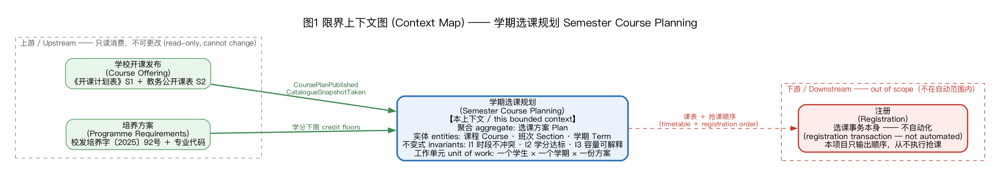
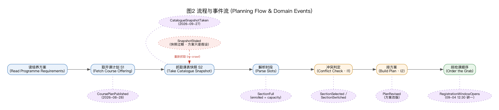
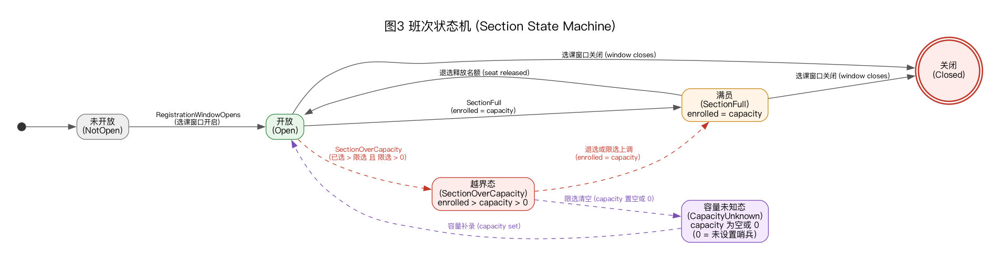
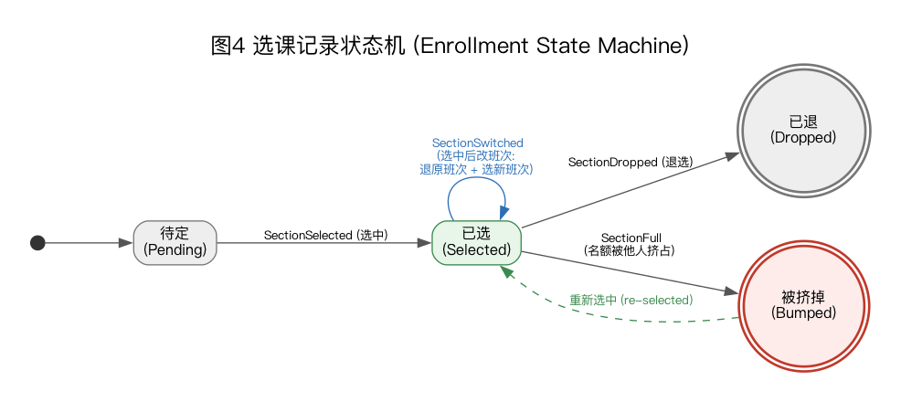

# A2 — Domain Model and Testable Specification

Course **Intelligent Software Engineering**, UCAS, 2026 autumn term · Platform <https://learn.spaiq.ai>
Author: 汤力为 (Liwei Tang), student ID 2026E8001082052
Repository: <https://github.com/Tom1246/ise-course> · tag `a2-v1` · report generated 2026-10-04

This report is the reading copy of A2. Its sources are the files below, kept next to it as the authoritative
versions; the executable parts are a check script, a notebook whose outputs are stored in it, and diagrams whose
Graphviz sources are committed alongside the rendered images.

| Part | Source file | Executable / regenerable with |
| --- | --- | --- |
| Domain glossary and context map | `domain-glossary.md` | `bash figs/render.sh` (context map) |
| Data dictionary | `data-dictionary.md` | measured from the frozen inputs |
| Invariants and checks | `invariants.md` | `python3 scripts/a2_check_invariants.py` |
| One material rule, three ways | `conflict-decision-table.md` | check script, section 1 |
| Data source, authority, quality, retention, deletion, privacy | `data-governance.md` | — |
| Model walkthrough record | `model-walkthrough.md` | `notebooks/a2-domain-model-walkthrough.ipynb` |
| Raw output of the checks | — | `data/derived/a2/invariant-checks.md` |

---


# A2 — Domain glossary and context map

The ubiquitous language for the course-planning domain. Terms are given Chinese-first (the data and the
rules are Chinese) with the English term that code and documents use. Where a term has a trap, the trap is
stated — half of this domain's bugs come from words, not from algorithms.

## 1. Bounded context

**Semester course planning** — from *the university says what will run* to *the student has a timetable and an
order to register in*. Everything in this repository lives inside this boundary.

- **Upstream, outside:** the university's course-offering system (publishing the plan and the listing) and the
  programme requirements document. We consume them; we cannot change them.
- **Downstream, outside this context:** the registration transaction itself. Registration is *not* automated here —
  out of scope by policy (see `data-governance.md` and A1's misuse scenario).
- **The unit of work** is one student, one semester, one plan. Not a cohort, not a department.

## 2. Entities — identity that persists across time

| Chinese | English | Identity | What it is | Traps found in the real data |
| --- | --- | --- | --- | --- |
| 课程 | Course | 课程编码 (18 characters) | a course as a catalogue entry | the code is not opaque: position 13 = 培养层次, 14 = 课程属性, **18 = 校区 (`Y` = 玉泉路)** |
| 班次 | Section | 课程编码 + suffix (`-01`, `-08`, `-W003`) | one teaching instance with its own slot, room, capacity | one course normally has several sections with *different* slots — "the course clashes" is almost always false; *sections* clash |
| 学期 | Term | e.g. 2026-2027 秋季 | the teaching period a section belongs to | the workbook **does** carry it, per row (秋季 400 / 春季 332 in the committed import) — A1 used exactly that column to show the three required courses are autumn-only; the public listing has no per-row term (the term is implied by the crawl) |
| 培养方案 | ProgrammeRequirement | 校发培养字〔2025〕92号 + programme code | the credit floors and degree-course rules a plan must satisfy | states floors only; no ceiling (see `invariants.md`, I2) |
| 选课方案 | Plan | the student's own | the chosen sections for one term, plus an order to register in | **personal data** — kept out of this repository (aggregates only) |
| 选课记录 | Enrollment | student × section | the state of one student's registration for one section | the privacy-sensitive entity: enrolment lists identify people |

## 3. Value objects — no identity, equal by value

| Chinese | English | Value | Notes |
| --- | --- | --- | --- |
| 周次区间 | `WeekRange` | `(start, end)`, e.g. `(2, 5)` | the field is an **interval set**, not a number: `第2-5,7-17周` is `[(2,5),(7,17)]` |
| 节次区间 | `PeriodRange` | `(first, last)`, e.g. `(10, 12)` | 节 are 1..12 within a day |
| 星期节次 | `DayPeriod` | `(weekday, PeriodRange)` | the listing packs several into one cell: `周三(5-7)；周六(5-7)` |
| 时段 | `Slot` | `DayPeriod` + `WeekRange` set | the unit the conflict rule compares |
| 学分 | `Credit` | number | used by I2 |
| 容量 / 已选 | `Capacity` / `Enrolled` | non-negative integer or *unknown* | **`0` is a sentinel for "not set"** — 40 rows in the snapshot have `0` capacity with people enrolled |
| 教室 | `Room` | string | informational; not part of any invariant |
| 课程属性 | `CourseAttribute` | 学位课 / 选修 / 必修 | the degree-course floors are expressed in this vocabulary |
| 校区 | `Campus` | `Y` = 玉泉路, `H` = 雁栖湖, `Z` = 中关村 | centralised-teaching students may not cross campuses (school notice, quoted in A1) |
| 冲突 | `Conflict` | boolean derived from two `Slot`s | **derived, never stored** — see the decision table |

## 4. Domain events — what happens, in the order it happens

| Event | Trigger | Meaning for the model |
| --- | --- | --- |
| `CoursePlanPublished` | the university issues the workbook (2026-08-28) | sections get a *planned* existence; no weekday/weeks yet |
| `CatalogueSnapshotTaken` | we crawl the listing (2026-09-27) | a **frozen** view; every later question is answered against it |
| `RegistrationWindowOpens` | 09-02 public electives, 09-03 professional, **09-04 12:30 for first-year master's**, 09-18 12:30 close | the order to register in becomes the scarce resource |
| `SectionFull` | `enrolled = capacity` | the section is effectively unavailable; the plan must change |
| `SectionOverCapacity` | `enrolled > capacity > 0` | a state the system allows; must be surfaced, never read as "a seat exists" |
| `SectionSelected` / `SectionDropped` / `SectionSwitched` | student action | **the real case in A1**: switching a full section re-arranged the whole timetable |
| `PlanRevised` | student action | A1's two saved versions are two instances of this event (22 removed / 45 added cells) |
| `SnapshotStaled` | time passes | the catalogue no longer matches the live system: the plan is a hypothesis, not a fact |

## 5. Context map

See `figs/context-map.dot` (source) and `figs/context-map.png` (rendered; regenerate with
`bash doc/assignments/a2/figs/render.sh`). Reading it: two upstream contexts (offering, requirements) feed the
planning context; the planning context emits a timetable plus a registration order; the registration context is
downstream and deliberately outside the automated boundary.

## 6. Words we refuse to use loosely

- **"课" alone** — always say 课程 (course) or 班次 (section). A1's own first draft confused the two, and the
  confusion is what makes "the course is full" sound true when only one section is.
- **"优先" / priority** — two different orders exist and they are *not* the same: the **plan order**
  (which course matters more when something must be dropped) and the **grab order** (which section to register
  first under first-come-first-served). Documents say which one is meant.
- **"抢课"** — the act of competing for seats. This project outputs an *order*, never an actuator.
- **"周次"** — never a single number; always an interval set. `第6周` is the degenerate set `[(6,6)]`.
- **"满" (full)** — a *state of a section*, not a violation of an invariant (see `invariants.md`, I3).


\newpage


# A2 — Data dictionary (S1 / S2 / S5, field by field)

A field-level reference for the three frozen inputs this project consumes, written to be *looked up*, not read
end-to-end. Field names are given Chinese-first (the data is Chinese) with the English name code and documents use;
the semantics are constrained to `doc/assignments/a2/domain-glossary.md` (entities: 课程/班次/学期/培养方案;
value objects: 周次区间/节次区间/星期节次/时段/学分/容量/教室/课程属性/校区).

- **Every number below was measured in this session** with inline `python3` on the committed files (no number is
  copied from another document). The exact snippet is cited next to each figure under "实测出典" / in §5.
  No script file was added (the A2 brief allows only this one new file), so the measurements are reproducible from
  the quoted one-liners and the frozen hashes in §0.2.
- Companion raw output: `data/derived/a2/invariant-checks.md` (§0 "Parsing quality"); where I re-checked its
  numbers, §5 records both and flags any difference.

---

## 0. Scope, sources and how to read this

### 0.1 Sources and the naming caveat (read this first)

| label | what it is | committed file(s) | rows |
| --- | --- | --- | --- |
| **S1** | 开课计划表 — official course-planning workbook (计划态) | `data/s1-plan-workbook/sections-snapshot.json` | 732 |
| **S2** | 教务公开课表 — official public listing, `jwba.ucas.ac.cn` (当前态, crawled 2026-09-27) | `data/s2-public-listing/89576-campus20.json` (+ `89577-campus20.json`, `history/`) | 341 (autumn) |
| **S5** | 培养方案 — 校发培养字〔2025〕92号 credit floors | `data/s5-programme/degree-requirements.json` | 1 object |
| *(derived)* | **课程库快照** — the 347-course 玉泉路 dataset that A2's conflict check actually runs on | `data/derived/course-library-snapshot.json` | 347 |

**Naming caveat (measured, not a typo).** This repository's convention (`README.md` §"Where the data comes from",
A1 brief) is: **S1 = 开课计划表, S2 = 教务公开课表 jwba**. The 347-row `course-library-snapshot.json` is neither:
it is **a snapshot of course data crawled from the academic system**, archived through the course-planning site's
public JSON (`default-courses.json`; the URL, size and hash of the archived copy are recorded in
`data/derived/live-listing-provenance.md`, and the same data is what `doc/data-authority.md` calls source ❹).
It is a **derived** dataset — a second pipeline over the same academic-system facts — so it is used for
cross-checking and as the carrier of the schedule fields the A2 checks consume, **never as an authority**.
Because it is derived, it is not expected to be identical to S2; where the two disagree on the 251 shared base
codes (weekday/period 8 cases, week sets 9 cases ≈ 3 %) this document records the disagreement rather than
smoothing it (§5.6, §6 T8/T10).

### 0.2 Frozen-input hashes (recomputed this session)

| file | sha256 (recomputed) | committed `.sha256` |
| --- | --- | --- |
| `data/derived/course-library-snapshot.json` | `3724ade7ff05dcd3465c017f965feffe0eaa26cfbcaafebf976d268003122a69` | match ✓ |
| `data/s1-plan-workbook/sections-snapshot.json` | `ffcf1ae023e59fe8a09d83584fe7ba8293eb982cce8887f51e7db140f98d8c9e` | match ✓ |
| `data/s2-public-listing/89576-campus20.json` | `6510aa2e4127a096208de7d02916c6bc5c8643f66f050d68470cff2d83362db5` | match ✓ |
| `data/s5-programme/degree-requirements.json` | `36f99278312e4954129c9bd1575a794859cf1b9840268bfc3cf512a061af1dc3` | committed 2026-10-04 ✓ (source PDF hash recorded in `data/s5-programme/provenance.md`) |

### 0.3 Envelopes (the files are not bare arrays)

| file | top-level shape | how to read it |
| --- | --- | --- |
| `course-library-snapshot.json` | `{"campus_rule": "course code position 18 == 'Y'", "courses": [ … 347 … ]}` | rows are objects; one row = one 班次 |
| `sections-snapshot.json` | `{"campus_filter": "玉泉路", "courses": [ … 732 … ]}` | rows are objects; one row = one workbook record |
| `89576-campus20.json` | `{"campus_code": 20, "term_id": 89576, "crawled_at": "2026-09-27 16:31:49", "source": "https://jwba.ucas.ac.cn/sc/public/coursePublic", "rows": [ … 341 … ]}` | rows are objects; one row = one 班次 |
| `degree-requirements.json` | single object (`_source`, `programme`, `degree_track`, `semester_min_credits`, `categories`, `known_modelling_gaps`) | rules, not rows |

---

## 1. S1 — 开课计划表 (course-planning workbook)

`data/s1-plan-workbook/sections-snapshot.json` — 732 records, 414 distinct 课程编码 (413 after the one section
suffix is stripped), campus filter 玉泉路. Source workbooks: 《…开课计划表0828.xlsx》441 + 《…核心课和专业课列表0828.xlsx》291.

| 字段名 (中文 / English) | 所属实体 | 类型与单位 | 取值 / 示例 | 来源 | 质量与陷阱 |
| --- | --- | --- | --- | --- | --- |
| 课程编码 / `code` | 课程 (Course) + 班次 (Section) | string；18 字符为基码，可带 `-xxx` 班次后缀 | `180080025200M1002Y`（18 位）、`180089050200MB001Y-201`（22 位，唯一带后缀的一条） | S1 | 不是数字，不能当整数排序。**第 18 位恒为 `Y`** — 实测 732/732 的第 18 位都是 `Y`（玉泉路）。前缀 18 位是课程身份，`-` 之后是班次身份。 |
| 课程名称 / `name` | 课程 | string | `抽样调查` | S1 | 非唯一；不同班次同名，且同名课程在不同编码下存在。 |
| 学分 / `credit` | 学分 (Credit) | number（本文件为 JSON number：整型 582 条 / 浮点 150 条） | `2`、`0.5`、`2.5`、`3.5`（取值集合 `{0.5,1,2,2.5,3,3.5}`） | S1 | 与 S2 的字符串型 `credit`（`"2.00"`）类型不同，join 前须归一化；是 I2 唯一计分来源。 |
| 开课院系 / `department` | 班次 | string | `数学科学学院`；top：国际学院 160、计算机科学与技术学院 87、电子电气与通信工程学院 87、外语系 73 | S1 | 开课单位，不是"课程所属学科"；S2 有独立的 `department` 语义相同但口径是"开课单位"。 |
| 开课学期 / `semester` | 学期 (Term) | enum string | `秋季`（400 条）、`春季`（332 条） | S1 | **实测 S1 里确实有该字段**（见 §6 陷阱 T7 的反例说明）。S2/快照都没有逐行学期；S2 的学期只能从 `term_id` 按文件推。 |
| 课程属性 / `attribute` | 课程属性 (CourseAttribute) | enum string | `专业课`234、`学科核心课`206、`专业核心课`142、`公共选修课`79、`公共必修课`29、`研讨课`25、`实验课`16、`实践课`1 | S1 | 取值集合有 8 个，但**快照/S2 出现 `科学前沿讲座` 而没有 `实践课`**（§5.7）→ 两源属性词表不完全一致，不能当作同一受控词表 join。 |
| 开课校区 / `campus` | 校区 (Campus) | enum string | `玉泉路`（732/732） | S1 | 本文件已被 `campus_filter=玉泉路` 预过滤 → **没有区分度**，不能用来做跨校区判断；S2 的 `campus` 才是逐行真字段。 |
| 限选（容量）/ `capacity` | 容量 (Capacity) | 非负整数字符串 | **全部为空**（732/732 空串） | S1 | **S1 完全没有容量数据**。空串 ≠ 0 ≠ 无限；缺失必须显式建模（domain-glossary：Capacity = non-negative integer **or unknown**）。 |
| 已选 / `enrolled` | 已选 (Enrolled) | 非负整数字符串 | **全部为空**（732/732 空串） | S1 | 同上；S1 无法支持 I3。 |
| 分段排课 / `sessions` | 班次 → Slot[] | array of object，长度恒为 1 | `[{"room":"", "time":"", "weeks":""}]` | S1 | **实测 732/732 都是长度恰为 1 的空对象**（`room` 也全空）→ 该字段是空壳，不能据此认为"S1 有排课结构"。 |
| 星期节次 / `time` | 星期节次 (DayPeriod) | string（应为 `周一(1-2)；…`） | **全部为空** | S1 | 与 provenance 一致（0/732 有值）→ 单靠 S1 无法做冲突判断。 |
| 开课周 / `weeks` | 周次区间集 (WeekRange set) | string（应为 `第2-5,7-17周；…`） | **全部为空** | S1 | 同上。A1 报"0/732"，**本次复核仍为 0/732**（§5.4）。 |
| 考试方式 / `exam` | 考试方式 (ExamMode) | string | **全部为空**（732/732） | S1 | S1 无考核方式；快照有（`闭卷笔试` 等 6 值）。 |
| 来源工作簿 / `source` | 记录溯源元数据 | string | `2026-2027学年秋季和春季开课计划表0828.xlsx`（441）、`2026-2027学年研究生核心课和专业课列表…0828.xlsx`（291） | S1 | **溯源自证**：一条记录来自哪本工作簿，可用来解释属性/字段覆盖差异；不是课程属性。 |

**S1 缺失字段（三个来源都没有、或只有别处有）**：`level`（培养层次）、`subject`（所属学科/专业）、`teacher`
（主讲教师）、`hours`（学时）在本文件均不存在。

---

## 2. S2 — 教务公开课表 (public listing, jwba)

### 2a. 文件级字段（`89576-campus20.json` 的顶层）

| 字段名 (中文 / English) | 所属实体 | 类型与单位 | 取值 / 示例 | 来源 | 质量与陷阱 |
| --- | --- | --- | --- | --- | --- |
| 校区码 / `campus_code` | 抓取参数 | integer | `20` | S2 | `20`=玉泉路（`21`=中关村、`22`=雁栖湖，见 `doc/data-authority.md`）。整文件一个值 → 不是逐行字段。 |
| 学期号 / `term_id` | 学期 (Term) | integer | `89576` | S2 | 映射见 `terms.json`：`89576 = 2026—2027学年(秋)第一学期`，`89577 = (春)第二学期`。**学期只能由 term_id 反查，行内无学期字段。** |
| 抓取时间 / `crawled_at` | 记录时点 | datetime string (local) | `2026-09-27 16:31:49` | S2 | 这是 `SnapshotStaled` 事件的证据；S1 的时点是文件名里的 `0828`（2026-08-28）。 |
| 来源 URL / `source` | 溯源元数据 | string (URL) | `https://jwba.ucas.ac.cn/sc/public/coursePublic` | S2 | 列表页地址；详情页是 `https://jwba.ucas.ac.cn/sc/course/coursetime/{course_id}`（脚本 `scripts/fetch_official_db.py`）。 |
| 行集 / `rows` | 班次 (Section)[] | array of object，长度 341 | 见 §2b | S2 | `89577-campus20.json` 的 `rows` 长度 **实测为 0**（春季尚未发布）→ 拿去 join 会静默得到空集。 |
| 抓取页哈希 / `schedule_pages_sha256`（行内） | 溯源元数据 | string (hex) | 每行一个 | S2 | 逐行记录该班次详情页快照哈希，可复算；证明这一行来自哪一次抓取。 |

**字段集口径提醒**：`data/derived/live-listing-provenance.md` 记录上游原始下载（8,103,455 字节，未入库）的字段是
**19 个 SEP「学期课表」表头**；而**committed 的 `89576-campus20.json` 每行实测只有 15 个 key**（下表）。
被裁掉的上游字段包括 `培养层次`/`授课方式`/`考试方式`/`是否远程教学`/`所属学科·专业`/`助教`——其中 `level`、`exam`、
`subject` 改由 §2c 的 347 快照承载。**"19 字段"指上游原始下载，不是这个 frozen 文件。**

### 2b. 行级字段（`rows[i]`，实测 15 个 key，341 行；空值对数=该字段空串条数）

| 字段名 (中文 / English) | 所属实体 | 类型与单位 | 取值 / 示例 | 来源 | 质量与陷阱 |
| --- | --- | --- | --- | --- | --- |
| 序号 / `seq` | 抓取序号 | string(数字) | `"1"`、`"2"` … | S2 | 页内序号，非班次身份；不要当主键。 |
| 开课单位 / `department` | 班次 | string | `数学科学学院`（空 0/341） | S2 | 与 S1 `department` 语义可对齐。 |
| 课程编码 / `code` | 课程 + 班次 | string | `180080070100MX018Y`、`180089050200MB001Y-304`（空 0/341） | S2 | 同 S1：第 18 位恒为 `Y`（实测 341/341）。 |
| 课程名称 / `name` | 课程 | string | `实用最优化算法`（空 0/341） | S2 | — |
| 课程属性 / `attribute` | 课程属性 | enum string | `公共选修课`47、`学科核心课`75、`专业课`72、`专业核心课`53、`公共必修课`78、`研讨课`8、`实验课`7、`科学前沿讲座`1（空 0/341；合计 341） | S2 | 与 S1 属性词表略有出入（S2 有 `科学前沿讲座`，S1 有 `实践课`）。 |
| 学分 / `credit` | 学分 (Credit) | **string**，两位小数 | `"1.00"`、`"2.00"`、`"2.50"`、`"0.50"`；分布 `2.00`138/`1.00`78/`3.00`70/`2.50`34/`0.50`19/`3.50`2（空 0/341） | S2 | 字符串型！join 前必须 `float()`；与 S1 的 number 型不同（§1）。 |
| 课时 / `hours` | 学时 (Hours) | string(整数) | `"40"`99、`"60"`57、`"30"`28、`"128"`22（空 0/341） | S2 | **不是学分**；与 `credit` 同源一个上游列"课时·学分"被拆开。S1/S5 无此字段。 |
| 限选（容量）/ `capacity` | 容量 (Capacity) | 非负整数字符串 **或 `"/"`** | 数值 301 行（`40`47、`58`47、`30`32…）；**`"/"` 40 行**（空 0/341） | S2 | **官方"未设置"哨兵是 `"/"`，不是 `0`**（§5.3）。`"/"` 绝不能当容量 0 读——否则 40 行会被误判成"容量为零"。 |
| 已选 / `enrolled` | 已选 (Enrolled) | 非负整数字符串 | `0`75 行、`1`11、`14`9…（空 0/341；无 `"/"`） | S2 | 值 `0` 是真实"没人选"，与 `capacity` 的哨兵语义**不同**；两列不要用同一套缺失规则。 |
| 分段排课 / `schedule` | 班次 → Slot[] | array；元素 `{weekday, periods, rooms, weeks}` | 见下四行 | S2 | **结构化的**（不是 `；` 分隔字符串）。实测：含排课 339 行、**空数组 2 行**（`180089050200MB001Y-201 硕士学位英语（慕课学习）`、`180090125600PB001Y 工程伦理（玉泉路慕课）`）；每行条目数分布 `0:2, 1:173, 2:127, 3:36, 4:3`。 |
| ↳ 星期 / `schedule[].weekday` | 星期 (Weekday) | integer 1–7 | `1`=周一 … `7`=周日；分布 1:76, 2:92, 3:77, 4:75, 5:53, 6:88, 7:86 | S2 | **1-based，日=7**（例：`180080070100MX018Y` 有 `weekday 6` + `weeks [[6,6]]`，对应快照的"周六…第6周"）。映射到 `一二三四五六日` 时用 `idx-1`。 |
| ↳ 节次 / `schedule[].periods` | 节次区间 (PeriodRange) | array `[first,last]`，节 ∈ 1..13 | `[5,7]`133、`[10,12]`108、`[1,4]`80、`[3,4]`50、`[5,6]`33 | S2 | 已是区间端点对，不是字符串；`first==last` 表示单节。 |
| ↳ 教室 / `schedule[].rooms` | 教室 (Room) | array of string | `["教学楼阶一3"]` | S2 | 数组（可多点）；与节次/周次**平行**：不含教室，域内无教室不变量。 |
| ↳ 周次 / `schedule[].weeks` | 周次区间集 (WeekRange set) | array of `[start,end]` | `[[2,5],[7,17]]`、单周 `[[6,6]]` | S2 | **区间集合，不是数字**；`[6,6]` 是退化为一点的集合。实测 min 周=1，max 周=22，无 `start>end`。 |
| 主讲教师 / `teacher` | 班次 | string | `牛凌峰`（**空 69/341**） | S2 | 有缺失（慕课/讲座类）。 |
| 首席教授 / `chief` | 班次 | string | 示例常为空（**空 202/341**，占 59%） | S2 | 缺失率极高，**不能当"该课没有负责人"的证据**，只能当"未登记"。 |
| 详情页 ID / `course_id` | 抓取句柄 | string | `315207` | S2 | 用于回抓 `coursetime/{course_id}`；非课程编码，不要与 `code` 混用。 |
| 开课校区 / `campus` | 校区 (Campus) | enum string | `玉泉路`（341/341，空 0/341） | S2 | 官方逐行真字段——修好 `doc/data-authority.md` 所说的老错觉（"公开库没有校区"）。但本文件已被 `campus_code=20` 过滤 → 也**无区分度**。 |

### 2c. 派生快照 `course-library-snapshot.json`（347 行，A2 冲突检查实际使用）

每行 = 一个 班次；347 行 = 347 个不同 `code`（实测无重复）。**13 个字段实测 0 空值**——"缺失"在本文件里不表现为空串，
而表现为哨兵值（`capacity="0"`），或干脆没有该行。

| 字段名 (中文 / English) | 所属实体 | 类型与单位 | 取值 / 示例 | 来源 | 质量与陷阱 |
| --- | --- | --- | --- | --- | --- |
| 课程编码 / `code` | 课程 + 班次 | string | `180080070100MX018Y`；长度分布 18:256、20:7、21:70、22:1、23:13；第 18 位恒 `Y` | 派生快照（从教务系统爬取的课程数据快照；见 §0.1） | 班次后缀 `-01`/`-W003`/`-304` 等；去重须按前 18 位。 |
| 课程名称 / `name` | 课程 | string | `实用最优化算法` | 派生快照 | — |
| 学分 / `credit` | 学分 | **number**（整型 291 / 浮点 56；取值 `{0.5,1,2,2.5,3,3.5}`） | `1`、`2.5` | 派生快照 | 整型/浮点混用；与 S2 字符串型不同。 |
| 课程属性 / `attribute` | 课程属性 | enum string | `学科核心课`77、`公共必修课`76、`专业课`74、`专业核心课`53、`公共选修课`50、`研讨课`8、`实验课`8、`科学前沿讲座`1 | 派生快照 | 与 S1 词表差在 `实践课`/`科学前沿讲座`（§5.7）。 |
| 培养层次 / `level` | 课程属性 | enum string | `硕博通用课程`203、`硕士课程`136、`博士课程`8 | 派生快照 | S1/S2-frozen 均**无**此字段；只在这一源有。 |
| 所属学科 / `subject` | 课程属性 | string（77 个不同值） | `数学`、`语言学及应用语言学`30、`工程管理`25 | 派生快照 | S1/S2-frozen 均无；粒度是"一级学科/专业"。 |
| 主讲教师 / `teacher` | 班次 | string | `牛凌峰`（空 0/347） | 派生快照 | 与 S2 不同：这里 0 缺失（S2 有 69 空）。 |
| 教室 / `room` | 教室 (Room) | string（53 个不同值） | `教学楼阶一3`（空 0/347） | 派生快照 | 单个字符串（S2 是数组）。 |
| 星期节次 / `time` | 星期节次 (DayPeriod) | string，`；` 分隔段 | `周三(5-7)；周六(5-7)`；`周一(10-11)；周三(10-11)；周六(10-11)` | 派生快照 | **与 `weeks` 段数一一对应**（实测 0 处不对应）。段数分布：1 段 177、2 段 128、3 段 40、4 段 2（§5.2）。 |
| 开课周 / `weeks` | 周次区间集 | string，`；` 分隔段；段内 `,` 分隔区间 | `第2-5,7-17周；第6周`；`第2-20周；第2-5,7-20周；第6周` | 派生快照 | **区间集合，不是数字**（`第6周` = `[(6,6)]`）。段内区间数最多到 8；实测无不可解析段。 |
| 容量 / `capacity` | 容量 | 非负整数字符串 | `40`、`58`、**`"0"` 41 行**（空 0/347） | 派生快照 | 哨兵：`"0"` = 未设置（§5.3）；真实 overcapacity（enrolled>cap>0）实测 **0**。 |
| 已选 / `enrolled` | 已选 | 非负整数字符串 | `25`；`"0"` 70 行（空 0/347） | 派生快照 | `enrolled=0` 是真实"没人选"。 |
| 考试方式 / `exam` | 考试方式 | enum string | `闭卷笔试`110、`课堂开卷`97、`读书报告`55、`大开卷`24、`其它（需说明）`51、`文献综述`10（空 0/347） | 派生快照 | 只此一源有；据 `doc/data-authority.md` 属"人工从 SEP 复制"的辅助字段，不可当逐行官方口径。 |

---

## 3. S5 — 培养方案（学分下限）

`data/s5-programme/degree-requirements.json`（校发培养字〔2025〕92号；085402 通信工程，2026 级）。

| 字段名 (中文 / English) | 所属实体 | 类型与单位 | 取值 / 示例 | 来源 | 质量与陷阱 |
| --- | --- | --- | --- | --- | --- |
| 方案名 / `programme` | 培养方案 | string | `085402 通信工程（0854 电子信息专业学位，2026 级，集中教学在玉泉路 Y）` | S5 | 单一学生口径，不是全院规则。 |
| 总学分下限 / `degree_track.master.total_min_credits` | 培养方案 | integer 学分 | `36` | S5 | 只给**下限**（I2 的 ceiling 半无来源）。 |
| 课程学习下限 / `…master.course_learning_min_credits` | 培养方案 | integer 学分 | `24` | S5 | I2 主判据。 |
| 必修环节学分 / `…master.required_practicum_credits` | 培养方案 | integer 学分 | `12` | S5 | 非课程学分，不能与选课学分混算。 |
| 公共学位课下限 / `…master.public_degree_credits` | 培养方案 | integer 学分 | `7` | S5 | 与 `categories[public_degree]` 重复表达，改一处须同步。 |
| 专业学位课下限 / `…master.professional_degree_min_credits` | 培养方案 | integer 学分 | `12` | S5 | 同上（= 核心课 4 + 专业课 4 … 口径按类别表）。 |
| 转博（硕博）学分线 / `degree_track.combined_master_phd` | 培养方案 | object | `course_learning_min_credits:32`、`public_degree_credits:11`、`professional_degree_min_credits:16` + `note` | S5 | **陷阱**：转博**考核**线是 24（硕士课程学习），32 是转博后博士毕业前要求——`note` 明写，勿当考核线。 |
| 每学期学分下限 / `semester_min_credits.value` | 培养方案 | integer 学分 | `10`；`applies_to`="秋季与春季每学期，不含人文讲座与科学前沿讲座"；`source`="教务部选课说明" | S5 | 按"学期"而不是"学年"；`applies_to` 的排除项是实质约束。 |
| 类别 / `categories[]` | 培养方案 | array of 7 objects | 见 §5.8 | S5 | 各类别 `kind` ∈ {degree, non_degree, non_course}；计分按类别独立核算（见 `known_modelling_gaps`）。 |
| ↳ 类别名 / `categories[].name` + `id` | 培养方案 | enum | `公共学位课`/`专业学位课·核心课`/`专业学位课·专业课`/`公共必修非学位课`/`公共选修课`/`专业选修课`/`必修环节` | S5 | 与数据源 `attribute` **不是**同一套词表——须经 `matches_attributes`/`matches_names` 映射。 |
| ↳ 下限 / `categories[].min_credits` | 培养方案 | integer 学分 | `7,4,4,1,2,2,12` | S5 | 有的类别还有 `min_courses`（核心课 2、专业课 2）。 |
| ↳ 匹配规则 / `matches_attributes` `matches_names` `also_allows` `fixed_components` | 培养方案 | string[] / object[] | 例：核心课 `matches_attributes:["学科核心课","专业核心课"]`；`fixed_components` 用 `name_contains` 匹配课名 | S5 | **按课名/属性软匹配**——课名改字即失配（`known_modelling_gaps[0]` 记了 attribute 无法区分公共学位课与公共必修非学位课的缺口）。 |
| ↳ 固定组成 / `fixed_components[].credits` `note` | 培养方案 | 学分 | 中特 2、自辩 1、学术规范 1（通论+分论各 0.5）、英语 3；实践 6/开题 2/中期 2/学术报告与社会实践 2 | S5 | 含"各 0.5 须合计 1""免修免考记 EX 学分照得"等**语义注记**，不是可直接相加的行。 |
| 已知建模缺口 / `known_modelling_gaps[]` | 培养方案 | array（3 条） | 每条 `{gap, resolution}` | S5 | 是**诚实的未决项**，不可当作已解决；引用 S5 结论时须连同这 3 条一起引。 |
| 出处 / `_source` | 溯源元数据 | object | `document`/`local_copy`(~Desktop)/`extracted:2026-09-27`/`extraction_method`/`note` | S5 | `note` 明写"未含院系加码"——即**分母是校发口径**，院系可更严。 |

---

## 4. 派生值对象与计算字段（没有存储，由上面字段推得）

| 字段名 (中文 / English) | 所属实体 | 类型与单位 | 定义 / 示例 | 来源 | 质量与陷阱 |
| --- | --- | --- | --- | --- | --- |
| 周次区间 / `WeekRange` | 值对象 | `(start,end)` 整数周 | `(2,5)`；`第6周` → `(6,6)` | 派生（快照/ S2 的 `weeks`） | 区间**半开/闭**必须统一；`[6,6]` 不是"第6到第6周"以外的任何东西。 |
| 节次区间 / `PeriodRange` | 值对象 | `(first,last)`，节 ∈ 1..13 | `(5,7)`；实测快照出现 18 种不同节次区间 | 派生 | 节次上界因源而异（S2 观测到 13）。 |
| 星期节次 / `DayPeriod` | 值对象 | `(weekday, PeriodRange)` | `(3,(5,7))` = 周三第 5-7 节 | 派生 | 快照用字符串、S2 用 `weekday+periods`——**同一概念两种编码**，join 要归一化。 |
| 时段 / `Slot` | 值对象 | `DayPeriod` + `WeekRange` set | 切分单位，冲突规则比较的对象 | 派生 | 一个 班次 可有多个 Slot（快照里靠 `；` 分段表达）。 |
| 冲突 / `Conflict` | 值对象（派生布尔） | boolean | `weekday 相同 ∧ 节次相交 ∧ 周次相交` | 派生 | **从不存储**；只比"星期+节次"会误报（半学期同格），不看周次会漏报（domain-glossary §3、invariants I1）。 |
| 满 / `SectionFull` | 班次状态 | boolean | `enrolled = capacity`（且 capacity 已知） | 派生 | `capacity` 未知（空/`0`/`/`）时该状态**不可判定**，不是"未满"。 |
| 超容量 / `SectionOverCapacity` | 班次状态 | boolean | `enrolled > capacity > 0` | 派生 | 实测这份数据里 0 例（§5.3）；`capacity=0/`/` 的行不算，须单独报告。 |

---

## 5. 实测统计（本会话所有关键数字与出典）

> 方法：`python3` 内联脚本，`json.load` 后按行统计；无临时文件。下面每行「出典」给出可复算的 python 表达式
> （变量名：`s1=load("…sections-snapshot.json")["courses"]`、`s2=load("…/89576-campus20.json")["rows"]`、
> `snap=load("…course-library-snapshot.json")["courses"]`，`base=lambda c:c[:18]`）。

### 5.1 ① 条数与去重后课程编码数

| 来源 | 记录数 | 去重 `code` 数（原样） | 去重后基码数（前 18 位） | 出典 |
| --- | --- | --- | --- | --- |
| S1 | 732 | 414 | **413** | `len(s1)`, `len({c['code']})`, `len({base(c['code'])})` |
| S2（89576 原始） | 341 | 341 | **270** / **282** | `len(s2)`, 两种去后缀口径见下 |
| 派生快照 | 347 | 347 | **277** | `len(snap)`, 同上 |

- S1 编码长度分布 `{18:731, 22:1}`（唯一 22 位 = `180089050200MB001Y-201`）。
- S2 编码长度分布 `{18:249, 20:7, 21:70, 22:2, 23:13}`；快照 `{18:256, 20:7, 21:70, 22:1, 23:13}`。
- **第 18 位字符**：三源实测 100% 为 `Y`（S1 732/732、S2 341/341、快照 347/347）→ `campus_rule` 成立。

### 5.2 ② 时间字段分段结构

| 指标 | 值 | 出典 |
| --- | --- | --- |
| 快照 `time` 空 / `weeks` 空 | 0 / 0（347） | `sum(1 for c in snap if not c['time'].strip())` |
| `time` 段数分布（`；` 切） | `{1:177, 2:128, 3:40, 4:2}` | `Counter(len(c['time'].split('；')))` |
| `weeks` 段数分布 | `{1:177, 2:128, 3:40, 4:2}`（与 time **完全相同**） | `Counter(len(c['weeks'].split('；')))` |
| time/weeks 段数不一致的行 | **0** | 逐行比较两式 |
| 不可解析的周次段 | **0** | 正则 `^第[\d,\-]+周$` |
| `weeks` 每段内区间个数分布 | `{1:324, 2:211, 3:13, 4:10, 5:1, 7:1, 8:1}` | `Counter(len(seg.split(',')))` |
| 星期 token 计数 | 一79 二96 三81 四75 五52 六90 日88 | 正则 `^周([一二三四五六日天])` |
| 节次区间（快照）不同取值数 | 18；top `(5,7)`139、`(10,12)`109、`(1,4)`80、`(3,4)`50 | `Counter(...)` |
| S2 结构化：含排课行 / 空排课行 | 339 / **2** | `sum(bool(r['schedule']))` |
| S2 每行排课条目数分布 | `{0:2, 1:173, 2:127, 3:36, 4:3}` | `Counter(len(r['schedule']))` |
| S2 `weekday` 分布（1–7） | 1:76 2:92 3:77 4:75 5:53 6:88 7:86 | `Counter(e['weekday'])` |
| S2 `weeks` 全局 min/max | 1 / **22**；`start>end` 0 例 | `min/max(...)` |
| S2 每段周次区间数分布 | `{1:314, 2:205, 3:15, 4:10, 5:1, 7:1, 8:1}` | `Counter(len(e['weeks']))` |

### 5.3 ③ capacity / enrolled 缺失值与 0 值

| 来源 | capacity 空 | capacity = 0（快照）/ = `"/"`（S2） | capacity > 0 | enrolled 空 | enrolled = 0 | enrolled > 0 |
| --- | --- | --- | --- | --- | --- | --- |
| 快照 347 | 0 | **41**（字面 `"0"`） | 306 | 0 | 70 | 277 |
| S1 732 | **732**（全空） | 0 | 0 | **732**（全空） | 0 | 0 |
| S2 341 | 0 | **40**（字面 `"/"`，另 `0` 值 **0** 条） | 301 | 0 | 75 | 266 |

- **快照** `capacity=="0"` 且 `enrolled>0` 的行 = **40**（与 `invariant-checks.md` §3 一致，本次复核相同）；
  剩 1 行 `capacity=="0"` 且 `enrolled==0`（`180101120500PB003Y-03 学术道德与学术写作规范`）。
- 快照里 `enrolled > capacity > 0` 的**真实超容量** = **0**。
- 出典：`sum(1 for c in snap if c['capacity']=='0')` 等；`sum(1 for r in s2 if r['capacity']=='/')`=40。

### 5.4 ④ 周次超出学期长度

- 参照：秋季学期 **20 教学周**（`doc/prototype-issues.md` P15、`scripts/build_web_prototype.py` 明写"秋季学期共 20 教学周"）。
- 快照：**周次上界 > 20 周的行 = 16**（全部恰好到第 **22** 周，全部是 `初级汉语1`/`初级汉语2`，
  编码 `180101050102PB001Y-*`(5 条) 与 `180101050102PB002Y-*`(11 条)，属性均为 `公共必修课`）。
- 快照每门最大周次直方图：`{7:2, 8:3, 9:12, 10:13, 11:6, 12:16, 13:31, 14:17, 15:34, 16:45, 17:25, 18:32, 19:29, 20:66, 22:16}`（无 21 周）。
- 阈值敏感性：>18 周 **111** 行、>19 周 **82** 行、>20 周 **16** 行、>22 周 **0** 行。
- S2 原始同样 **16** 行（同一批汉语课）。
- 出典：`sum(1 for c in snap if max(int(x) for x in re.findall(r'\d+', c['weeks']))>20)`。
- ⚠ **诚实边界**：三个冻结源里**没有任何字段声明学期长度**；"20 周"是 `prototype-issues.md` 引用的教务口径，
  不是数据。这个数字随学期口径变化，引用时必须带口径。

### 5.5 ⑤ 同一课程同一时段出现在多个周次块

- 快照中"某课程的同名 `(星期,节次)` 段在 `；` 分段中出现 ≥2 次"的行 = **4**（与 `invariant-checks.md` §0 一致）：

| 课程编码 | 课程 | time | weeks |
| --- | --- | --- | --- |
| `180086081201P3003Y` | 超大规模集成电路基础 | 周三(5-7)；周三(5-7)；周六(5-7) | 第3-5,7-15周；第16周；第6周 |
| `180096120400MX020Y` | 科技创新政策分析 | 周一(10-12)；周一(10-12) | 第2-3,5-12周；第13周 |
| `180202085403P2004Y` | 集成电路制造技术 | 周一(10-12)；周一(10-12)；周六(1-3) | 第3-13周；第14周；第2-5,7-13周 |
| `180202085403PB001Y` | 学术道德与学术写作规范-分论 | 周三(10-11)；周三(10-11) | 第3-5,7周；第8周 |

- 同一课程"整段 (time **且** weeks) 完全重复"的行 = **0** → 这 4 行是**半学期拆分**（同一格、不同周次），
  不是数据重复。正是 I1 要保护的场景。
- S2 原始：同一行内 `(weekday,periods)` 出现在 >1 个 schedule 条目 = **0**（它那 4 行在原始里是**不同周次**的条目，
  被快照压平成重复段）。
- 出典：`Counter(re.sub(r'\s','',s) for s in c['time'].split('；'))`。

### 5.6 S1 time/weeks 为空（A1 复核）

- **S1 顶层 `time` 非空 = 0/732；`weeks` 非空 = 0/732。**
- `sessions[]` 的 `time`/`weeks`/`room` 非空 = **0**；`sessions` 长度 = **732/732 恒为 1**。
- 结论：A1 "0/732" **本次复核成立**，且连退路（`sessions`）也是空的。

### 5.7 词表与跨源一致性（`；` 段数之外的对账）

- 属性词表：S1 有 `实践课`(1) 无 `科学前沿讲座`；快照/S2 有 `科学前沿讲座`(1) 无 `实践课`。
- 快照 vs S2 原始，在 **251 个可 1:1 对应的共享基码**上：
  - 星期节次集合不一致 **8** 例（占 3.2%）；例如 `1801010705I0P1003Y` 快照 `周一(9-11)` / S2 `周一(10-12)`。
  - 周次整数集合不一致 **9** 例（占 3.6%）；例如 `180086081202PX005Y` 快照含第 5 周、S2 不含。
- **计数口径（必须写在数字旁边）**：S2 的 341 行按「去掉数字班次后缀 `-NN`」去重 = **282**（A1 简报 E3 用的口径）；按「去掉第一个 `-` 之后的全部后缀」/ 取前 18 位 = **270**。两者差 12 个字母后缀（`-S503`、`-W501`、`-201`、`-304` 等）。下表统一用 **270（更激进）**；引用 282 时说明是「仅去数字后缀」口径。
- 基码重叠：S1 413、S2 270（282 口径下为 282）、快照 277；S1∩S2raw **224**、S1∩快照 **230**、快照−S1 **47**、S2raw∩快照 **269**。
- 与 `doc/data-authority.md` "❶与❹对同一门课的星期+节次+周次**完全一致**"相比：**在被引用的那个样例上一致，在全集上约 96–97% 一致**——已不是"完全一致"（§6 陷阱 T8）。

### 5.8 分类分布（供字典取值列复核）

| 字段 | 分布 | 出典 |
| --- | --- | --- |
| S1 `semester` | 秋季 400 / 春季 332 | `Counter` |
| S1 `department` | 国际学院 160、计算机科学与技术学院 87、电子电气与通信工程学院 87、外语系 73、网络空间安全学院 49、集成电路学院 41 | `Counter().most_common` |
| S1 `source` | 开课计划表0828.xlsx 441 / 核心课和专业课列表0828.xlsx 291 | `Counter` |
| 快照 `level` | 硕博通用课程 203 / 硕士课程 136 / 博士课程 8 | `Counter` |
| 快照 `exam` | 闭卷笔试 110 / 课堂开卷 97 / 读书报告 55 / 大开卷 24 / 其它（需说明）51 / 文献综述 10 | `Counter` |
| 快照 `subject` | 77 个不同值；top 语言学及应用语言学 30、工程管理 25、外国语言文学 19 | `Counter` |
| 快照 `room` | 53 个不同值 | `set` |
| S2 `hours` | `40`99、`60`57、`30`28、`36`27、`50`24、`128`22、`32`21、`20`17 | `Counter` |
| S5 `categories` | 7 类（含 `min_credits` 7/4/4/1/2/2/12；核心课与专业课另有 `min_courses=2`） | 读文件 |

---

## 6. 陷阱清单 —— 逐条与"示例陷阱"对账（含**不符**发现）

| # | 示例/文档中的说法 | 实测结论 | 判定 |
| --- | --- | --- | --- |
| T1 | `capacity=0` 是"未设置"哨兵而非真实容量 | 快照 41 行 `capacity=="0"`，其中 40 行 `enrolled>0`；真实 `enrolled>capacity>0` = 0 | ✅ **在 347 快照上成立** |
| T2 | 同上（陷阱的措辞） | **官方 S2 原始里"未设置"哨兵是 `"/"`（40 行），不是 `0`；`0` 值 0 条。**快照把 `"/"` 渲染成 `0` | ⚠️ **部分不符（口径差异，不是矛盾）**：官方原文用 `"/"`；**快照把 `"/"` 渲染成 `0`**。判据不变——两者都是「未设置」哨兵 |
| T3 | `time`/`weeks` 用 `；` 分段且两字段段数对应 | 段数分布完全相同，不一致 0 行 | ✅ 成立（**仅对 347 快照**；S1 两列全空，S2 是结构化数组，不存在"段数"概念） |
| T4 | 周次是区间集合不是单个数字 | `第2-5,7-17周` 可展开为整数集合；`第6周` = `[(6,6)]`；`start>end` 0 例 | ✅ 成立 |
| T5 | 同一课程编码可有多班次后缀 | S1 732→414→**413**；S2 341→**282**（只去数字后缀）/ **270**（去全部后缀）；快照 347→**277** | ✅ 成立（口径见 §5.7） |
| T6 | S1 里 `time`/`weeks` 为空的行数（A1 报 0/732） | 顶层 **0/732**；`sessions[]` 也 0；`sessions` 恒 1 条且空 | ✅ 成立（A1 复核通过） |
| T7 | **学期字段不在开课计划表内** | **不符**：committed 的 S1 快照**每行都有 `semester`**（秋季 400 / 春季 332），另有 `campus`(玉泉路)、`department`、`source`。`doc/data-authority.md` 更把 ❷ 工作簿列为"开课学期"的**权威源**（★ 只有它有） | ❌ **与数据不符**：S1 有学期；真正**没有**逐行学期的是 S2 与快照（S2 只能按 `term_id`/文件推） |
| T8 | `doc/data-authority.md`："❶(官方) 与 ❹(派生快照) 对同一门课的星期+节次+周次**完全一致**" | 在 251 个共享 1:1 基码上：星期节次不一致 **8** 例(3.2%)、周次集合不一致 **9** 例(3.6%) | ⚠️ **不符（规模上）**：样例一致，全集约 96–97%，非"完全一致" |
| T9 | S2 = 19 字段原始抓取 | committed `89576-campus20.json` **每行 15 个 key**；19 字段是**上游未入库原始下载**的表头（`live-listing-provenance.md`）。committed 文件不含 `level`/`exam`/`subject`/`授课方式`/`是否远程教学`/`助教` | ⚠️ **措辞须区分**：19 字段≠本文件 |
| T10 | 两个"冻结数据源"= S1 + S2 | 另有一份 347 快照是**派生**数据（从教务系统爬取，归档渠道见 `live-listing-provenance.md`），与 S2 不是同一次抓取，二者在 251 个共同基码上仍有 3% 级分歧（T8） | ⚠️ **命名分歧**：A2 冲突检查实际跑在这份派生快照上，引用其数字时须标清上游 |
| T11 | （领域）教室/考试方式 | 快照 `room` 0 空、`exam` 6 值；S2 `rooms` 是数组、**无** `exam`；S1 `exam` 全空 | 提示：三源字段覆盖不同，别跨源假定字段都在 |
| T12 | （领域）"课程满"是班次状态 | 快照真实 `enrolled>capacity>0` = 0 例；`capacity` 未知（空/`0`/`/`）时"满/未满"**不可判定** | 提示：`capacity` 缺失率高时不可下"无超容量"结论 |
| T13 | 缺失 ≠ 空 | 快照 **13 字段 0 空值**；"缺"表现为哨兵 `0`/`/` 或整行缺席。S2 `chief` 空 202/341(59%)、`teacher` 空 69/341 | 提示：别用"空串"作唯一缺失判据 |
| T14 | 编码"不是不透明的" | 前 18 位为基码，第 18 位恒 `Y`（三源 100%）；长度 18/20/21/22/23 | 成立；但**只能**推校区，不能推学期/容量 |

---

## 7. 未证实 / 需外部依据（不编造）

- **学期长度**：三个冻结源无此字段；"秋季 20 周"来自 `doc/prototype-issues.md` 引用，**非数据**（§5.4）。
- **S2 原始文件的确切逐字段上游映射**：`live-listing-provenance.md` 给出 19 个 SEP 表头；committed 15 key 与
  它们的**逐列一一对应**我只核到 13 个语义等价列（另 2 个 `course_id`/`schedule_pages_sha256`/`campus` 为抓取侧新增），
  其余为**结构推断**，文中已标注，未逐条证实。
- **`department` 是否等同工作簿"课程所属学科"**：`sections-snapshot.json` 的取值（如"国际学院""计算机科学与技术学院"）
  读起来是**开课院系**而非学科；与 `data-authority.md` 所述工作簿列"课程所属学科"是否同一列，**未证实**。
- **S1 的 `semester` 是工作簿列还是快照生成时按工作表名回填**：`snapshot-provenance.md` 的导入提示只列了
  "缺少 培养层次/开课周/星期节次"，未提学期；因此两读法都可能，**未证实**（但 committed 文件里字段确实存在）。
- **S2 `capacity` 数值的官方口径**（限选是否为"计划容量"或"实际可容"）：数据无说明，**未证实**。

---

*实测于本会话（2026-10-04），全部为 inline `python3` 对 committed 文件运行；哈希见 §0.2。未新增任何脚本文件。*


\newpage


# A2 — Invariants and their automated checks

Three invariants, each stated in the domain's vocabulary (see `domain-glossary.md`), each backed by a check that
runs on the committed data. Raw output: `data/derived/a2/invariant-checks.md`. Re-run:

```bash
python3 scripts/a2_check_invariants.py        # writes the raw output, exits 0 whether or not it finds violations
```

A violation found by a check is a **finding about the data**, not a script error. Two of the three invariants
below are violated by the real data, and those violations are the interesting part.

---

## I1 — No timetable may contain two sections whose slots overlap

**Statement.** For any two sections `a`, `b` in the same plan:

```
conflict(a, b)  ⟺  weekday(a) = weekday(b)  ∧  periods(a) ∩ periods(b) ≠ ∅  ∧  weeks(a) ∩ weeks(b) ≠ ∅
```

All three conditions at once. Any two of them alone do not make a clash (the full truth table is in
`conflict-decision-table.md`).

**Why it is worded this way.** The naive screen — *same weekday and overlapping periods* — is wrong in both
directions: it **over-reports** (two courses in the same slot at disjoint week ranges are perfectly compatible,
which is the normal half-semester pattern in this data) and it **under-reports** nothing, because it is a
superset condition. A second naive screen — comparing whole-semester slots — **under-reports** the case of two
courses that only share part of a slot's week range.

**Check.** `scripts/a2_check_invariants.py` section 1–2:

| reading | result |
| --- | --- |
| decision-table cases (6 canonical cases incl. the week-interval trap) | all behave as specified |
| catalogue as a whole (347 scheduled courses, 146,427 segment comparisons) | **4,757 conflicting course pairs** = 7.9 % of course pairs = the *conflict density of the offer set* |
| an illustrative plan of 6 courses (`data/derived/a2/sample-plan.json`) | **1 internal conflicting pair** |
| the three courses named in A1 (计算机代数 / 数字图像处理与分析 / 深度学习) | all three at 周四 第 10-12 节 → **3 conflicting pairs** |

**The A1 case, reproduced.** A1 asserted that three courses in the author's plan all sit in one slot. That claim
is re-derivable from committed data alone:

| course | code | slot | weeks |
| --- | --- | --- | --- |
| 计算机代数在科学与工程中的应用 | `180081070100PX001Y` | 周四 第 10-12 节 | 2-18 |
| 数字图像处理与分析 | `180093081002P3008Y` | 周四 第 10-12 节 | 2-19 |
| 深度学习方法与应用 | `180206085406P3002Y` | 周四 第 10-12 节 | 2-4, 6-15 |

All three pairs conflict. The clash is a property of the **offer set**, which is why the planner needs the rule
rather than a printed plan.

**Limit.** The catalogue-level figure (4,757) is *not* a violation of I1: a timetable is a chosen subset, and a
student cannot take every course. Only the plan-level reading is an invariant check proper.

---

## I2 — Planned credits must satisfy the programme's floors

**Statement.** For the planned course set `P` and the programme's floors `f`: `Σ credits(P) ≥ f` for each floor
that the programme states.

**Check.** `scripts/a2_check_invariants.py` section 4: reads `data/s5-programme/degree-requirements.json`
(master track: total 36, course learning **24**, public degree 7, professional degree 12, practicum 12) and the
plan under test.

| reading | result |
| --- | --- |
| illustrative plan (6 courses) | 13.5 credits → **floor not satisfied** (the check works; the plan is deliberately a sample) |
| the author's real plan (private; only its aggregate is committed) | course-learning credits reached **26** (floor 24) — see `data/derived/credit-gap-summary.md` |

**Honest limits.** (a) The programme document states **floors only**, so the ceiling half of the invariant has no
source and is *left unimplemented rather than invented*. (b) The per-course plan is personal data and is not
committed, so the check ships with a committed illustrative plan so that it is runnable from the repository
alone; the real plan's aggregate is quoted from the committed summary. (c) The "planned course missing from the
catalogue" branch is a real case in 春季 and is not exercised by the illustrative plan.

---

## I3 — An enrolled count must be interpretable against a known capacity

**Statement (as first drafted).** `enrolled ≤ capacity` for every section.

**Statement (as the data forced it to be).** `enrolled` must be interpretable against a **known** capacity;
`capacity ∈ {empty, "0"}` means **unknown**, and unknown capacity must be surfaced to the planner — never
silently read as "unlimited" and never silently read as "full".

**Where the sentinel comes from.** In the official listing the unset value is written `"/"` (40 rows); the
committed derived snapshot renders that as `0`. Either way it means *not set* — but it is worth knowing which
layer produced the nicer-looking number (see `data-dictionary.md` §6 T2).

**Why the statement changed.** The first run reported 40 violations. Every single one of them had `capacity = 0`
with a non-zero enrolment — a row with 86 students against capacity `0` is not a section that admits nobody: it
is a row where the capacity field was never filled in. Reading it literally would have produced a headline
finding ("the school oversells 40 sections") that is simply wrong. After separating the sentinel:

| reading | result |
| --- | --- |
| sections with both figures present | 347 |
| capacity missing/empty | 0 |
| **rows with capacity `0` and enrolled > 0 (sentinel = not set)** | **40** |
| **violations with a real capacity (`enrolled > capacity > 0`)** | **0** |

**Check.** `scripts/a2_check_invariants.py` section 3 — it reports the two groups *separately*, so a sentinel row
can never be laundered into a violation count.

**Limit.** With capacity `0` meaning "not set", the honest conclusion about over-capacity in this snapshot is
*"cannot be determined from this field"*, not *"none exists"*. A1 observed over-capacity from an earlier crawl
(422/420 for 自然辩证法 sections); the two observations differ because they were taken at different times, which
is exactly why every frozen input in this repository carries a capture time and a hash.

---

## What the three invariants do **not** cover

- room clashes (same room, overlapping slots) — the data supports it, no invariant claimed;
- teaching loads, exam timetables, and travel time between campuses;
- fairness of the grab order (first-come-first-served is taken as given, not modelled);
- anything about the registration transaction itself, which is deliberately out of scope.


\newpage


# A2 — Material rule as a decision table, contract and temporal property

A2 asks for one material rule expressed as a decision table, a contract, an assertion, or a temporal property.
This repository does it three ways for the same rule, because the three forms disagree in the way they fail.

The rule: **I1 — two sections may not overlap in a timetable.**

---

## 1. Decision table (the primary form)

Inputs (all three are conditions on a pair of sections): same weekday?, period ranges overlap?, week ranges overlap?

| # | same weekday | periods overlap | weeks overlap | Verdict | Why |
| --- | --- | --- | --- | --- | --- |
| 1 | N | — | — | **no clash** | different days cannot clash |
| 2 | Y | N | — | **no clash** | same day, different periods |
| 3 | Y | Y | **N** | **no clash** | same slot in *disjoint week blocks* — the half-semester pattern |
| 4 | Y | Y | **Y** | **CLASH** | the only clashing row |

The two conditions marked `—` are *don't care*: their value cannot change the verdict. That is the whole point of
the table — a naive screen treats "same weekday ∧ periods overlap" as sufficient, which is row 3 stated wrongly
as a clash, and a whole-semester screen hides row 4 when the overlap is only partial.

**Executable form.** `scripts/a2_check_invariants.py` implements exactly this table:

```python
def conflict(a, b):
    return (a.weekday == b.weekday
            and overlap_periods(a, b)
            and overlap_weeks(a.weeks, b.weeks))
```

Its canonical cases (printed into `data/derived/a2/invariant-checks.md` §1, all four rows plus two registry
cases) — all six behave as the table says:

| case | verdict |
| --- | --- |
| same weekday + overlapping periods + overlapping weeks | clash |
| weeks disjoint `[3,5]` vs `[6,8]` | no clash (row 3) |
| weeks interleaving `[3,5]` vs `[4,8]` | **clash** (row 4) — the trap |
| same weeks, periods apart | no clash (row 2) |
| same weeks and periods, different weekday | no clash (row 1) |
| identical section (the same section compared with itself) | clash — matters because the calling code must never
compare a section with itself |

---

## 2. Contract form (design by contract)

```
operation  detectClash(a: Section, b: Section) -> Conflict | NoConflict

pre:      a ≠ b                                  # a section never clashes with itself
          a.weekday, a.periods, a.weeks are parsed   # an unparsable field is an error, not "no clash"
post:     result = Clash  ⟺  a.weekday = b.weekday
                              ∧ a.periods ∩ b.periods ≠ ∅
                              ∧ a.weeks ∩ b.weeks ≠ ∅
invariant (of the caller): collected plan P  ⟹  ∀ a,b ∈ P, a ≠ b : detectClash(a,b) = NoConflict
```

The two pre-conditions are the ones that actually bite:

- **`a ≠ b`** — a section compared with itself always "clashes", so a caller that forgets the guard reports the
  whole catalogue as broken. (The check counts self-clashes separately; the snapshot has 0 because the data
  contains no exact duplicate segments — but the guard is what makes that a *finding* rather than luck.)
- **fields must be parsed, not defaulted** — an empty or unparsable time field must raise, never be silently read
  as "no clash". A default of "no clash" turns missing data into a false all-clear, which is the single most
  dangerous failure mode for this whole project.

---

## 3. Temporal-property form

For the registration window, where the plan changes over time:

```
G( selected(a) ∧ selected(b) ∧ a ≠ b  →  ¬overlap(a, b) )
```

"At every moment, if two distinct sections are selected, they do not overlap." Two refinements that the model
makes explicit (see `domain-glossary.md` for the events):

- `F(SectionFull(s) ∧ selected(s))` — a section that was selected may become full later: the property holds on
  selection state, not on capacity state, so a delayed clash is possible in reality and is surfaced as a
  `SectionFull` event for the plan, not hidden;
- `F(PlanRevised) → G(¬overlap)` — after every plan revision the property must be re-established; that is why the
  product re-checks the whole plan after an edit instead of checking the edited pair only.

---

## 4. What this rule does **not** decide

- two sections in the same slot with **non-overlapping** week ranges are allowed, by design (row 3) — this is
  therefore not a "slot is taken" check but a "time is taken" check;
- a clash is *derived*, never stored: there is no `conflicts_with` field anywhere in the data, so a stale stored
  answer is impossible by construction;
- room, campus-travel and exam clashes are out of scope (see `invariants.md`, final section).


\newpage


# A2 — Data governance: source, authority, quality, retention, deletion, privacy

This document answers one question at field granularity, not at "dataset" granularity: **for each field of each
source, where does the value come from, who is allowed to believe it, how long it is kept, how one person's copy
of it is deleted, and what it costs if the field is wrong.**

Written 2026-10-05. Companions: `domain-glossary.md` (entities and value objects), `invariants.md` (the three
rules and their limits), `conflict-decision-table.md` (the 8-row rule), `data-dictionary.md` (field types),
`model-walkthrough.md` (which cites this file's §5 as the executable deletion procedure).

**Source numbering is fixed and must not be renumbered.** S1 = the official course-planning workbook (2026-08-28);
S2 = the university's public course listing, `jwba.ucas.ac.cn` (crawled 2026-09-27); S3 = the author's own two
saved plan versions; S4 = the AI-generated plan, which is **derived** from S1 and therefore is *not* an
independent source; S5 = the programme requirements (校发培养字〔2025〕92号); S6 = the school's autumn course-selection
notice. Two further inputs exist that are **outside the S1–S6 numbering** and are labelled `X1` / `X2` below so
that they can never be mistaken for an official source.

---

## 1. Source inventory

Acquisition time, method, hash, and authority grade, per source. Authority grade is one of three words and is
read per-field in §2:

- **authoritative (权威)** — this field is taken from here;
- **reference (参考)** — read for context, or used when the authoritative source lacks the field, and labelled as
  such in the output;
- **cross-check only (仅交叉验证)** — never a value's origin; used only to confirm or to distrust an authoritative
  value.

| ID | Source (form) | State | Acquired | Method | Artefact + sha256 | Authority grade |
| --- | --- | --- | --- | --- | --- | --- |
| **S1** | Official course-planning workbook — `2026-2027学年秋季和春季开课计划表0828.xlsx` + `…研究生核心课和专业课列表…0828.xlsx` (xlsx, 2 workbooks) | planned | issued 2026-08-28; imported & frozen **2026-09-27** | `python3 scripts/freeze_snapshot.py` (structured import via the planner backup) | `data/s1-plan-workbook/sections-snapshot.json` `ffcf1ae023e59fe8a09d83584fe7ba8293eb982cce8887f51e7db140f98d8c9e` (+ `.sha256`); provenance `snapshot-provenance.md` | **authoritative for 开课学期**; reference for 课程属性/学分/学时/开课校区 |
| **S2** | Public course listing, `https://jwba.ucas.ac.cn/sc/public/coursePublic` (list) + `/sc/course/coursetime/{cid}` (schedule) — server-rendered HTML, no login, no captcha | current at capture | 2026-09-27 (2026-27 terms captured **16:31:49** Asia/Shanghai) | `python3 scripts/fetch_official_db.py --terms … --campus 20`; `--sleep 0.25`, 3 retries; cached | `data/s2-public-listing/89576-campus20.json` (341 rows) `6510aa2e4127a096208de7d02916c6bc5c8643f66f050d68470cff2d83362db5` (+ `.sha256`); 6 past terms under `history/` with per-term list-page and output hashes (e.g. 74468 → `a90296c9…`, 84068 → `6e1f4505…`); provenance `official-db-provenance.md` | **authoritative for 开课校区, 课程属性, 学分, 课时, 开课周, 星期节次, 上课地点, 限选, 已选, 教师**; also the sole source of 学期 boundaries *only* as "which term it was crawled under" |
| **S3** | The author's two saved plan versions — `选课规划-已选课程-2026-09-05.xlsx`, `…-2026-09-15.xlsx` (xlsx, **not committed**) | own working record | exported 2026-09-05 11:33 / 2026-09-15 21:41; inspected **2026-09-27 15:37** | `python3 scripts/inspect_plan_versions.py`; hash + cross-version cell diff | only the report is committed: `data/s3-my-plan-versions/plan-versions.md`; the two files' hashes are recorded there (`8d6f9e65…`, `dcc6cae7…`) | **authoritative for "what I actually chose / what changed"**; nothing else |
| **S4** | AI-generated plan (2026-08-28) | derived from S1 | 2026-08-28 | — | `ai/ai-use-log.md`, `doc/prototype-issues.md` | **not a source** — kept only as a failure case; excluded from the independence count |
| **S5** | Programme requirements — 中国科学院大学电子信息专业学位研究生培养方案（校发培养字〔2025〕92号）(PDF, not committed) | official, stable | extracted **2026-09-27** | verbatim text extraction, §第二部分 + 六、必修环节及学分要求 | `data/s5-programme/degree-requirements.json` + `.sha256` sibling (added 2026-10-04); provenance `data/s5-programme/provenance.md` — but see §3.5, the transcription itself is still manual | **authoritative and sole source for the credit floors and degree-course rules** |
| **S6** | School notice on autumn course selection | official, event-scoped | read 2026-09 | quoted text | cited in the A1 brief and `doc/evidence-ledger.md`; no archived copy | **authoritative for the registration window and the conduct rules** (no cross-campus for centralised-teaching students; no disrupting/hoarding registrations) |
| **X1** | Third-party course library, `courseplanner.cysdy.cn/default-courses.json` (JSON) | snapshot, maintainer-updated 2026-09-14 13:00 | raw download 8,103,455 bytes; **not committed**; hash re-verified 2026-09-27 | `curl` + `python3 scripts/fetch_public_listing.py` | raw `7c6090e40801d1ba4ebf3665c54eafaf4ec6e5e3565d996df74e63fac53e8413` (kept, not committed); frozen subset `data/derived/course-library-snapshot.json` (347 Yuquanlu codes) `3724ade7ff05dcd3465c017f965feffe0eaa26cfbcaafebf976d268003122a69`; provenance `data/derived/live-listing-provenance.md` | **reference and cross-check only** — never authoritative for any field |
| **X2** | SEP auxiliary fields, frozen from X1's raw download | derived from X1 | frozen 2026-09-27 | `python3 scripts/freeze_aux_fields.py` (refuses to run unless the raw download's sha256 prefix matches `7c6090e4…`) | `data/derived/sep-aux-fields.json` (2,951 course codes) `7d48eb75e1af1477d2475d710449f2065307d36eb0658a615cea48fb906061cc` | **reference only** (授课方式/考试方式/是否远程教学/助教/培养层次) |

**Independence, stated honestly (unchanged from the ledger).** S1, S2, S5, S6 are official publications — one type.
S3 is the author's own record — the other type, and the only record of what actually changed between two planning
attempts. S4 is derived from S1 and is *not* counted. X1 is a third-party re-publication of SEP data: it is a
**different pipeline over the same underlying facts**, which is why it is usable as a cross-check (S2 and X1 agree
exactly on 星期节次+开课周 for sampled courses, e.g. 实用最优化算法 = 周三第 5–7 节, weeks 2–5/7–17) and *not*
usable as an authority.

### 1.1 What is deliberately not in the repository

Repeated here because retention (§4) and deletion (§5) depend on it: student ID, name, programme code and the
personal plan spreadsheets; any other student's selection record (never read); per-course personal priority detail
and the personal credit-gap file (`data/private/`); the prototype HTML (it embeds the personal plan); the raw HTML
crawl cache (`data/s2-public-listing/cache/`); the 8.1 MB X1 raw download; the 4,877-record planner backup; and
credentials/tokens/cookies, of which there are none anywhere in history.

---

## 2. Field-level authority

One row per field. "Authoritative source" is where the value is taken from; "fallback" is what is allowed when the
authoritative source has no value; "conflict rule" is what happens when two sources disagree.

| Field (Chinese) | Type | Authoritative | Fallback (labelled in output) | Conflict rule |
| --- | --- | --- | --- | --- |
| 课程编码 `code` | 18-char string | S2 (live) | S1 (planned) | Treat as identity: if the codes differ the rows are **different courses**, never merged. If S1 and S2 carry the same code with different names, S2 wins for the name and the difference is logged. |
| 课程名称 `name` | string | S2 | S1 | S2 wins (S2 is the current system); a mismatch is logged as a naming drift, not silently overwritten. |
| 开课校区 `campus` | enum (`Y`/`H`/`Z` by code position 18; S2 carries the word) | **S2** (a real column) | S1 (real column) | S2 wins. For **X1 only** — which has **no campus field at all** — campus is *inferred* from code position 18 and must stay labelled `inferred`; it is never promoted to a fact. |
| **开课学期 `semester`** | enum (秋/春/both) | **S1** — the only source that has it (208 autumn-only, 179 spring-only, 27 both in the kept subset) | none | S2 has no per-course term and X1 has none; the only S2-derived term statement is "this row belongs to the term it was crawled under" (2026-27 秋 = termId 89576). If S1 says 春季 and S2 shows it in the autumn crawl, that is a **coverage finding**, reported, not resolved. |
| 课程属性 `attribute` | enum | **S2** | S1 | S2 wins; S1 is the corroboration (data-authority §二 reached the same conclusion: ❷ may mutually confirm, ❶ is authoritative). |
| 学分 `credit` | number | **S2** | S1 | S2 wins. Type caveat: S2 stores `"1.00"` (string), S1 stores a number — coerce at the boundary, keep the source string. |
| 学时 `hours` | number | **S2** | S1 | S2 wins. |
| 开课周 `weeks` | **interval set**, e.g. `[(2,5),(7,17)]` | **S2** (detail page) — 347/347 rows in the frozen subset | none | S1 has this field in **0 of 732** rows; X2/X1 are cross-check only. Never a single number (see glossary: `第6周` = `[(6,6)]`). |
| 星期节次 `time` / session weekday+period | `DayPeriod` list | **S2** (detail page) — 347/347 | none | Same as above: 0 of 732 in S1. X1 is an exact-match cross-check. |
| 上课地点 / 教室 `room` | string, informational | S2 for 地点 | X1/X2 for 教室 | Not part of any invariant. Both are reference-grade; label the origin in the UI. |
| 限选 `capacity` | non-negative integer, or **unknown** | **S2** | X1/X2 **cross-check only** | S2 wins. `0` / empty = **unknown** (never "unlimited", never "full"); `"/"` = the official "no enrolment limit" — a *different* value from blank (A1 finding #3). |
| 已选 `enrolled` | non-negative integer | **S2** | X1/X2 cross-check only | S2 wins. Time-varying; always display with the capture time (§3). |
| 教师 `teacher` / `chief` | string (public professional info) | S2 | X1 | S2 wins. Instructor names are public course information; they are not used to build any per-person profile. |
| 授课方式 / 考试方式 / 是否远程教学 / 助教 / 培养层次 | enum/string | **none on any official source** | **X2 reference only** | X2 is human-copied from a logged-in SEP view; A1's reverse-lookup found 0 hits for these words on all three official pages. Treat as *unverified reference*, never as a row-trustworthy fact; if it drives a decision, say so in the output. |
| 培养方案学分下限 / 学位课规则 | numbers + rules | **S5** — sole source | none | No other source has it; where S5 is ambiguous it is a modelling gap (see `degree-requirements.json` `known_modelling_gaps`), not something to be filled from a course table. |
| "我实际选中的课 / 最终结果" | personal | **S3** | S2/S3 aggregate | Only S3 has it, and S3's raw files are never committed (§4). Post-2026-09-18 (system closed) it is only recoverable from an exported result. |
| 报名窗口 / 纪律规则 | dates + conduct | **S6** | none | Quoted text; not re-derived. |
| 冲突 `Conflict` | boolean | **derived** | — | Never stored, never sourced: computed from two `Slot`s by the three-condition rule (glossary §3, `conflict-decision-table.md`). |

**The one-line answer to "which source should I trust":** take S2 first; use S1 only to fill 开课学期 and to
corroborate 属性/学分/学时; demote X1/X2 to cross-check and auxiliary; use S5 for the credit floors and S6 for the
window and the rules; use S3 only for what actually happened to **my** plan.

---

## 3. Quality: known absences, sentinels, drift, expiry

### 3.1 Known absences (per field, per source)

| Absence | Measured | Consequence |
| --- | --- | --- |
| 开课周 in S1 | **0 of 732** | Nothing can be conflict-checked from S1 alone |
| 星期节次 in S1 | **0 of 732** | same |
| 限选 / 已选 in S1 | blank in the snapshot rows (e.g. `"capacity": "", "enrolled": ""`) | no capacity pressure from S1 |
| 开课学期 in S2 / X1 | no field | S1 is the only 学期 source; 6 of 14 planned courses have 学期 unknown **from every source** (`plan-priority-summary.md`) |
| campus in X1 | **no field at all** | inferred from code position 18, always labelled |
| 培养方案要求 | absent from **all** of S1/S2/X1/X2 | human input; frozen at `data/s5-programme/degree-requirements.json` |
| Join coverage | 217 codes in both; **197 S1-only** (no week/period/capacity at all); **130 X1-only** (no campus, no semester) | for 197 courses a conflict check is **impossible** from the structured sources; that is a measured limit, committed as a number, not smoothed over |
| S2 parse failures | 12 recorded failures across terms (e.g. `180089050200MB001Y-201`, 硕士学位英语（慕课学习）) | those courses exist but carry no parsed schedule; reported, not guessed |
| S2 spring 2026-27 (termId 89577) | **0 rows**, 158-byte file | 2027 spring was unpublished at capture; any spring statement is out of scope |

### 3.2 Sentinel values (this is where a literal reading produces a false headline)

- **`capacity = 0` means "not set", not "admits nobody".** 40 rows in the frozen snapshot have capacity `0` with a
  non-zero enrolment — one shows **86 enrolled** against it (`180090125601M2004Y` 财务与成本管理).
  `invariants.md` I3 records that reading this literally would have produced the wrong headline "the school
  oversells 40 sections"; after separating the sentinel: **real over-capacity violations (`enrolled > capacity > 0`)
  = 0**, and the honest conclusion is *"cannot be determined from this field"* — **not** *"none exists"*.
  A1 separately observed genuine over-capacity (自然辩证法 422/420) from an earlier crawl, which is exactly why
  "0 violations" and "422/420" can both be true: different capture times.
- **Empty ≠ `/` ≠ `0`.** Blank = unknown; `"/"` = the official "no enrolment limit"; `0` = not set. Three distinct
  meanings in one column; the checks report them in separate buckets so a sentinel can never be laundered into a
  violation count.
- **Stringly-typed numbers.** S2 gives `"111"`, `"22"`, `"1.00"`; S1 gives numbers. Compare numerically, keep the
  original string for the record.
- **Interval sets, not scalars.** 237 of 561 course records (42%) have discontinuous teaching weeks; this is
  normal, not an anomaly (A1 overturned claim #4).

### 3.3 Fields that move with time

`capacity`, `enrolled`, and therefore "remaining seats" and the whole **grab order**, are the only fields that are
*expected* to change between two captures. Everything else (name, attribute, credit, room, code) is stable within a
term.

- **Snapshot expiry risk.** The committed S2 snapshot was captured **2026-09-27**, which is **after** the
  registration window closed (2026-09-18 12:30). The conflict-check claim is unaffected (times do not move after
  publication), but the grab-order claim **cannot be validated against the committed snapshot at all**, and a
  later re-crawl would produce different numbers and different hashes.
- The model names this state `SnapshotStaled` (glossary §4): the plan is a hypothesis, not a fact. The only defence
  is that every output prints the capture time, and a stale one must be re-crawled.
- A1 measured the drift directly: 09-05 vs 09-15 enrolment figures differ, and the two plan versions differ by
  **22 removed / 45 added timetable cells**.

### 3.4 Format properties that are *not* guarantees

`invariants.md` §0 records that all 347 courses carry both a time and a week string, with matching `；`-separated
segment counts, and 0 unparsable segments. That is a property **of this snapshot**, not of the format: the check
*counts* mismatches and would report them rather than assume them.

### 3.5 Provenance hygiene defects found while writing this document (recorded, not fixed here)

These are small but real, and they are the kind of thing a governance section exists to surface:

1. **Stale filenames in two `.sha256` sidecars.** `data/derived/course-library-snapshot.json.sha256` names the file
   `yuquanlu-live-courses.json`, and `sep-aux-fields.json.sha256` names `aux-sep-fields.json`. The **hashes match
   the files they sit beside** (verified: `3724ade7…`, `7d48eb75…`), so integrity is intact — only the second
   column of the sidecar is stale from an earlier rename. A verification script that trusts the *filename* column
   would fail on a file that is perfectly fine.
2. **The 2026-27 captures (termId 89576/89577) are not covered by `official-db-provenance.md`**, whose six term
   sections stop at 84068 (2025-26 春). The 89576 file does carry its own `crawled_at` (2026-09-27 16:31:49) and a
   matching `.sha256`, so the record is not lost — but the provenance note is incomplete.
3. **`data/s5-programme/degree-requirements.json` had no `.sha256` sibling** (closed on 2026-10-04: the sibling and
   `data/s5-programme/provenance.md` are now committed, and the source PDF's own sha256 is recorded there). The
   harder half of the gap stays open and is stated rather than papered over: the extraction was done **by hand** from
   a PDF that is *not* committed (a university document), so the hash pins the JSON and the identity of its source,
   not the fidelity of the transcription. This remains the one irreproducible link in the I2 credit-floor claim.
4. **X2 holds 2,951 course codes against 2,991 raw X1 entries** (the file is keyed by course code, so 40 duplicate
   codes collapsed). The file's own metadata does not state this; the count is a measured fact, not a documented one.
5. **S1 and S2 do not share a row schema.** S1 stores one coarse `sessions[{room,time,weeks}]` plus top-level
   `time`/`weeks` (empty); S2 stores a parsed `schedule[{weekday,periods,weeks,rooms}]`. Any join must state which
   shape the field came from.

---

## 4. Retention

Three retention classes; **what is kept is a function of whether it can be re-derived**, not of whether it is
interesting.

### 4.1 Long-term (kept indefinitely, with hash and capture time)

Frozen official/derived inputs and their `.sha256` siblings — the audit trail, and the reason any A1/A2 number can
be re-checked years later. None of it is personal data; all of it is either published by the university or derived
from published data.

| Artefact | sha256 | Why kept |
| --- | --- | --- |
| `data/s1-plan-workbook/sections-snapshot.json` (+ `.sha256`) | `ffcf1ae0…` | the planned-offering side of every join; 开课学期's only source |
| `data/s2-public-listing/*.json` + `history/*.json` (+ `.sha256` each) | e.g. 89576 `6510aa2e…`, 74468 `a90296c9…`, 84068 `6e1f4505…` | the current-state side; re-crawl would change hashes |
| `data/derived/course-library-snapshot.json` (+ `.sha256`) | `3724ade7…` | X1's frozen subset — the schema/sha are already cited, so it must not change |
| `data/derived/sep-aux-fields.json` (+ `.sha256`) | `7d48eb75…` | X2 reference fields; frozen with a forced raw-hash check so the X1 chain stays intact |
| `data/derived/plan-priority-summary.md`, `credit-gap-summary.md`, `data/derived/a2/*` | (regenerated by script) | **aggregates only** — counts, tiers, buckets; no row-level personal detail |
| `data/derived/a2/sample-plan.json` | (regenerated) | an *illustrative* 6-course plan, explicitly not the real plan, so I1/I2 run from the repository alone |
| `data/s5-programme/degree-requirements.json`, `data/s3-my-plan-versions/plan-versions.md`, `doc/evidence-ledger.md`, `doc/data-authority.md` | — | the rules and the claim→source→file mapping |

### 4.2 Aggregates only (retained, but never at row level)

Anything touching a person: the plan's totals (14 courses, 26 course-learning credits, 25 evidenced-open in 秋季,
8 of 13 at ≥90% capacity, P0/P1/P3/PX/PU = 3/3/1/1/6), the credit-gap verdict (2 categories short). These are kept
because a claim needs a number; there is no per-course commitment anywhere in the repository.

### 4.3 Not retained (or local-only)

| Item | Policy | Why |
| --- | --- | --- |
| The two S3 `.xlsx` plan versions, the planner backup, the prototype HTML | **local only, never committed** (`*.xlsx`, `选课地图-本地备份*.json`, `prototype/*.html`, `data/private/` are all gitignored) | personal data; the prototype embeds the plan |
| `data/s2-public-listing/cache/` (1,400+ raw HTML pages) | **delete after a successful freeze** | re-fetchable and large; kept only so a crawl can resume |
| X1 raw download (8.1 MB) | **not committed**; keep the hash `7c6090e4…` only | re-fetchable; the hash is the evidence |
| The 4,877-record planner backup | **not committed**; keep the hash `62594e79…` only | contains the 开课校区 field for the whole school that S1's kept subset drops |
| `data/private/` (`credit-gap.md`, `plan-priority.md`) | **kept during the course, deleted at the end** (§5) | per-course personal priority detail |

### 4.4 Where it is retained

Public GitHub (`github.com/Tom1246/ise-course`) for §4.1 and §4.2; the author's local machine only for §4.3.
There is no third-party store, no cloud bucket, no analytics sink.

**Retention is limited by history, and this must be said plainly:** a file removed by a *new commit* still exists in
the repository's history. §4.1/§4.2 artefacts are chosen so that nothing personal has ever been committed; the
gitignore in §4.3 is the first line of defence, and the pre-commit protocol is not to stage anything under those
patterns.

---

## 5. Deletion

A procedure for removing **one person's data** — written so it can be *executed*, not promised. It assumes the
subject is the author (the only person whose data this project ever holds). Run it in order; each step's check must
pass before the next is attempted. **This document does not execute git operations**; steps 5 and 8 state the
commands to run and their expected output.

### Step 1 — delete the gitignored private working copies

```bash
rm -rf data/private/                       # credit-gap.md, plan-priority.md (per-course personal detail)
rm -rf prototype/*.html prototype/*.png    # the prototype embeds the plan; keep the generator
rm -rf data/s2-public-listing/cache/       # re-fetchable raw HTML, no personal content, but large
```

Delete the personal working files outside the repository as well (the original imports and any exported copy).
`~` globs are not recursive by default, so locate them explicitly rather than trusting `**`:

```bash
rm -f ~/Downloads/选课地图-本地备份*.json
rm -f ~/Downloads/选课规划-已选课程-*.xlsx
find ~/Desktop -maxdepth 6 -name '选课规划-已选课程-*.xlsx' -print -delete
```

### Step 2 — confirm the personal freeze inputs are gone and only their hashes remain

The two S3 `.xlsx` files and the planner backup are the *inputs* to S1's import and to the plan-version report.
They must be gone from every location, and the hashes recorded in `data/s3-my-plan-versions/plan-versions.md`
(`8d6f9e65…`, `dcc6cae7…`) and `doc/evidence-ledger.md` (`62594e79…`) are the only thing that needed to survive:

```bash
find ~ -name '选课规划-已选课程-*.xlsx' -o -name '选课地图-本地备份*.json' 2>/dev/null
# expect: no output
```

If a hash line is the only remaining trace, the deletion preserved the evidence and removed the data — which is the
intended end state. If the files are still present, the greps in step 4 will pass over an empty repository while the
data sits on disk, so this step is a precondition for step 4's result to mean anything.

### Step 3 — confirm the repository now holds only aggregates

Read, do not assume:

```bash
python3 -c "import json;d=json.load(open('data/derived/a2/sample-plan.json'));print(d['_note']);print(d['codes'])"
# expect: the illustrative note + 6 codes that are explicitly NOT the real plan
```

Then open `data/derived/credit-gap-summary.md` and `data/derived/plan-priority-summary.md` and confirm every
number is a count, a total, a tier or a bucket — no course name tied to the author, no per-course row.

### Step 4 — `git grep` for the four string classes

Run each over tracked files only (`git grep` reads tracked files, so gitignored private files cannot create false
confidence), from the repository root:

```bash
# The literal values are supplied locally and are deliberately not written down in this repository
# (writing them here would defeat the step that is meant to find them):
#     export SID='<student id>'  NAME='<name or pinyin>'   # then run the greps below

# (a) student ID
git grep -nE "$SID"

# (b) name / pinyin / handle
git grep -niE "$NAME|Tom1246"

# (c) programme code — ANCHORED, see the trap below
git grep -nE '(^|[^0-9])0854[0-9]{2}([^0-9]|$)'

# (d) local absolute paths / home-relative paths
git grep -nE '/Users/[A-Za-z0-9._-]+/|~/Desktop|~/Downloads|~/Documents|files/工作'
```

**The trap in (c), measured:** a naive `0854[0-9]{2}` matches **658 lines** in this repository, because almost
every course code embeds its programme code (`180086085404P2003Y` contains `085404`). The anchored pattern above
reduces that to **1 real hit**. An unanchored grep here is not a strict check — it is noise that trains the reader
to ignore the output.

**Measured result at the time of writing (A2, 2026-10-05) — non-zero, and that is the point of the step:**

| class | hits | where |
| --- | --- | --- |
| (a) student ID | **1** | `README.md:6` |
| (b) name / handle | **6** | `README.md:4,6,125` (byline + repo URL `Tom1246`), `doc/assignments/a2/A2-summary-en-2026-10-04.md:31`, `doc/assignments/a1/A1-summary-en-2026-09-28.md:20`, `doc/archive/A1-brief-en-v1-2026-09-27.md:5` (`Author: Liwei Tang`) |
| (c) programme code, anchored | **1** | `data/s5-programme/degree-requirements.json:9` (the programme string) |
| (d) local paths | **10** | `scripts/{inspect_plan_versions,build_web_prototype,credit_gap,freeze_snapshot,rank_plan_priority}.py` (the `~/Downloads/…` defaults), `doc/selection-design.md:102`, `data/s5-programme/degree-requirements.json:4` (`local_copy`), `data/s1-plan-workbook/snapshot-provenance.md:3`, and — before this pass — `notebooks/a2-domain-model-walkthrough.ipynb:36`, which printed the machine's absolute home path into a committed notebook |

A defect this scan actually caught: the A2 notebook's first cell once printed the machine's absolute home path into its stored output (a full `/Users/...` path, i.e. the author's local directory layout). The notebook now prints only the repository folder name, and the path is gone from the committed output. The finding is kept here because the scan is the reason it is gone — and because the same failure mode (a tool printing its working directory into a stored artefact) will recur in A3 and beyond.

**These non-zero hits are the honest part of the procedure.** As of A2 the repository still carries the author's
name and student ID (`README.md`), the GitHub handle in four files, the programme code in the committed
credit-rules file, and ten local-path strings — one of which is a full absolute path with the username. Most are
*deliberate* (attribution, reproducible script defaults, provenance of an uncommitted source) and the student ID is
the one that carries real risk. The deletion is finished only when every hit has been **classified** — keep with a
stated reason, or remove and regenerate the artefact — not when the count reaches zero. A check that is written to
expect zero, in a repository that legitimately contains attribution, will be disabled by the first person who sees
it fail for a good reason.

### Step 5 — re-scan committed PDFs page by page with pymupdf

The greps above see the `.md`/`.json`/`.py` text; PDFs hide theirs in a text layer. Extract and scan every
committed PDF:

```bash
python3 - <<'PY'
import pathlib, re, fitz
pats = {
  "student_id": re.compile(os.environ.get("SID_PATTERN", r"\b\d{4}[A-Z]\d{10}\b")),
  "name":       re.compile(os.environ.get("NAME_PATTERN", r"$^"), re.I),
  "prog_code":  re.compile(r"(?:^|[^0-9])0854\d{2}(?:[^0-9]|$)"),
  "local_path": re.compile(r"/Users/[\w.\-]+/|~/Desktop|~/Downloads|~/Documents"),
}
hits = 0
for p in pathlib.Path(".").rglob("*.pdf"):
    with fitz.open(p) as doc:
        for i, page in enumerate(doc, 1):
            text = page.get_text()
            for name, rx in pats.items():
                for m in rx.finditer(text):
                    hits += 1
                    print(f"{p} p{i} [{name}] ...{text[max(0,m.start()-40):m.end()+40]!r}...")
print("TOTAL HITS:", hits)
PY
```

Run it **once per PDF set** — the A1 briefs are text-layer PDFs, so this is the step that would catch an ID or a
personal course list that survived a Markdown edit. Each hit is then classified as (i) a public fact in an
offer-set claim, or (ii) personal detail, which must be removed and the PDF regenerated.

**Measured over the 9 committed PDFs (A2, 2026-10-05): 2 hits, 0 student-ID hits.**

| file | page | class | text |
| --- | --- | --- | --- |
| `doc/selection-design.pdf` | 4 | local_path | `本地（~/Desktop/files/工作/硕士/）` |
| `doc/archive/A1-brief-en-v1-2026-09-27.pdf` | 1 | name/handle | the first English draft's own byline |

The student ID appears in **no** committed PDF — the same string that §5 step 4 finds in `README.md`. That is the
point of scanning the PDFs separately: the two artefacts are generated from different sources, so passing one says
nothing about the other.

### Step 6 — scan the git history, not just the working tree

```bash
git log --all --oneline -- '*.xlsx' 'data/private/*' 'prototype/*.html' '选课地图-本地备份*'
```

If anything is returned, the data is in history even though the file is gone. Recovering it requires a history
rewrite (`git filter-repo`) and a force-push — a decision for the author, and the reason the gitignore exists.
Because this project's rule is "never commit it in the first place", the expected answer here is **empty**.

### Step 7 — verify the tree is clean and re-run the checks

```bash
git status --porcelain          # expect: no modifications to tracked files (deletions staged by the author)
python3 scripts/a2_check_invariants.py    # still exits 0: the checks must be runnable without private data
```

The point of step 7: deleting the personal data must not break the invariant checks. Because the checks run on
`data/derived/a2/sample-plan.json` and the committed catalogue, not on the real plan, they still pass — which is
itself the evidence that the repository never depended on the private data.

### Step 8 — record the deletion

Append the date, the bytes removed, and the grep results to the A2 log so the deletion is verifiable after the
fact. A deletion that is not recorded is indistinguishable from a deletion that was never run.

---

## 6. Privacy and access

### 6.1 Who may access what

| Tier | Contents | Who can read it | What protects it |
| --- | --- | --- | --- |
| **1 — public repository** | S1/S2 frozen snapshots, S5 rules, derived aggregates, scripts, docs, the illustrative sample plan | anyone, including anonymous GitHub readers | nothing withheld that is personal; the repository is public by design |
| **2 — gitignored, present in the local checkout** | `data/private/`, the `.xlsx` plan versions, the planner backup, the prototype HTML/PNG, the raw crawl cache | only the author's local account | `.gitignore` patterns (`*.xlsx`, `选课地图-本地备份*.json`, `data/private/`, `prototype/*.html`, `data/s2-public-listing/cache/`) |
| **3 — local-only, never inside the repository** | the original imports in `~/Downloads`, the A2 working folder, the real plan | only the author | never staged; §5 is the exit procedure |

The unit of work is **one student, one semester, one plan** (glossary §1) — no cohort, no department, so there is
no product reason to hold anyone else's row.

### 6.2 What is in tier 1 that mentions a person

Instructor names (`teacher`, `chief`) in the S2 snapshot — **public professional information**, published by the
university on a public page, retained verbatim as part of the official record, and used only to identify a course,
never to build a profile. The author's own name/ID appear only in the README byline (see §5 step 4, flagged).

### 6.3 Red lines (hard-coded, not policy aspirations)

1. **Do not collect another student's enrolment record.** `Enrollment` (student × section) is the identifying
   entity (glossary §2); the crawl touches course-level public pages only and never a per-student view. This is
   A1's abuse scenario 2, and the answer is that the data is never read — not that it is read and hidden.
2. **Do not register on anyone's behalf.** The system has **no actuator**; it emits a timetable and an *order*
   only. Automatic seat-grabbing breaks first-come-first-served and is forbidden by the school notice (S6). The
   registration context is drawn as a dashed, out-of-scope box on the context map precisely so that adding a
   submit step is a visible scope change.
3. **Do not export an identifying roster.** Outputs are per-plan, for the plan's owner. No list of people, no
   student IDs, no names of students, no cross-student join. Where a person's data must appear in a committed
   artefact, it appears as an aggregate.
4. **No credentials, tokens or cookies** anywhere — no login is used by any committed script; the crawl reads
   public pages only.
5. **Do not let the AI fill a gap with a plausible value.** Every section must trace to a source + capture time; a
   mismatch is an error, not something to be smoothed over (A1's own AI misuse, and the reason `ai/ai-use-log.md`
   exists).

### 6.4 Access-control reality check

There is no authentication, no role model and no encryption in this project, and pretending otherwise would be
worse than the truth. The whole access model is: **tier 1 is public, tiers 2–3 exist only on one machine, and the
only thing that keeps them apart is the `.gitignore` plus the discipline of never staging a private file.** §5
exists because discipline alone is not a control.

---

## 7. Threat to the claim

The A2 claim has two halves, and they are threatened by *different* fields. Stating which is which is how this
document exposes rather than hides the weakness.

### 7.1 What breaks the conflict-detection claim

The claim: *two sections clash iff same weekday ∩ overlapping periods ∩ overlapping weeks, and this is decidable
from frozen committed data.*

| Field | If it is wrong or missing | Effect on the claim |
| --- | --- | --- |
| **开课周 `weeks`** | a wrong or absent interval set | **the claim fails in both directions**: a bitemporal pair (自然辩证法 weeks 2-5/7-10 vs 中特 weeks 11-18 sharing cell C5) becomes a false conflict, and a genuine partial overlap is missed. This is exactly A1's observed failure — the AI read weeks wrong and produced a wrong recommendation. For the **197 S1-only codes** the field is absent, so the claim is simply *not decidable* for them — a limit, not a bug. |
| **星期节次 `time`** | shifted by one period or one weekday | every pair in the catalogue changes membership; the 4,757 figure is a function of this field alone |
| **课程编码 `code`** | a wrong position-18 char, or a mis-join | silently moves a course in or out of the campus subset; two different sections could be merged into one identity |
| **学分 `credit`** | wrong credit | only threatens I2 (the floor verdict), not I1 |
| 课程属性 `attribute` | wrong value | mis-buckets a course into "must take" vs "candidate", which changes the plan under test |

Mitigations already in the repository: the rule was validated on a 6-case decision table **before** the catalogue
figure was quoted; the catalogue-level 4,757 is explicitly labelled *offer-set density*, **not** a violation of I1
(`invariants.md` I1 "Limit"); the plan-level check is the one that counts, and it is run on a committed
illustrative plan so it is falsifiable from the repository alone.

### 7.2 What breaks the grab-order claim

The claim: *the order to register in can be ranked from remaining seats plus semester-only availability.*

| Field | If it is wrong | Effect |
| --- | --- | --- |
| **已选 `enrolled`, 限选 `capacity`** | stale by even one capture | the ranking is wrong; a full section looks open (A1's "the system cannot know by itself that the data is stale") |
| **`capacity = 0` sentinel** | read as "full" or as "unlimited" | the order is wrong in two opposite ways |
| **开课学期 `semester`** | unknown (6 of 14 planned courses) | a spring-only course is ranked as if it could be deferred, or an autumn-only one is not prioritised |

**This is the weakest half of the deliverable, and the repository says so on its face:** the committed snapshot is
captured **after** the registration window closed, so the grab-order claim **cannot be validated at all** against
the committed evidence. The only honest status of that claim is "the inputs and the ranking script are committed;
the ranking was not re-checked against a live system". `model-walkthrough.md` "what the walkthrough did not settle"
says the same thing: the ordering rule is deliberately left to A3/A4 rather than specified now.

### 7.3 How this document exposes rather than hides the weakness

- **Unknown is a first-class value.** Missing capacity is reported as "unknown", never as unlimited, never as full;
  the sentinel bucket is printed **separately** from the violation bucket so it cannot be laundered into a headline.
- **Every finding carries source + capture time + hash.** A stale conclusion is visible as a stale timestamp, not
  as a wrong number.
- **Limits are written next to the claims.** `invariants.md` I1 (4757 is not a violation), I2 (floors only — the
  ceiling is left unimplemented rather than invented), I3 ("cannot be determined" ≠ "none exists").
- **Negative results stay in.** The coverage gap (197/130), the 12 parse failures, the expired snapshot, the
  overturned AI claims — all committed.
- **Provenance hygiene defects are recorded** (§3.5), including the stale `.sha256` filenames and the missing
  provenance note for the 2026-27 captures.
- **Deletion is executable** (§5) rather than promised, and §5 step 4 states its own expected non-zero hits instead
  of pretending the repository is clean.

### 7.4 The single weakest conclusion in this document (stated plainly)

The weakest statement here is **"0 real over-capacity violations"** in §3.2. It is true *of the frozen snapshot*
and it is arithmetically checked, but it is the most fragile claim in the document: the same school produced
**422/420** in an earlier crawl (A1), the sentinel bucket holds 40 rows whose capacity is unknown, and the snapshot
is post-window so it cannot be refreshed to settle the question. "0 violations" is therefore a statement about
**one capture of a field that is frequently left blank**, not a statement about the university's behaviour. Anyone
reading it as "the school does not oversell sections" would be reading a governance limit as a fact — which is
precisely the error this section exists to prevent.


\newpage


# A2 — Model walkthrough record

A walkthrough is done by taking the A1 scenarios and *running the A2 model against them*, in order, and writing
down every place where the model was wrong, ambiguous, or silent. The findings below are the record; several of
them changed the model, and those changes are noted in place.

- Model under test: `domain-glossary.md` (language), `figs/*.dot` (structure), `data-dictionary.md` (field
  reality), `invariants.md` + `conflict-decision-table.md` (rules).
- Data under test: the committed frozen inputs (`data/derived/course-library-snapshot.json`,
  `data/s1-plan-workbook/sections-snapshot.json`, `data/s5-programme/degree-requirements.json`) — no live system.
- Executed with: `python3 scripts/a2_check_invariants.py`, plus the SQL-free queries recorded inline.

---

## Scenario 1 — normal: plan one semester from the published documents

Walk: `CoursePlanPublished` → read the workbook (732 Yuquanlu records, 413 course codes) → `CatalogueSnapshotTaken`
from the listing (347 courses with slot and capacity) → parse slots → apply the decision table → emit a timetable
and a grab order.

Findings:

1. **The two upstream sources do not agree on what exists.** A1 measured this as 282 listing codes vs 234 workbook
   codes with 223 in common. The model must therefore treat "the catalogue" as *the union of the sources with an
   authority per field*, not as a single table — which is what `data-governance.md` §2 now specifies. **Model
   change:** the context map shows *two* upstreams, not one.
2. **"The course clashes" is almost never true.** A course normally has several sections (`-01`, `-08`,
   `-W003`), and the clash is a property of *sections*. An early draft of the glossary said "课程冲突"; it is
   wrong and is now listed among the words the model refuses to use loosely.
3. **The workbook cannot answer "when".** 0 of 732 records carry weekday/period or week ranges — the fields exist
   but are empty, and the empty `sessions` array is the evidence. A model that let the workbook be authoritative
   for slots would be silent exactly where the student needs an answer. **Model change:** field-level authority
   (`data-governance.md` §2) instead of source-level.

## Scenario 2 — boundary: half-semester courses, a full section, a stale snapshot

Walk: rows 3 and 4 of the decision table; `SectionFull`; `SnapshotStaled`.

Findings:

4. **Row 3 is not an edge case, it is the norm.** Slots are routinely split into week blocks (`第2-5,7-17周`).
   A screen that ignores weeks marks most of the catalogue as mutually exclusive. This is why the decision table,
   not a rule of thumb, is the specification.
5. **Two courses may even share *one* slot with different week blocks** — the data contains
   `周一(10-12)；周一(10-12)` with two different week ranges on the same weekday and periods. The model therefore
   stores a *set of slots* per section, and the UI must show the week block with every slot, not just the day.
6. **`capacity = 0` is a sentinel, not a capacity.** The first run of the I3 check reported "40 violations" — all
   of them rows with `capacity = 0` and real enrolments (up to 86). The model now states capacity as
   *integer or unknown*, and the check reports sentinel rows and real over-capacity rows separately. **Model
   change:** I3 was rewritten; see `invariants.md`.
7. **A stale snapshot is a first-class state, not an accident.** The listing is a snapshot taken 2026-09-27 and
   registration continues until 09-18 (…) — capacity keeps moving after the snapshot. `SnapshotStaled` is a domain
   event, and the plan it produces is a *hypothesis*. A1 observed the same section at 422/420 in one capture and
   differently later, which is why every frozen input carries a capture time and a hash.

## Scenario 3 — failure: the real plan that had to be rearranged

Walk: `SectionFull` → `SectionSwitched` → `PlanRevised` (the A1 record: 自然辩证法 moved from 周二第 1 节 +
周日第 1 节 to 周三第 5 节 + 周六第 5 节; 中特 from 周二第 1 节 to 周三第 1 节).

Findings:

8. **A switch is a multi-section event.** Moving one course changed three others; the model must re-run the whole
   plan check after every edit, which the temporal property in `conflict-decision-table.md` §3 states.
9. **The clash the plan actually contained is reproducible from committed data**: 计算机代数 / 数字图像处理与
   分析 / 深度学习 all at 周四第 10-12 节 → 3 conflicting pairs. The walkthrough closes the loop between the A1
   narrative and the A2 model: the narrative's claim is now a check, not a story.

## Scenario 4 — misuse: "just register for me"

Walk: the boundary where the model refuses. See A1's abuse scenario: an automatic seat-grabbing bot breaks
first-come-first-served and the school notice explicitly forbids disrupting or hoarding registrations.

Findings:

10. **The model has no actuator and must not grow one.** The deliverables are a timetable and an *order*; the
    registration context appears on the context map as a dashed, out-of-scope box precisely so that "add the
    posting step" is a visible scope change, not an implementation detail.
11. **The privacy boundary is part of the model, not a policy afterthought.** `Enrollment` is the identifying
    entity, so per-course and per-student detail lives outside the repository (`data/private/`, gitignored) while
    only aggregates are committed; the deletion procedure is written down in `data-governance.md` §5 so it can be
    executed rather than promised.

---

## What the walkthrough did **not** settle

- **The grab order is under-specified by this model.** "Which section first" depends on capacity pressure that is
  itself stale; A2 stores the inputs (capacity, enrolled, timing) but does not yet define the ordering rule. That
  is deliberate: it belongs to A3/A4, and pretending to specify it now would be a specification that cannot be
  tested.
- **`SectionOverCapacity` has no decision attached.** The model flags it; whether the planner should avoid such a
  section is a product decision this walkthrough did not make.
- **Spring-term data is thin** — 2027 spring is unpublished, so the model's "semester" value is exactly the case
  the data dictionary labels *unknown*, not a value to be guessed.


\newpage


# Appendix — diagrams (source and render)



*Figure A1 — Bounded contexts: two upstream sources, the planning context, and the registration context that stays out of scope.*



*Figure A2 — Planning flow with the domain events attached to each step.*



*Figure A3 — Section states, including the over-capacity and unknown-capacity states.*



*Figure A4 — Enrollment states, including the switch that re-arranges a plan.*

Each figure is generated from the committed `.dot` source by `bash figs/render.sh`; the sources are the authoritative artifact and the PNG is a build output.

