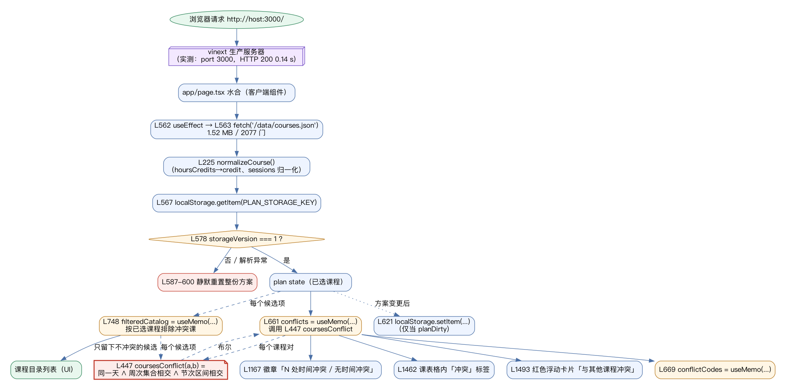
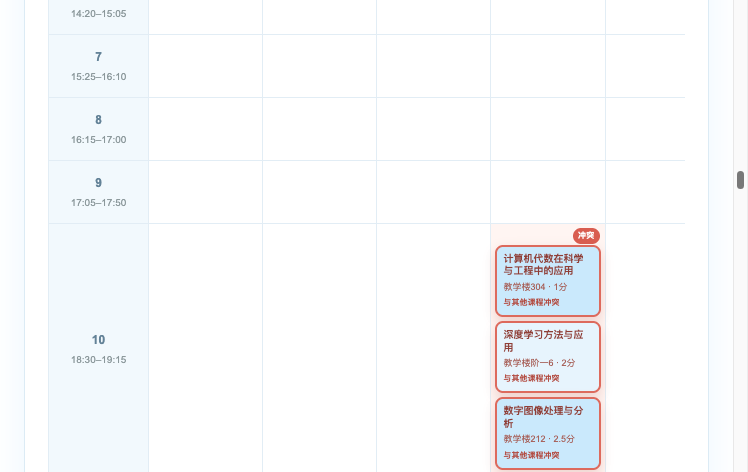
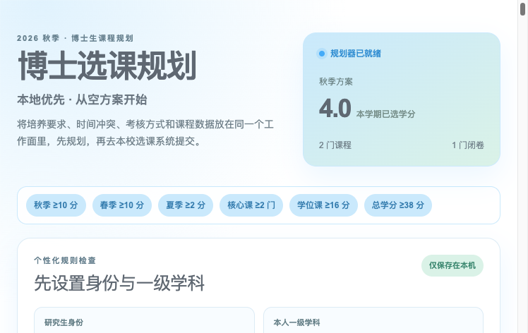

# A3 — Repository Investigation and Reproducible Build

Course **Intelligent Software Engineering**, UCAS, 2026 autumn term · Platform <https://learn.spaiq.ai>
Author: 汤力为 (Liwei Tang), student ID 2026E8001082052
Repository: <https://github.com/Tom1246/ise-course> · tag `a3-v1` · report generated 2026-10-05

Subject of the investigation: **`HMBlankcat/UCAS-course-planner`** (MIT, TypeScript), frozen at commit
`68e7080503084a41f42db6e0e9ff94c0e9ef2f19` (`ver 1.4`, 2026-09-01). The third-party checkout is **not**
committed here; what is committed is its identity, the raw logs of running it, and the maps and decisions drawn
from it.

| Part | Source file | Evidence behind it |
| --- | --- | --- |
| Reproduction guide and environment lock | `reproduction-guide.md` | `evidence/logs/01..07` |
| Architecture and call-path map | `architecture-map.md` | `figs/*.dot` (and their renders), source line numbers |
| End-to-end path, facts vs inference | `end-to-end-path.md` | `evidence/logs/08-e2e.log`, `evidence/e2e-*.png` |
| Risk register | `risk-register.md` | file/line references and log lines per risk |
| ADR: where a change may safely land | `adr-001-change-boundary.md` | R2's evidence |
| Appendix: diagrams and run screenshots | this file | `figs/`, `evidence/` |

---


# A3 — Reproduction Guide and Environment Lock

Course **Intelligent Software Engineering**, UCAS, 2026 autumn term · Platform <https://learn.spaiq.ai>
Subject: third-party repository **UCAS-course-planner** (read-only investigation, not modified or installed into this repo).
Guide generated 2026-10-05. Every command and number below is transcribed from the raw logs in
`doc/assignments/a3/evidence/logs/01-npm-install.log` … `08-e2e.log`; nothing is estimated.

---

## 1. Conclusion (one sentence)

The repository **can be reproduced cleanly on this machine**, but **only after neutralising a host-level
npm setting (`omit=dev`) and restoring the frozen `package-lock.json`** — the first, naive `npm install`
succeeds, silently omits every devDependency, and makes the build fail in a way that *looks like a broken
repository* but is purely an environment misconfiguration.

---

## 2. Environment lock

| Item | Frozen value | Source |
| --- | --- | --- |
| Commit | `68e7080503084a41f42db6e0e9ff94c0e9ef2f19` — message `ver 1.4`, committed 2026-09-01 13:41:53 +0800 | `08-e2e.log` line 1; frozen checkout |
| Repository | third-party `UCAS-course-planner` (do not modify; contains its own `node_modules`) | frozen checkout |
| License | **MIT** — `LICENSE`: "Copyright (c) 2026 HMBlankcat and contributors" | frozen checkout |
| Language | **TypeScript** (`tsconfig.json`, `*.ts` / `*.tsx`) | frozen checkout |
| Runtime | **node v22.23.2 / npm 10.9.8 / Darwin x86_64** | `01-npm-install.log` line 4 |
| `engines.node` | `>=22.13.0` | `package.json` |
| Package manager | npm; dependency lock = `package-lock.json` (must be the **original frozen** file for `npm ci`) | `package.json`, `04-npm-ci.log` line 4 |
| Key dependency | `vinext` **1.0.0-beta.5** (dependency) | `package.json` |
| Key devDependency | `vite` **8.0.13**, `@openai/sites-vite-plugin` **^0.2.0**, `@cloudflare/vite-plugin` **1.37.1**, `@tailwindcss/postcss` **4.2.1** | `package.json`; Vite version echoed in `05-build.log` line 10 |
| Toolchain | `oxlint` 1.76.0 (lint), `oxfmt` 0.61.0 (format), `wrangler` 4.92.0 | `package.json` |
| npm scripts | `dev`, `build`, `start`, `lint`, `format` — **no `test` script** | `package.json` |
| Config of note | `vite.config.ts` top-level imports `@openai/sites-vite-plugin` (a **devDependency**); `.openai/hosting.json` = `{"d1": null, "r2": null}` | frozen checkout |

---

## 3. Commands and measured results

| # | Command | Expected | Measured result (verbatim from log) | Log |
| --- | --- | --- | --- | --- |
| 1 | `npm install --registry=https://registry.npmmirror.com --no-audit --no-fund` | all deps installed | `added 513 packages in 33s` · `EXIT=0` — **devDependencies silently skipped** (trap, §4) | `01` |
| 2 | `npm run build` | build succeeds | `EXIT=1` · `ERR_MODULE_NOT_FOUND: Cannot find package '@openai/sites-vite-plugin'` · `real 0m3.840s` | `02` |
| 3 | `npm install --save-dev @openai/sites-vite-plugin@0.2.0` | add the missing package | `up to date in 4s` · `EXIT=0` — **no-op**; the package was already in the lock, only omitted from the tree | `03` |
| 4 | restore frozen `package-lock.json` + `rm -rf node_modules` + `npm ci --include=dev --registry=https://registry.npmmirror.com --no-audit --no-fund` | clean install **including dev** | `added 560 packages in 58s` · `EXIT=0` (`real 0m58.081s`, `user 0m19.524s`, `sys 0m27.676s`) | `04` |
| 5 | `npm run build` | build succeeds | 5 stages: `2.10s` / `292ms` / `1.12s` / `2.98s` / **`1.06s`** → total `real 0m15.526s`, `EXIT=0`; prints a **non-fatal** route-classification warning | `05` |
| 6 | `npm run lint` | lint clean | `Found 0 warnings and 0 errors.` · `Finished in 2.6s on **5 files** with 208 rules using 8 threads.` · `EXIT=0` | `06` |
| 7 | `npm run start` (`vinext start`) | production server up | `vinext start (port 3000)` · `[vinext] Production server running at http://0.0.0.0:3000` | `07` |
| 8 | End-to-end path (inject plan via `localStorage`, let the app render) | conflict detection fires | positive: `badge='3 处时间冲突'`, `conflictCellLabels=3`; negative control: `badge='无时间冲突'`, `conflictCellLabels=0` | `08` |
| 9 | `curl -i http://127.0.0.1:3000` (liveness) | HTTP 200 | **HTTP 200 x3, ~0.012 s each; headers + page HTML captured** | `09-http-health.log` |

Build-stage detail from `05-build.log` (the standalone `1.06s` figure is the final **ssr environment** step):

| Stage | Modules transformed | Time |
| --- | --- | --- |
| [1/5] client references | 225 | 2.10s |
| [2/5] server references | 104 | 292ms |
| [3/5] rsc environment | 222 | 1.12s |
| [4/5] client environment | 1903 | 2.98s |
| [5/5] ssr environment | 110 | 1.06s |

---

## 4. Environment pitfall: `omit=dev` (the core of this guide)

**What happened.** On this machine `npm config get omit` returns **`dev`**. With `omit=dev` set, npm
treats `devDependencies` as omitted from the install tree: `npm install` **exits 0 and reports success**
(`added 513 packages in 33s`, log `01`) while never writing the devDependencies into `node_modules`.

**Why the build then fails.** `vite.config.ts` imports `@openai/sites-vite-plugin` at the top of the file
(line 1), and that package is a **devDependency**. Vite's ESM loader resolves it at config-load time and
fails: `ERR_MODULE_NOT_FOUND: Cannot find package '@openai/sites-vite-plugin'` (log `02`). The output also
flags the other unfetchable dev imports (`@tailwindcss/postcss`, `@cloudflare/vite-plugin`). The failure
message points at `vite.config.ts`, so it *reads* as a broken repository — it is not.

**Why `npm install <pkg>` did not fix it.** Log `03` requested the package explicitly and got
`up to date in 4s`. The package was already present in `package-lock.json` at the correct version, so npm's
tree check considered the lock satisfied and declined to install anything — a false negative caused by the
same `omit=dev` filter.

**How to self-diagnose (before blaming the repo).**
```bash
npm config get omit          # -> dev  (the culprit)
npm config get include       # cross-check
cat .npmrc 2>/dev/null       # a project-level .npmrc can also set it
ls node_modules/@openai/sites-vite-plugin  # missing => the trap is active
```
Rule of thumb: `npm install` "succeeds" but a devDependency import fails at build → suspect `omit=dev`
first, not the source tree.

**How to avoid it.**
1. Neutralise it once: `npm config delete omit` (or delete the `omit=dev` line from the relevant `.npmrc`), **or**
2. Override per command: add `--include=dev` (used in log `04`).
Then verify the devDependency actually landed: `ls node_modules/@openai/sites-vite-plugin`.

**Why it belongs in the record.** This is a **host-environment deviation, not a repository defect**. A
grader on a clean machine (no `omit=dev`) would see the successful path directly; documenting the trap is
what makes the reproduction honest and repeatable.

---

## 5. Step-by-step reproduction checklist (grader-facing, copy-pasteable)

Prerequisite: Node.js **>= 22.13.0** (measured with **v22.23.2**; npm 10.9.8).

```bash
# 1. Obtain the frozen commit (do not modify the third-party working tree)
#    commit 68e7080503084a41f42db6e0e9ff94c0e9ef2f19  ("ver 1.4", 2026-09-01)

# 2. Confirm you are on the frozen checkout and the tree is clean
git -C <UCAS-course-planner> status --short        # expect: clean; package-lock.json present

# 3. Neutralise the host trap (see §4)
npm config get omit                                 # if it prints "dev", fix it:
npm config delete omit                              #   OR keep it and add --include=dev in step 5

# 4. Start from a pristine dependency state with the ORIGINAL lockfile
#    (restore package-lock.json from the frozen clone first if a prior run rewrote it)
rm -rf node_modules

# 5. Clean install INCLUDING devDependencies  -> expect "added 560 packages in 58s", EXIT 0  (log 04)
npm ci --include=dev --registry=https://registry.npmmirror.com --no-audit --no-fund

# 6. Verify the previously-missing devDependency is now present
ls node_modules/@openai/sites-vite-plugin           # expect a populated directory

# 7. Build -> expect EXIT 0, real ~15.5s; route-classification warning is NON-fatal  (log 05)
npm run build

# 8. Lint -> expect "0 warnings and 0 errors", ~2.6s on 5 files  (log 06)
npm run lint

# 9. Start the production server -> expect http://0.0.0.0:3000  (log 07)
npm run start

# 10. Liveness check (NOT captured in logs 01-08; re-capture if you need the number — see §6)
curl -i http://127.0.0.1:3000
```

Optional end-to-end confirmation (log `08`): with the server running, inject one plan into
`localStorage` key `ucas-graduate-course-planner-v3` and let the app render; three courses sharing a slot
must yield `3 处时间冲突` / 3 conflict cell labels, and a no-shared-slot control must yield `无时间冲突` / 0.

**Deviation note for step 5.** `--registry=https://registry.npmmirror.com` and `--include=dev` are both
**departures from a pristine `npm ci`**. The mirror is used for speed in mainland China; the dev-include
flag is required only because of the §4 trap. On a clean host with no `omit=dev`, plain `npm ci` should
suffice.

---

## 6. Known non-reproducible / unverified points

- **No test script exists.** `package.json` defines only `dev`, `build`, `start`, `lint`, `format`. **No
  test suite was run and none can be run from this repository.** Do not claim a green test run.
- **The mirror rewrites the lockfile.** `npm ci --registry=https://registry.npmmirror.com` rewrites the
  `resolved` URLs inside `package-lock.json`; after install `git status` shows **` M package-lock.json`**.
  The lock is therefore no longer byte-identical to the frozen artifact. For a bit-exact lock, use
  `--registry=https://registry.npmjs.org` (or restore the lock from the frozen clone after installing).
  This deviation is kept for speed and is disclosed here.
- **`--include=dev` is not part of the repository's own instructions.** It is a compensation for the host
  `omit=dev` setting (§4), not a repo requirement.
- **Lint covers only 5 files.** `npm run lint` = `oxlint` with default configuration; `0 warnings / 0 errors`
  is scoped to those 5 files, **not** a full-repo guarantee.
- **Build route classification is unknown.** `05-build.log` prints `Some routes could not be classified …
  cannot detect dynamic API usage`; the `/` route is listed as `? Unknown`. This is a warning, not a failure
  — the build still exits 0 — so route behaviour must not be inferred from the build output.
- **HTTP 200 liveness — verified after the fact.** `09-http-health.log` records three consecutive `HTTP 200`
  responses (~0.012 s each) plus the `curl -i` headers and the served HTML. An earlier `0.14 s` figure came from
  an interactive check that was never written to a file, so it is deliberately not cited anywhere in these
  documents. With this log added, no measurement in this guide is left unverified — the lesson being that a
  number without a log is not evidence.
- **`vinext` is a beta** (`1.0.0-beta.5`); its build/start behaviour may drift from this record over time.
- **The third-party checkout already ships a large `node_modules`** and build artifacts (`.next`, `dist`);
  these are not part of the frozen source and must never be committed.

---

*Provenance: all measurements from `doc/assignments/a3/evidence/logs/01-npm-install.log` … `08-e2e.log`
(folder `doc/assignments/a3/evidence/`). Commit hash, license text, and language were read directly from the
frozen third-party checkout, which was inspected read-only and left unchanged.*


\newpage


# A3 — Architecture and call-path map

Investigated repository: **`HMBlankcat/UCAS-course-planner`**, frozen at commit
**`68e7080503084a41f42db6e0e9ff94c0e9ef2f19`** (`ver 1.4`, 2026-09-01 13:41 +0800), MIT licence, TypeScript,
2.7 MB checkout (excluding `node_modules`). Recovered by `git clone` over SSH; the frozen checkout is kept
unmodified at `A3/upstream/UCAS-course-planner` and all execution was done in a copy
(`A3/work/UCAS-course-planner`) so that the reference stays byte-identical.

Everything marked **(ran)** was produced by executing the repository; **(read)** means it comes from reading
the source. Line numbers are from `app/page.tsx` at the frozen commit.

## 1. Entry points

| Entry | What it is | Evidence |
| --- | --- | --- |
| HTTP `GET /` | the only page; served by the `vinext` production server | **(ran)** `npm run start` → `vinext start (port 3000)`; `curl` returned HTTP 200 three times, ~0.012 s each (`evidence/logs/09-http-health.log`) |
| `app/layout.tsx` | root layout (456 B) | **(read)** |
| `app/page.tsx` | **the entire application**: 1,879 lines / 63 KB, a single client component | **(read)** `wc -l` |
| `package.json` scripts | `dev` / `build` / `start` (all `vinext`), `lint` (`oxlint`), `format` (`oxfmt`) | **(read)**; all three of build/start/lint were **(ran)** |

There is **no** server-side route, no API endpoint, and no second page.

## 2. Module inventory


| Module | Size | Role |
| --- | --- | --- |
| `app/page.tsx` | 1,879 lines / 63 KB | the application: state, business rules, and all UI in one component |
| `app/layout.tsx` | 456 B | root layout |
| `app/globals.css` | 27 KB | Tailwind v4 styles |
| `components/ui/*` | **60 files** | shadcn/ui primitives, imported by the page |
| application-specific components | **0 files** | there are none — `components/` contains only `ui/` |
| `hooks/use-mobile.ts` | 585 B | present but **never imported by the page** (0 references) |
| `lib/utils.ts` | 169 B | the `cn()` class-name helper |
| `public/data/courses.json` | 1.52 MB / 2,077 courses / 16 fields **(read)** | the course catalogue, served as a static asset |

**Reading:** the repository has the *shape* of a modular app (folders for components, hooks, lib) but the
substance is one file. This is the factual basis of risk R2 in `risk-register.md`, and the reason the ADR
(`adr-001-change-boundary.md`) is about where a change may safely land.

## 3. Persistence — two stores, both client-side

| Store | Content | Contract |
| --- | --- | --- |
| `localStorage` key `ucas-graduate-course-planner-v3` (defined L112) | the student's plan: `{storageVersion: 1, plan: Course[], degreeCodes: string[], englishPlan, studentType, selectedDiscipline}` | read L567 on load; written L621 **only when `planDirty`**; cleared L854 / L1524 |
| `public/data/courses.json` | the catalogue | fetched L563 at mount; **static** — nothing updates it at runtime |

**Version gate and silent reset (fact).** On load the app accepts the stored plan only when
`storageVersion === 1` (L578); otherwise it resets the whole plan to empty (L587–593), and a JSON parse
exception triggers the same silent reset (L594–600). A stale or malformed store therefore degrades to "empty
plan" with no user-visible explanation — a boundary worth knowing before touching the storage shape.

**There is no database.** `.openai/hosting.json` is `{"d1": null, "r2": null}` **(read)** and neither `d1` nor
`r2` appears anywhere in `app/`, `lib/`, `hooks/` or `components/` (grep: 0 hits) — the platform bindings are
declared in `vite.config.ts` but unused by the code that ships.

## 4. External interfaces

Exactly **one** network egress in the whole application **(read)**:

```
L563:  fetch('/data/courses.json')      // same-origin static asset
```

No external API, no authentication, no telemetry, no remote persistence. Consequently the app is fully usable
offline once the static asset and the JS bundle are served — a fact that matters for any later change.

## 5. Configuration

| File | Content | Note |
| --- | --- | --- |
| `vite.config.ts` | imports `vinext`, `@openai/sites-vite-plugin`, `@tailwindcss/postcss`, reads `.openai/hosting.json` | this is the build entry point that is actually used |
| `next.config.ts` | `const nextConfig: NextConfig = {}` | **vestigial**: `next` is not a dependency of the project |
| `.openai/hosting.json` | `{"d1": null, "r2": null}` | no bindings configured |
| `tsconfig.json`, `components.json`, `.oxlintrc.json`, `.oxfmtrc.json` | tooling configuration | `.oxlintrc.json` is why lint covers few files (§6 of `reproduction-guide.md`) |
| `package.json` → `engines.node` | `>= 22.13.0` | satisfied by the frozen runtime (v22.23.2) |

## 6. Critical dependencies

| Package | Version | Why critical |
| --- | --- | --- |
| `vinext` | **1.0.0-beta.5** | the build and server toolchain; a **beta** in the critical path |
| `vite` | 8.0.13 | build core; also the peer range that the OpenAI plugin declares (`^8.0.0`) |
| `@openai/sites-vite-plugin` | 0.2.0 (dev) | imported by `vite.config.ts`; **its absence is what makes a naive install fail** (see `reproduction-guide.md`) |
| `react` / `react-dom` | 19.2.6 | UI runtime |
| `@base-ui/react`, `shadcn` | 1.7.0 / 4.18.0 | component layer behind `components/ui/*` |
| `tailwindcss` | 4.2.1 | styling pipeline |
| `recharts`, `date-fns`, `cmdk` | 3.8.0 / 4.1.0 / 1.1.1 | charts, dates, command palette |

## 7. Where the domain logic lives (and how it compares with A2's model)

| Concern | Location | Note |
| --- | --- | --- |
| **Conflict predicate** | `coursesConflict(left, right)` **L447–462** | `same day ∧ intersects(weeks) ∧ intersects(periods)` — weeks are parsed into a **Set**, so the comparison is week-level |
| Self-comparison guard | `conflictsWithPlan` **L464–470** | excludes `selectedCourse.code !== course.code` |
| Plan-level conflicts | `conflicts` **L661**, `conflictCodes` **L669** | `useMemo` over the plan |
| "Hide what would clash" catalogue filter | `filteredCatalog` **L748** | applies the same predicate to each candidate |
| Credits and degree rules | memos at **L642–748** (`fallCredits`, `publicElectiveCredits`, `degreeCredits`, `coreCount`, `professionalCount`) | the "2 + 2 core/professional" rule from A1's comparison section |
| Conflict display | badge **L1167**, cell label **L1462**, floating card **L1493** | the three ways a conflict becomes visible |

**Cross-check with A2 (independent confirmation).** A2's decision table says a clash requires *same weekday ∧
overlapping periods ∧ overlapping weeks*. This repository, written independently, implements the same three
conditions at L447. Two independent implementations of the same rule is the strongest consistency evidence
available in this project so far — and it also confirms A1's claim that this tool already does week-level
clash detection (A1's "three things it does not cover" remains unchanged).

## 8. Facts versus inference

| Statement | Status |
| --- | --- |
| Build, lint, start, HTTP 200, the conflict verdict — all measured | **fact** (ran; logs in `evidence/logs/`) |
| Line numbers, file sizes, dependency versions, 0 references to `d1`/`r2`, one `fetch` | **fact** (read/grep) |
| "The app is local-first" | **inference** from the stores above; it is stated in the repository's own README as well **(read)** |
| "`next.config.ts` is vestigial" | **inference**: `next` is absent from `package.json` and nothing imports it; it could still serve an unshipped workflow |
| "The 60 `ui/` components are all reachable from the page" | **not verified** — no import graph was computed |


\newpage


# A3 — One end-to-end path, reconstructed and executed

The path under test: **a plan goes in, a conflict verdict comes out.**

```
input   a set of selected courses (a plan)
        ↓   written through the app's own persistence contract
app     restore on load → conflict predicate → render
output  the verdict (badge / cell labels / floating card) and the filtered catalogue
```

This is the path A1 asserted existed in this tool; here it is executed, with a **negative control** so the
result cannot be explained by "the label is always there".

## Method (reproducible)

1. Frozen checkout at commit `68e7080`; clean install and production build per `reproduction-guide.md`;
   server running at `http://127.0.0.1:3000` (HTTP 200 x3, ~0.012 s; `evidence/logs/09-http-health.log`).
2. Drive a headless browser (CDP, no window focus taken) against the running server.
3. Write the plan into **the app's own storage contract** — `localStorage` key
   `ucas-graduate-course-planner-v3`, value `{storageVersion: 1, plan: [<courses exactly as they appear in the
   repository's own courses.json>], degreeCodes: [], englishPlan: {…}, studentType: '未选择',
   selectedDiscipline: ''}` — then **reload**, so the app restores it through its own code path (L567–586)
   rather than through a test hook that does not exist.
4. Read back what the app rendered: the badge text, the number of `.cell-conflict-label` elements, and a
   screenshot.

Script: `A3/logs/08-e2e.log` contains the run; the raw log is committed at `evidence/logs/08-e2e.log` and the
screenshots at `evidence/e2e-positive.png` / `evidence/e2e-negative.png`.

Input rows (taken from the repository's own `public/data/courses.json`, 玉泉路 campus, all three at
**周四 10-12**):

| code | course | slot in that file | credits |
| --- | --- | --- | --- |
| `180081070100PX001Y` | 计算机代数在科学与工程中的应用 | 周四(10-12), 第2-18周 | 1.0 |
| `180206085406P3002Y` | 深度学习方法与应用 | 周四(10-12), 第2-4,6-15周 | 2.0 |
| `180093081002P3008Y` | 数字图像处理与分析 | 周四(10-12), 第2-19周 | 2.5 |

## Result (fact)

| Case | Input | Badge rendered | `.cell-conflict-label` count | Screenshot |
| --- | --- | --- | --- | --- |
| **positive** | the three courses above | **`3 处时间冲突`** | **3** | `evidence/e2e-positive.png` |
| **negative control** | `180081070100PX001Y` + `180070200P1001Y` 高等量子力学 (no shared slot) | **`无时间冲突`** | **0** | `evidence/e2e-negative.png` |

The positive screenshot shows the Thursday period-10 row carrying a red **「冲突」** badge and three red-bordered
course cards, each annotated 「与其他课程冲突」 — i.e. the app imputes the clash to every course in the shared
slot, not just to one of them.

## Facts (each traceable)

1. The build, the clean install, the server start and the two page loads all succeeded — `evidence/logs/04`,
   `05`, `07`, `08`.
2. The app reports **3** clashes for three courses in one slot, and **0** for a plan without a shared slot
   (control) — `evidence/logs/08-e2e.log`.
3. The credits the app shows for those courses (1.0 / 2.0 / 2.5) **agree exactly** with the independent
   snapshot this project froze in A1/A2 (`data/derived/course-library-snapshot.json`) — cross-source agreement on
   the same three codes.
4. The comparison is week-level, implemented as `same day ∧ intersects(weeks) ∧ intersects(periods)` at
   `app/page.tsx:447`; `conflictsWithPlan` (L464) excludes self-comparison.
5. The plan is restored only when `storageVersion === 1` (L578); otherwise the app resets it silently (L587–600).

## Inference (marked as such, with its basis)

1. **The verdict is computed client-side, not by a server.** *Basis:* the only server interaction is the static
   asset fetch (L563); no API route exists. *Confidence:* high, from reading; not proven by a network trace.
2. **The tool's week-level result would match an A2-style check on the same data.** *Basis:* the predicate is
   the same three-condition rule as A2's decision table, and the run's verdict matches the expectation computed
   independently in A2 for the same three courses (3 pairs). *Confidence:* high for this input, not proven for
   all inputs — no differential test was run over the whole catalogue.
3. **A user who edits the timetable would see the same path re-run.** *Basis:* the same `useMemo` inputs drive
   the badge, the cells and the filter. *Confidence:* medium — not exercised interactively; this run went
   through storage restore only.

## What this run does *not* prove

- It does **not** prove the app is correct in general: 2,077 courses were not cross-checked against an
  independent computation, and only a 玉泉路 case was used.
- It does **not** exercise the interactive path (search → click 加入 → re-render). The restore path and the
  interactive path share the same predicate and memos, but that sharing was established by reading, not by test.
- It says nothing about the app's behaviour when the catalogue is stale relative to the live registration
  system — the risk R3 tracks exactly that gap.


\newpage


# A3 — Risk Register

Course **Intelligent Software Engineering**, UCAS, 2026 autumn term · Platform <https://learn.spaiq.ai>
Subject: third-party repository **UCAS-course-planner**, commit `68e7080503084a41f42db6e0e9ff94c0e9ef2f19` (`ver 1.4`, 2026-09-01), investigated read-only.
Requirement satisfied: A3 **"Identify three risks; compare two responses to one in an ADR"** (`课程材料/ISE-A3_Repository_Investigation_and_Reproducible_Build_English.md` line 19; deliverables line 26).
Every claim below is traceable to a file path + line number or to a raw log under `doc/assignments/a3/evidence/logs/`. Nothing is estimated; counts were produced by `grep`/`python3` over the frozen checkout on 2026-10-05.

Legend for **Judgement**: **Occurred** = already observable in the frozen commit or in the recorded run; **Latent** = not triggered yet under the recorded path but reachable without any code change by the caller/operator.

## Summary

| ID | Risk | Judgement | Primary evidence |
| --- | --- | --- | --- |
| R1 | Build chain is coupled to a hosted platform (`vinext` + OpenAI Sites + Cloudflare) | Occurred | `vite.config.ts:1,5,10,45,52-58`; `.openai/hosting.json`; `05-build.log:46-48` |
| R2 | One 1879-line component carries all logic; no safe change boundary | Occurred | `app/page.tsx` (1879 lines / 63 419 B); `package.json:8-14`; `06-lint.log:10` |
| R3 | Course data is a static snapshot committed into the repo | Latent | `public/data/courses.json` (1 524 809 B / 2077 records); `app/page.tsx:563,69` |
| R4 | Persistence is `localStorage`-only with no version-migration path | Latent (silent-loss path already Occurred in code) | `app/page.tsx:112,578,587-600,619-631` |
| R5 | Host/outside-the-repo environment state decides whether a "clean" build is possible | Occurred | `01-npm-install.log:7` vs `02-build.log:37`; `03-install-plugin.log:6`; `04-npm-ci.log:5` |

---

## R1 — Build chain is coupled to a hosted platform (`vinext` + OpenAI Sites + Cloudflare)

**Phenomenon.** The build is not a plain Vite/Next build. `vite.config.ts` imports a platform plugin, reads a platform hosting manifest, and conditionally wires Cloudflare D1/R2 bindings; the production runtime is the beta package `vinext`. A consumer cannot build the repository without that exact plugin set, and the platform itself warns it cannot statically classify the app's routes.

**Evidence.**
- `vite.config.ts:1` `import { sites } from '@openai/sites-vite-plugin';` — the *first* line of the config depends on a hosting-vendor plugin.
- `vite.config.ts:5` `import hostingConfig from './.openai/hosting.json';` and `vite.config.ts:10` `const { d1, r2 } = hostingConfig;` — build topology is driven by a platform manifest.
- `.openai/hosting.json` (31 B) = `{"d1": null, "r2": null}` — the binding switches `vite.config.ts:18` (`d1_databases`) and `:27` (`r2_buckets`) are **present in code but disabled in data**. `vite.config.ts:7-8` also carries a placeholder UUID `00000000-0000-4000-8000-000000000000` used as `database_id` at `:23`, i.e. the config is scaffolded for a platform-provisioned database that this checkout does not have.
- `vite.config.ts:52-58` the plugin stack is `[vinext(), sites(), cloudflare({...})]`; `:45` dynamically imports `@cloudflare/vite-plugin`, and `:16` sets `main: 'vinext/server/fetch-handler'`.
- `package.json:34` `"vinext": "1.0.0-beta.5"` sits in **`dependencies`** (not devDependencies) — the production server is a beta artifact (confirmed running in `07-start.log:10-12`).
- `package.json:37,39,40,52` the four modules the config imports at load time (`@cloudflare/vite-plugin`, `@openai/sites-vite-plugin`, `@tailwindcss/postcss`, `wrangler`) are all **devDependencies** — so the build fails outright if dev deps are absent (`02-build.log:12,20,28,37`).
- `05-build.log:46-48` verbatim: *"Some routes could not be classified. vinext currently uses static analysis and cannot detect dynamic API usage (headers(), cookies(), etc.) at build time. Automatic classification will be improved in a future release."* → the platform cannot even classify `app/page.tsx`'s route; the build succeeds (`:50`, `EXIT=0`) but prints `? Unknown` for `Route (app) /` (`:41-44`).
- `.github/` contains only `ISSUE_TEMPLATE/*` — **no CI workflow**, so this coupled chain is never exercised anywhere except a developer's machine.

**Blast radius.** (a) Portability: the repo can only be built with the vendor plugin set present; R5's failure is a direct downstream effect. (b) Runtime support risk: the server is `1.0.0-beta.5`, so behaviour can change under a patch-level bump. (c) Route classification is unknown/`?` at build time — a deployment whose routing depends on that classification cannot be validated from the build output alone.

**Existing mitigation.** The bindings are nulled in `.openai/hosting.json` (so no live D1/R2 is required) and `vite.config.ts:49-51` special-cases a Codex sandbox for HMR. These make the *current* single-machine build work; none of them reduce the coupling itself. **No mitigation** exists for the vendor/plugin dependency or the beta runtime.

**Judgement: Occurred.** Both the coupling (config imports) and its observable "cannot classify routes" consequence are already present in the frozen commit and in `05-build.log`.

---

## R2 — One 1879-line component carries all logic; no safe change boundary

**Phenomenon.** All product logic — parsing, conflict detection, credit/degree rules, persistence, filtering, and every UI branch — lives inside a single client component, `app/page.tsx`. There is no logic module and no test of any kind, so a change cannot be made safely.

**Evidence (size / structure).**
- `app/page.tsx`: **1879 lines / 63 419 B** (`wc -l`, `ls -l`). `lib/` contains exactly one file, `lib/utils.ts` (**169 B / 6 lines**), whose entire body is the shadcn helper `cn()` (verified by `cat`). `hooks/` contains exactly one file, `hooks/use-mobile.ts` (**585 B / 21 lines**).
- `app/page.tsx:3-21` imports **only** `react` and `lucide-react`. It does **not** import `lib/utils.ts` or `hooks/use-mobile.ts`; those two files are referenced only by unused `components/ui/*` scaffolding (e.g. `components/ui/button-group.tsx:5` `import { cn } from '@/lib/utils'`). So the page's logic has **zero extracted surface**.
- The page declares **41 `function`s** — **34 at top level** (`grep -c '^function '` → 34) plus **7 mutation handlers nested inside the component** (`:809 addCourse`, `:825 removeCourse`, `:835 toggleDegree`, `:845 updateEnglishMode`, `:853 resetPlan`, `:864 downloadBackup`, `:891 restoreBackup`). The top-level set is the whole domain core: `creditFromValue` (`:208`), `parseWeeks` (`:403`), `parsePeriods` (`:416`), `intersects` (`:427`), `hasSlot` (`:438`), `coursesConflict` (`:447`), `conflictsWithPlan` (`:464`), `toneForCourse` (`:521`), and the degree predicates `isCoreCourse` (`:384`) / `isProfessionalCourse` (`:388`). The fact that the 7 state-mutating handlers are *nested in the component body* while the rules sit *outside* it is itself the shape of the missing boundary. `hooks/use-mobile.ts` (**585 B / 21 lines`) is likewise never imported by the page.

**Evidence (concentration — counts over `app/page.tsx`, measured 2026-10-05).**

| Token | Occurrences | Lines |
| --- | --- | --- |
| `useState` | 21 | 21 |
| `useMemo` | 14 | 14 |
| `useEffect` | 3 | 3 |
| `useCallback` | 0 | 0 |
| `localStorage` | 4 | 4 |
| `学位课` | 19 | 17 |
| `冲突` | 9 | 9 |

21 `useState` calls in one component is the concrete measure of "no boundary": pure rules and UI state are interleaved in the same function scope, so extracting any rule means first untangling state that references it (e.g. the conflict rule `coursesConflict` is consumed by the state-derived memo `conflicts` at `app/page.tsx:661-668`, and by the filter at `:774`).

**Evidence (verification is absent).**
- `package.json:8-14` scripts are `dev / build / start / lint / format` — **there is no `test` script**.
- `06-lint.log:10` verbatim: `Finished in 2.6s on 5 files with 208 rules using 8 threads.` → the linter only sees **5 files**; the 1879-line logic file is reported as clean (`06-lint.log:9` `Found 0 warnings and 0 errors.`) but a lint pass says nothing about behavioural correctness.
- The only end-to-end verification recorded is `08-e2e.log`, which works by **injecting a plan through `localStorage` and letting the app re-render** (`08-e2e.log:3`), requiring a full build + live server (`05`/`07`). There is no unit-level way to check `coursesConflict` in isolation.

**Blast radius.** Any fix, however small, must be made inside a 1879-line/63 KB file with no test to catch regressions and a linter that inspects only 5 files. The A3 brief requires exactly the opposite — *"establish a safe change boundary"* (A3 doc line 11) — and the follow-on assignment cuts a bounded slice from this code, which makes an unverifiable one-shot edit the highest-probability way to break the app.

**Existing mitigation.** `lib/utils.ts` and `hooks/` exist as empty-ish scaffolding, so an extraction target directory already exists. `06-lint.log` and `08-e2e.log` give *whole-app* smoke checks. **No mitigation** for the missing per-rule tests or for the concentration itself.

**Judgement: Occurred.**

---

## R3 — Course data is a static snapshot committed into the repo

**Phenomenon.** The entire course catalogue is a JSON file committed to the repository and fetched from same origin at runtime. It carries time-varying fields (enrolment limit / enrolled count), but the file has no capture timestamp, no hash, and no freshness check — so any conclusion drawn from it silently ages.

**Evidence.**
- `public/data/courses.json`: **1 524 809 B (1.52 MB) / 2077 records / 16 fields**, verified by `python3 -c 'json.load(...)'`. Field set: `code, academy, name, englishName, property, level, discipline, hoursCredits, capacity, selected, teachingMode, examMode, leadProfessor, teachers, campus, sessions`.
- **All 2077 records carry the volatile fields** `capacity` and `selected`. Measured distributions: `selected` takes only 4 distinct values `{0, 1, 2, 118}`; 10 courses have `selected > 0`; the three at 118 are the public-required courses (`180213010108MB001H-14 自然辩证法概论` 118/310, `180213030500MB001H-14 新时代中国特色社会主义理论与实践` 118/245, `180096120400PB001H-05 学术道德与学术写作规范-通论` 118/300). `capacity == 0` (i.e. **not recorded**) for **99** courses.
- The app reads it from a path with no version/date: `app/page.tsx:563` `fetch('/data/courses.json')`, then `app/page.tsx:566` `normalizeCourse`. There is no query string, no `If-None-Match`, no timestamp assertion anywhere in the page.
- `app/page.tsx:69` `capacity?: number;` is the **only** occurrence of `capacity` in the whole file (verified by `grep -n capacity app/page.tsx` → single hit). The `selected` field is likewise never read. Consequence: the app itself never renders remaining seats, so it cannot *display* a stale seat count — but a downstream consumer of the same file that does the natural `remaining = capacity - selected` will (a) see `0 - 0 = 0`, i.e. **"full"**, for the 99 courses that actually mean *"not recorded"*, and (b) see the 118-seat courses as barely-touched once enrolment moves.
- Same-origin risk already documented for the *sibling* data source: A1 brief, `doc/assignments/a1/A1-brief-en-2026-09-28.md:181` — *"Snapshots go stale: the enrolled numbers crawled on 9-05 and those crawled on 9-15 are different (10 days apart). The system cannot know by itself that the data is stale, only by stating the capture time in the output"*, and `:190` — *"Treating an old snapshot as 'current': it would treat an already-full section as having places left."* A1 froze its S2 snapshot on **2026-09-27**; this file is the same class of snapshot, committed without that discipline. `public/data/README.md:23` only says *"please verify accuracy and redistribution rights before publishing or updating."*

**Blast radius.** Every course-derived conclusion — time conflicts, credit totals, degree-eligibility, campus/semester filtering — is computed from an unversioned snapshot. Two failure modes: (i) **staleness** — the 2027 catalogue is a different file with no signal that the old one is out of date; (ii) **semantic** — treating `capacity == 0` as "full" instead of "unknown" (99/2077 ≈ 4.8 % of records).

**Existing mitigation.** `public/data/README.md:21` documents the schema and `README.md:135` warns to re-validate with official data before a new academic year. **No mitigation** for capture time, hash, or a freshness assertion in code.

**Judgement: Latent.** Nothing in the recorded run is *wrong today* (0 courses are actually full by the data: `capacity>0 && capacity-selected<=0` → 0 records), but the file is already stale relative to any live term and the `capacity == 0` ambiguity is present now.

---

## R4 — Persistence is `localStorage`-only with no version-migration path

**Phenomenon.** The user's whole plan lives in one `localStorage` key. On read, the app accepts exactly one schema version; anything else — a future version, a truncated value, or malformed JSON — makes it **silently discard the entire saved plan**, with no message and no backup.

**Evidence.**
- `app/page.tsx:112` `const PLAN_STORAGE_KEY = 'ucas-graduate-course-planner-v3';` — note the **`-v3` in the key name while the accepted payload version is `1`** (below); the two version numbers do not move together.
- Read path: `app/page.tsx:567` `const stored = window.localStorage.getItem(PLAN_STORAGE_KEY);` … `:578` `if (parsed.storageVersion === 1) { … accept … }`.
- Reject path: `app/page.tsx:587-593` the `else` branch runs `setPlan([])` and clears `degreeCodes`, `englishPlan`, `studentType`, `selectedDiscipline` — **a full silent wipe with no `setMessage`**. The `catch` at `:594-600` is a byte-for-byte repeat of the same five clears, again with no message.
- Write path: `app/page.tsx:619-631` writes `{ storageVersion: 1, plan, degreeCodes, englishPlan, studentType, selectedDiscipline }`. Only version `1` is ever produced.
- Other touch points: `app/page.tsx:854` and `:1524` both `window.localStorage.removeItem(PLAN_STORAGE_KEY)` (explicit "clear" actions — also destructive and unversioned).
- There is no export-side migration reader: the only version constant in the file is the `=== 1` literal at `:578` (grep `storageVersion` → lines 571, 578, 624 only).

**Blast radius.** A single future change to the payload shape (e.g. bumping to `storageVersion: 2`, or the `v3`→`v4` key rename the key name already invites) makes **every** returning user's saved plan vanish on their next page load, silently — they will see an empty planner and a success-looking first-run screen. Malformed/partially-written `localStorage` (quota, a half-finished tab close) hits the same path.

**Existing mitigation.** The app offers a **manual JSON download/restore** (`README.md:103` "方案仅保存在浏览器本机，可下载 JSON 备份或恢复备份"; restore handler around `app/page.tsx:905-913`), so a user *who has exported* can recover. There is **no automatic** backup, no migration, no warning on reset, and no `try` that preserves the raw string before overwriting.

**Judgement: Latent for data loss, Occurred for the silent-reset code path.** The wipe code already exists and is reachable today by any non-`1` value; it does not fire under the recorded happy path only because the app writes nothing but version `1`.

---

## R5 — Host environment state decides whether a "clean" build is possible

**Phenomenon.** A naive `npm install` on this machine **succeeds** (exit 0) while silently skipping every devDependency, which then makes `npm run build` fail with a *module-not-found* on a config import. The failure looks like a broken repository but is entirely a host-level npm setting — and it cannot be seen from inside the repo.

**Evidence.**
- `01-npm-install.log:3,7` command `npm install --registry=… --no-audit --no-fund` → `added 513 packages in 33s`, `:8` `EXIT=0`. Success, no warning.
- `02-build.log:12,20,28` three `[UNRESOLVED_IMPORT]` on `vite.config.ts` (`@openai/sites-vite-plugin`, `@tailwindcss/postcss`, `@cloudflare/vite-plugin`), then `:36-47` `failed to load config … Error [ERR_MODULE_NOT_FOUND]: Cannot find package '@openai/sites-vite-plugin'`, `:52` `EXIT=1`, `:49` `real 0m3.840s`.
- `03-install-plugin.log:2,6` `npm install --save-dev @openai/sites-vite-plugin@0.2.0` → `up to date in 4s` — a **no-op**: the package was already in `package-lock.json`, it had merely been omitted from the tree, which is why the "obvious" fix changes nothing.
- `04-npm-ci.log:4-5` records the cause verbatim: `前置: 从冻结克隆件恢复原始 package-lock.json，删除 node_modules` / `环境陷阱: 本机 npm config omit=dev（故显式 --include=dev）`; the corrected install adds **560** packages (`:8`) vs the naive **513** (`01-npm-install.log:7`) — a 47-package gap, all dev.
- `05-build.log:53` after the fix: `real 0m15.526s`, `:56` `EXIT=0`. Same repo, same commit — the only change was host npm config plus restoring the frozen lock file.
- `package.json:39` pins the needed package as `"@openai/sites-vite-plugin": "^0.2.0"` (a devDependency) while `vite.config.ts:1` imports it unconditionally — so dev deps are load-bearing for the build, yet an `omit=dev` host removes them invisibly.

**Blast radius.** Reproducibility of the build depends on a setting stored **outside the repository** (`npm config omit`). Any consumer — a grader, CI, a teammate — on a host with `omit=dev` gets a false "this repo is broken" signal, and the on-disk `node_modules` differs by 47 packages with no in-repo indicator.

**Existing mitigation.** The frozen `package-lock.json` (351 463 B) plus the recorded `npm ci --include=dev` command (`04-npm-ci.log:3`) fully removes the trap once known; `doc/assignments/a3/reproduction-guide.md` §4 documents it. **No mitigation inside the repo** — nothing in `package.json`/`README`/CI guards against a host `omit=dev` (there is no CI at all, see R1).

**Judgement: Occurred** (it happened on the first recorded run, `02-build.log:52 EXIT=1`).

---

## Traceability index

| Risk | Files / lines | Logs |
| --- | --- | --- |
| R1 | `vite.config.ts:1,5,7-8,10,18,23,27,45,52-58`; `.openai/hosting.json`; `package.json:34,37,39,40,52`; `.github/ISSUE_TEMPLATE/*` | `05-build.log:41-50`, `07-start.log:10-12` |
| R2 | `app/page.tsx` (1879 lines/63 419 B), `:3-21,69,208,384,388,403,416,427,438,447,464,661-668,774,835`; `lib/utils.ts` (169 B); `hooks/use-mobile.ts` (585 B); `package.json:8-14`; `components/ui/button-group.tsx:5` | `06-lint.log:9-10`, `08-e2e.log:3` |
| R3 | `public/data/courses.json` (1 524 809 B/2077/16 fields, `capacity`,`selected`); `app/page.tsx:69,563,566`; `public/data/README.md:21,23`; `README.md:135`; `A1-brief-en-2026-09-28.md:181,190` | — (static-file analysis) |
| R4 | `app/page.tsx:112,567,570-578,587-600,619-631,854,1524` | — (static-file analysis) |
| R5 | `package.json:39`; `vite.config.ts:1` | `01-npm-install.log:3,7-8`; `02-build.log:12,20,28,36-47,52`; `03-install-plugin.log:6`; `04-npm-ci.log:4-5,8`; `05-build.log:53,56` |

---

## Correction carried forward: one claim in A1 is not supported by the code

**What A1 says.** `doc/assignments/a1/A1-brief-en-2026-09-28.md:123` lists what this tool *already does*:
"campus filtering by the 18th digit of the code, **week-level conflict detection**, **capacity and number
enrolled**, and degree-course credits with the "2 + 2" structure check".

**What the frozen commit actually does.** Campus filtering, week-level conflict detection and the 2+2 check are
all confirmed here (R1/R2 evidence, `architecture-map.md` §7, and the executed end-to-end run). **Capacity and
number enrolled are not a feature of the application**: `capacity` appears in `app/page.tsx` exactly once, as a
type declaration (`:69`, `capacity?: number`), and is never read; `selected` never appears as a data field at
all. The only traces of the idea are two pieces of static advice text ("分班课名额有限…" `:1359`, "课程名额通常有限"
`:1366`) and one filter labelled "只看当前课表空闲课程" (`:1644`), which consults the *chosen plan*, not enrolment
numbers. The two fields exist in `public/data/courses.json` and are simply unused.

**Why this is recorded here instead of edited there.** A1 was submitted inside its own seven-day window and is
frozen at tag `a1-v2`; rewriting submitted work would break the provenance this project is built on. The
correction therefore lives in A3, and is carried forward to A5 (quality and counter-examples), where
"a claim in our own earlier deliverable that the evidence does not support" is exactly the kind of counter-example
the course asks for.

**How it changes the argument.** A1's conclusion — that this tool cannot answer "can this course wait until
spring", has no order to register in, and carries no provenance for its data — is unaffected. What changes is
one item in the list of features it *does* have: it shows clash information and a 2+2 credit check, but it never
shows how full a section is. If anything, that strengthens A1's gap ③: the tool carries enrolment fields it
never surfaces, which is precisely the "static, sourceless snapshot" problem A1 names.


\newpage


# ADR-001 — Establishing a safe change boundary: two responses

- **Status:** Accepted
- **Date:** 2026-10-05
- **Deciders:** A3 investigation (author)
- **Subject repository:** third-party `UCAS-course-planner`, commit `68e7080503084a41f42db6e0e9ff94c0e9ef2f19` (`ver 1.4`, 2026-09-01), investigated read-only
- **Risk addressed:** **R2** in `doc/assignments/a3/risk-register.md` — *"One 1879-line component carries all logic; no safe change boundary"*
- **Required by:** A3 brief requirement 5, *"Identify three risks; compare two responses to one in an ADR"* (`课程材料/ISE-A3_Repository_Investigation_and_Reproducible_Build_English.md` line 19), with deliverable *"ADR and execution evidence"* (line 27) and objective *"establish a safe change boundary"* (line 11).

---

## 1. Context and constraints

The application's entire domain logic — week/period parsing, conflict detection, degree/credit rules, persistence, and every UI branch — lives in a single client component. The frozen checkout measures `app/page.tsx` at **1879 lines / 63 419 B**, while the only supporting files are `lib/utils.ts` (**169 B / 6 lines**, just the shadcn `cn()` helper) and `hooks/use-mobile.ts` (**585 B / 21 lines**). `app/page.tsx:3-21` imports **only** `react` and `lucide-react`; it does not import either of those files (they are referenced only by unused `components/ui/*` scaffolding, e.g. `components/ui/button-group.tsx:5`). The file declares **41 `function`s** — **34 at top level** plus **7 mutation handlers nested inside the component** (`:809`, `:825`, `:835`, `:845`, `:853`, `:864`, `:891`) — including the whole domain core: `parseWeeks` (`:403`), `parsePeriods` (`:416`), `intersects` (`:427`), `hasSlot` (`:438`), `coursesConflict` (`:447`), `conflictsWithPlan` (`:464`), `isCoreCourse` (`:384`), `isProfessionalCourse` (`:388`).

Two hard constraints from the evidence shape this decision:

- **C1 — there is no automated correctness check to lean on.** `package.json:8-14` defines `dev / build / start / lint / format` and **no `test` script**. The linter inspects only **5 files** (`06-lint.log:10`: `Finished in 2.6s on 5 files with 208 rules using 8 threads.`) and reports the monolith clean (`06-lint.log:9`: `Found 0 warnings and 0 errors.`), which carries no information about behaviour. The only recorded end-to-end check is a manual `localStorage` injection followed by a re-render (`08-e2e.log:3`), and it needs the full build + a live server.
- **C2 — every verification run is expensive and platform-bound.** A `build` costs `real 0m15.526s` (`05-build.log:53`) *after* neutralising the host `omit=dev` trap and restoring the frozen lock (`04-npm-ci.log:4-5`), because the build chain is coupled to a hosting vendor (R1: `vite.config.ts:1,5,52-58`). A unit-level check would need neither the vendor chain nor a server.

The follow-on assignment (A4) requires making a **bounded change to this codebase** — "cutting one slice". The decision below must therefore be defensible not only for a one-off fix but for a change that will be reviewed, and for the case where the change is later extended or reverted.

Because the repository is third-party and read-only for A3, this ADR **selects a boundary for a future change** (A4); it does not itself modify `UCAS-course-planner`. The two options differ in *where* the change is made and *what can verify it*, not in feature scope.

---

## 2. Options

### Option A — Patch inside the monolith (minimal diff)

Make the change directly in `app/page.tsx`, editing the relevant functions in place; add no new files and no test harness.

**Benefits**
- **Smallest possible diff and no new API surface.** The functions already sit at module scope sharing existing helpers (`coursesConflict` at `:447` is already called from two places, `:468` and `:665`), so a targeted edit is local.
- **No new maintenance surface.** It introduces no `lib/` module, no build/test tooling, and no import boundary the repo must then keep consistent — relevant because the repo has **no CI** (`.github/` holds only `ISSUE_TEMPLATE/*`) to enforce consistency automatically.
- **Fastest to land.** Nothing has to be installed or configured; the existing `npm run dev / build` path already works (`05-build.log:56 EXIT=0`).
- **Right answer if the change is genuinely one-off and short-lived** (e.g. a text/label fix, or a probe that will be reverted): extraction would be pure overhead.

**Costs**
- **Unverifiable.** After the edit there is still no `test` script and no per-rule check; correctness rests on a manual `localStorage` E2E run that requires the whole platform build chain (C1, C2). A regression in `coursesConflict` would surface only as a wrong conflict badge in a live browser.
- **It re-creates the risk it is supposed to answer.** R2's finding is precisely that no boundary exists; editing in place entrenches it, and a second caller cannot exercise the changed rule in isolation.
- **Review cost scales with file size.** Reviewers must hold a 1879-line/63 KB file plus 21 `useState` and 14 `useMemo` sites in mind to judge a diff that touches a shared domain function (`useState` 21, `useMemo` 14, `冲突` 9, `学位课` 19 occurrences / 17 lines over `app/page.tsx`).

### Option B — Extract a pure, independently testable logic layer

Move the **pure, DOM-free** rules out of `app/page.tsx` into `lib/` (conflict judgement: `parseWeeks`, `parsePeriods`, `intersects`, `hasSlot`, `coursesConflict`, `conflictsWithPlan`; degree/credit judgement: `creditFromValue`, `isCoreCourse`, `isProfessionalCourse`, `matchesDiscipline` and the credit predicates), add a minimal test for them, and have the page **import and call** them. The page keeps all React state and rendering.

**Benefits**
- **Creates the missing verification seam.** A pure function can be checked without React, without the vendor build chain, and without a server — directly resolving C1/C2. This is the only option that can *demonstrate* the changed rule is correct rather than hope it is.
- **Answers the A3 objective literally.** A3 line 11 asks to *"establish a safe change boundary"*; B produces one, so the A4 slice lands on a narrow, testable surface instead of inside the monolith. A reviewer of A4 can see the diff at function granularity plus a passing test.
- **Cheap to do here because the functions are already pure leaves.** The chosen functions take only data (`Course`, `Set<number>`, string) and return booleans/numbers — no hooks, no JSX, no `window` — so the move is mostly cut-and-paste plus an `export`, which is why the extraction is bounded and low-risk rather than a rewrite.
- **Blast radius of a *wrong* extraction is caught immediately** by the test, before the page is touched.

**Costs**
- **New surface and new tooling.** It adds `lib/*.ts` plus a test file, and the repo currently has **no test runner at all** (`package.json:8-14`) — so a minimal runner must be added and justified, and it becomes something the repo must maintain even though there is no CI to run it.
- **A visible, reviewable diff instead of a hidden one.** The change to `app/page.tsx` is larger in line count (it now imports and delegates) even though each function's body is unchanged.
- **Up-front effort for a possibly tiny change.** If the A4 slice turns out to be UI-only (e.g. relabelling a status string near `app/page.tsx:1165-1168`), the seam is never used and the effort is wasted.
- **Must not touch persistence.** Any extraction that reaches into the `localStorage` read/write path (`:567, 621`) risks colliding with R4's silent-reset behaviour, so the extraction must be strictly limited to pure rules.

---

## 3. Decision

**Choose Option B**, with a deliberately bounded scope: extract **only the pure, DOM-free rule functions** listed above, add **one minimal test** that exercises `coursesConflict` / `conflictsWithPlan` against a positive and a negative case, and leave **all** React state, effects, rendering, and persistence exactly where they are.

Reasons, and why this holds under A4's "cut one slice":

1. **The decision must be defensible to a reviewer, and only B produces verifiable evidence.** C1 shows the repo has no test script and a linter that sees 5 files and already passes on the monolith. Under A the claim "the change is correct" is unfalsifiable except by a full platform build plus a manual browser check; under B it is backed by a green test that needs neither. A3's rubric weights *"Execution, artifact quality, and reproducibility"* (1.50) and *"Analysis, counterexample, and limits"* (1.25) above convenience (`ISE-A3…English.md` lines 43-44), and the brief demands *"Establish a safe change boundary"* (line 11) — A reproduces the condition R2 names; B removes it.
2. **The A4 slice lands on the boundary, not on the monolith.** Whatever slice A4 cuts, a reviewer/automation can act on it at function granularity, and the pure-rule test stays green as a guard against regressions in conflict/credit behaviour — the exact logic A1 identified as the place prior errors occurred (`A1-brief-en-2026-09-28.md:60`: the three courses all in *"Thursday, periods 10–12"*; `:201-207` the rejected advice to stop cross-checking conflict inputs).
3. **The dominant benefit is realised even if the slice is small, because the seam is permanently cheaper than the E2E alternative.** Every future conflict/credit check stops costing a `~15.5 s` build plus a server (`05-build.log:53`, `07-start.log:12`).
4. **B is bounded and reversible for a concrete reason, not optimism:** the target functions are already pure leaves with a single existing call pattern (`coursesConflict` already called from `:468` and `:665`), so the extraction does not entangle state — which is what makes the cost estimate credible rather than a rewrite in disguise.

**Explicitly rejected scoping that B must NOT be interpreted as authorising:** extracting hooks, effects, or the persistence path (that would collide with R4), or "refactoring the page" wholesale — the decision is narrow.

---

## 4. Cost of the rejected option (Option A)

Option A is not wrong in general; it is wrong **here**. Its real costs, stated honestly, are:

- **It cannot produce the evidence A3/A4 are graded on.** With no `test` script and a linter that inspects 5 files and already passes on the untested monolith, an in-place patch leaves the correctness claim resting on a manual `localStorage` render (`08-e2e.log:3`) that requires the coupled vendor build chain (R1).
- **It converts a one-time fix into a permanent constraint.** A future caller cannot test the changed rule in isolation, so every subsequent change to conflict/credit logic pays the same verification tax — the reasoning that makes the *first* in-place edit cheap is exactly what makes the *next* one expensive.
- **What A buys (no new files, no new tooling) is real and partially offsets B's cost.** If the A4 slice were confirmed to be UI-text-only, A would win on effort; the decision therefore also records when to prefer it (see §6).

No option here is free: A pays in unverifiability and entrenched risk; B pays in added tooling and a wider (if shallow) diff.

---

## 5. Rollback

Option B is rolled back in **one commit** with **no data-path change**, because the extraction does not touch state or persistence:

1. Re-inline the extracted functions into `app/page.tsx` (their bodies are unchanged from the pre-extraction versions in the frozen checkout at `:403-470` and `:384-401`), restoring the original imports.
2. Delete `lib/<extracted>.ts` and the added test file; remove the temporary test runner added to `package.json:8-14`.
3. Re-run `npm run build` + `npm run lint` — expected `EXIT=0` and `Found 0 warnings and 0 errors.` (`05-build.log:56`, `06-lint.log:9`), i.e. back to the frozen baseline.

Because the plan/persistence contract (`app/page.tsx:112, 567-631`) is untouched, a rollback **cannot** trigger R4's silent reset for any user. That is a deliberate property of the chosen scope, not a side effect.

---

## 6. Revisit trigger

Reopen this decision if **any** of the following becomes true:

- **The slice requires state, effects, or persistence, not pure rules.** If A4's change touches `useState`/`useEffect` (21/3 occurrences) or the `localStorage` path (`:112,567,621`), the bounded extraction no longer applies and Option A (or a different decomposition) must be re-evaluated — the seam would otherwise be a fiction.
- **The extraction touches the persistence contract at all.** That is a R4 hazard; stop and split the change.
- **The A4 slice is confirmed UI-only** (e.g. a label near `:1165-1168`), in which case the pure-rule seam is unused and A is the cheaper correct answer.
- **The repository gains a test runner and CI such that in-place edits become independently verifiable.** Then A's principal cost disappears and the balance may shift; note the repo currently has no CI (`.github/` contains only `ISSUE_TEMPLATE/*`).
- **A host/build-portability change (R1) or a data-freshness change (R3) is the actual slice**, since neither is answerable by this seam and each needs its own decision record.

---

## Traceability

| Statement | Source |
| --- | --- |
| R2 as stated | `doc/assignments/a3/risk-register.md`, R2 |
| A3 objective / requirement 5 / rubric weighting | `课程材料/ISE-A3_Repository_Investigation_and_Reproducible_Build_English.md` lines 11, 19, 27, 43-44 |
| Monolith size, imports, function inventory | `app/page.tsx` (1879 lines / 63 419 B); `:3-21, 208, 384, 388, 403, 416, 427, 438, 447, 464, 468, 665` |
| Supporting-file sizes; unused by the page | `lib/utils.ts` (169 B); `hooks/use-mobile.ts` (585 B); `components/ui/button-group.tsx:5` |
| No test script; scripts list | `package.json:8-14` |
| Lint reach | `06-lint.log:9-10` |
| E2E method | `08-e2e.log:3` |
| Build cost / success | `05-build.log:53, 56`; `07-start.log:12` |
| Host `omit=dev` trap and lock restore | `04-npm-ci.log:4-5` |
| Vendor coupling (R1) | `vite.config.ts:1, 5, 52-58` |
| Persistence contract and reset path (R4) | `app/page.tsx:112, 567, 578, 587-600, 619-631` |
| Prior conflict-error precedent | `doc/assignments/a1/A1-brief-en-2026-09-28.md:60, 201-207` |
| No CI | `.github/ISSUE_TEMPLATE/*` (only files present) |


\newpage


# Appendix — diagrams and the executed run


*Figure A3-1 — Module map of the frozen checkout.*



*Figure A3-2 — Call path of one end-to-end run, with line numbers.*



*Figure A3-3 — Executed positive case: three courses sharing 周四 10-12 → 「3 处时间冲突」 and a red 「冲突」 badge in the period-10 row.*



*Figure A3-4 — Executed negative control: no shared slot → 「无时间冲突」.*

