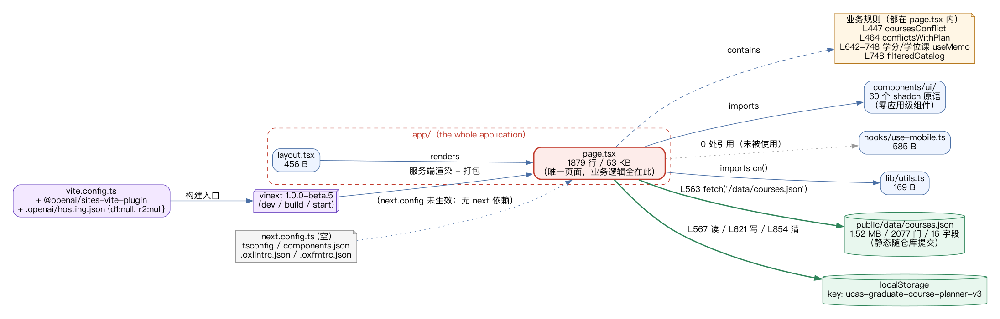

# A3 — Architecture and call-path map

Investigated repository: **`HMBlankcat/UCAS-course-planner`**, frozen at commit
**`68e7080503084a41f42db6e0e9ff94c0e9ef2f19`** (`ver 1.4`, 2026-09-01 13:41 +0800), MIT licence, TypeScript,
2.7 MB checkout (excluding `node_modules`). Recovered by `git clone` over SSH; the frozen checkout is kept
unmodified at `A3/upstream/UCAS-course-planner` and all execution was done in a copy
(`A3/work/UCAS-course-planner`) so that the reference stays byte-identical.

Everything marked **(ran)** was produced by executing the repository; **(read)** means it comes from reading
the source. Line numbers are from `app/page.tsx` at the frozen commit.

## 1. Entry points

| Entry | What it is | Evidence |
| --- | --- | --- |
| HTTP `GET /` | the only page; served by the `vinext` production server | **(ran)** `npm run start` → `vinext start (port 3000)`; `curl` returned HTTP 200 three times, ~0.012 s each (`evidence/logs/09-http-health.log`) |
| `app/layout.tsx` | root layout (456 B) | **(read)** |
| `app/page.tsx` | **the entire application**: 1,879 lines / 63 KB, a single client component | **(read)** `wc -l` |
| `package.json` scripts | `dev` / `build` / `start` (all `vinext`), `lint` (`oxlint`), `format` (`oxfmt`) | **(read)**; all three of build/start/lint were **(ran)** |

There is **no** server-side route, no API endpoint, and no second page.

## 2. Module inventory



| Module | Size | Role |
| --- | --- | --- |
| `app/page.tsx` | 1,879 lines / 63 KB | the application: state, business rules, and all UI in one component |
| `app/layout.tsx` | 456 B | root layout |
| `app/globals.css` | 27 KB | Tailwind v4 styles |
| `components/ui/*` | **60 files** | shadcn/ui primitives, imported by the page |
| application-specific components | **0 files** | there are none — `components/` contains only `ui/` |
| `hooks/use-mobile.ts` | 585 B | present but **never imported by the page** (0 references) |
| `lib/utils.ts` | 169 B | the `cn()` class-name helper |
| `public/data/courses.json` | 1.52 MB / 2,077 courses / 16 fields **(read)** | the course catalogue, served as a static asset |

**Reading:** the repository has the *shape* of a modular app (folders for components, hooks, lib) but the
substance is one file. This is the factual basis of risk R2 in `risk-register.md`, and the reason the ADR
(`adr-001-change-boundary.md`) is about where a change may safely land.

## 3. Persistence — two stores, both client-side

| Store | Content | Contract |
| --- | --- | --- |
| `localStorage` key `ucas-graduate-course-planner-v3` (defined L112) | the student's plan: `{storageVersion: 1, plan: Course[], degreeCodes: string[], englishPlan, studentType, selectedDiscipline}` | read L567 on load; written L621 **only when `planDirty`**; cleared L854 / L1524 |
| `public/data/courses.json` | the catalogue | fetched L563 at mount; **static** — nothing updates it at runtime |

**Version gate and silent reset (fact).** On load the app accepts the stored plan only when
`storageVersion === 1` (L578); otherwise it resets the whole plan to empty (L587–593), and a JSON parse
exception triggers the same silent reset (L594–600). A stale or malformed store therefore degrades to "empty
plan" with no user-visible explanation — a boundary worth knowing before touching the storage shape.

**There is no database.** `.openai/hosting.json` is `{"d1": null, "r2": null}` **(read)** and neither `d1` nor
`r2` appears anywhere in `app/`, `lib/`, `hooks/` or `components/` (grep: 0 hits) — the platform bindings are
declared in `vite.config.ts` but unused by the code that ships.

## 4. External interfaces

Exactly **one** network egress in the whole application **(read)**:

```
L563:  fetch('/data/courses.json')      // same-origin static asset
```

No external API, no authentication, no telemetry, no remote persistence. Consequently the app is fully usable
offline once the static asset and the JS bundle are served — a fact that matters for any later change.

## 5. Configuration

| File | Content | Note |
| --- | --- | --- |
| `vite.config.ts` | imports `vinext`, `@openai/sites-vite-plugin`, `@tailwindcss/postcss`, reads `.openai/hosting.json` | this is the build entry point that is actually used |
| `next.config.ts` | `const nextConfig: NextConfig = {}` | **vestigial**: `next` is not a dependency of the project |
| `.openai/hosting.json` | `{"d1": null, "r2": null}` | no bindings configured |
| `tsconfig.json`, `components.json`, `.oxlintrc.json`, `.oxfmtrc.json` | tooling configuration | `.oxlintrc.json` is why lint covers few files (§6 of `reproduction-guide.md`) |
| `package.json` → `engines.node` | `>= 22.13.0` | satisfied by the frozen runtime (v22.23.2) |

## 6. Critical dependencies

| Package | Version | Why critical |
| --- | --- | --- |
| `vinext` | **1.0.0-beta.5** | the build and server toolchain; a **beta** in the critical path |
| `vite` | 8.0.13 | build core; also the peer range that the OpenAI plugin declares (`^8.0.0`) |
| `@openai/sites-vite-plugin` | 0.2.0 (dev) | imported by `vite.config.ts`; **its absence is what makes a naive install fail** (see `reproduction-guide.md`) |
| `react` / `react-dom` | 19.2.6 | UI runtime |
| `@base-ui/react`, `shadcn` | 1.7.0 / 4.18.0 | component layer behind `components/ui/*` |
| `tailwindcss` | 4.2.1 | styling pipeline |
| `recharts`, `date-fns`, `cmdk` | 3.8.0 / 4.1.0 / 1.1.1 | charts, dates, command palette |

## 7. Where the domain logic lives (and how it compares with A2's model)

| Concern | Location | Note |
| --- | --- | --- |
| **Conflict predicate** | `coursesConflict(left, right)` **L447–462** | `same day ∧ intersects(weeks) ∧ intersects(periods)` — weeks are parsed into a **Set**, so the comparison is week-level |
| Self-comparison guard | `conflictsWithPlan` **L464–470** | excludes `selectedCourse.code !== course.code` |
| Plan-level conflicts | `conflicts` **L661**, `conflictCodes` **L669** | `useMemo` over the plan |
| "Hide what would clash" catalogue filter | `filteredCatalog` **L748** | applies the same predicate to each candidate |
| Credits and degree rules | memos at **L642–748** (`fallCredits`, `publicElectiveCredits`, `degreeCredits`, `coreCount`, `professionalCount`) | the "2 + 2 core/professional" rule from A1's comparison section |
| Conflict display | badge **L1167**, cell label **L1462**, floating card **L1493** | the three ways a conflict becomes visible |

**Cross-check with A2 (independent confirmation).** A2's decision table says a clash requires *same weekday ∧
overlapping periods ∧ overlapping weeks*. This repository, written independently, implements the same three
conditions at L447. Two independent implementations of the same rule is the strongest consistency evidence
available in this project so far — and it also confirms A1's claim that this tool already does week-level
clash detection (A1's "three things it does not cover" remains unchanged).

## 8. Facts versus inference

| Statement | Status |
| --- | --- |
| Build, lint, start, HTTP 200, the conflict verdict — all measured | **fact** (ran; logs in `evidence/logs/`) |
| Line numbers, file sizes, dependency versions, 0 references to `d1`/`r2`, one `fetch` | **fact** (read/grep) |
| "The app is local-first" | **inference** from the stores above; it is stated in the repository's own README as well **(read)** |
| "`next.config.ts` is vestigial" | **inference**: `next` is absent from `package.json` and nothing imports it; it could still serve an unshipped workflow |
| "The 60 `ui/` components are all reachable from the page" | **not verified** — no import graph was computed |
