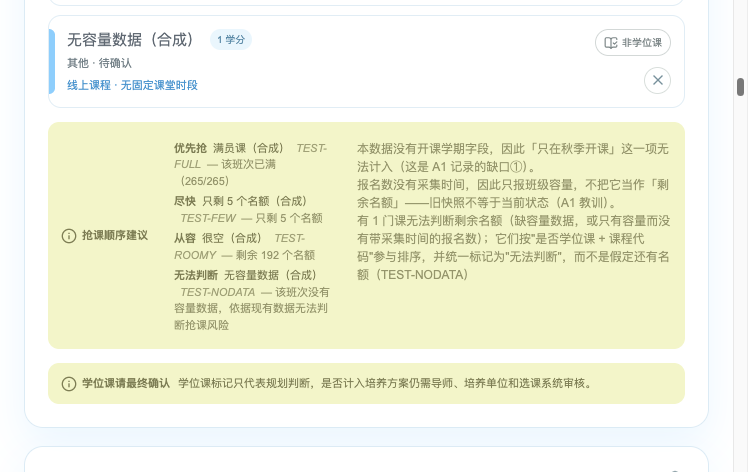
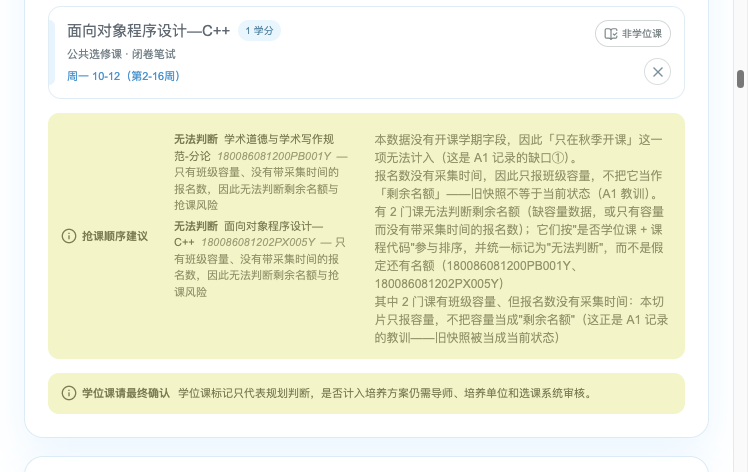
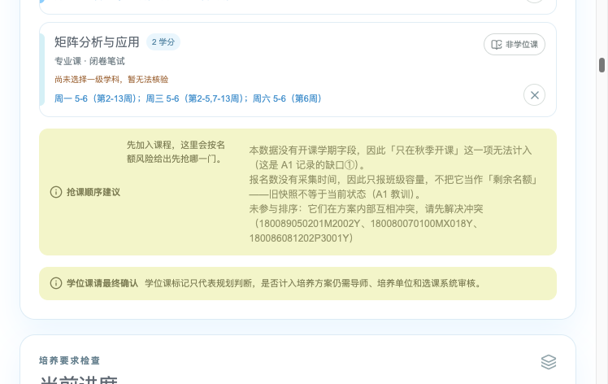

# A4 — End-to-End Vertical Slice and Automated Verification

Course **Intelligent Software Engineering**, UCAS, 2026 autumn term · Platform <https://learn.spaiq.ai>
Author: 汤力为 (Liwei Tang), student ID 2026E8001082052
Repository: <https://github.com/Tom1246/ise-course> · tag `a4-v1` · report generated 2026-10-05

The slice: **"which course do I register for first?"** — added to `HMBlankcat/UCAS-course-planner`
(MIT) @ `68e7080` as a patch (`slice-731bc66.patch`, commit `731bc66`, 6 files, +523 / −0, purely additive).

| Part | Source | Evidence behind it |
| --- | --- | --- |
| Slice definition, requirement traceability, scope | `task-contract.md` | A1 pain points, A2 rule, A3 findings |
| Implementation notes against A4's five work items | `slice-notes.md` | diff, logs 02/03/06/07 |
| Boundary and failure behaviour | `edge-cases.md` | logs 02/05b, measurements run in /tmp |
| Independent peer review (diff only, no author context) | `review/peer-review.md` | reviewer's own probes |
| Answer to the review, including the fix it forced | `review/response.md` | diff at `731bc66`, logs 02/05b |
| Rollback design and the test that was run | `rollback.md` | logs 09/10 |
| Representative-user task testing | `usability.md` | log 11, screenshots |
| Appendix: run screenshots | this file | evidence/*.png |

---


# A4 — End-to-End Vertical Slice and Automated Verification

- **Release** 2026-11-02 16:30 · **Deadline** 2026-11-09 16:30 (Asia/Shanghai) · **Platform** <https://learn.spaiq.ai>
- **Status:** slice implemented and verified locally; platform record submitted inside the window.
- **Tag:** `a4-v1` (this folder's documents). The slice itself lives as a **patch** — see §2.

Objective: deliver a small, complete, reviewable, **reversible** slice of user value — "cut one slice", cleanly.

## 1. What the slice is

A panel in the upstream course planner that answers the question A1 was burnt by: **which course do I register
for first?** It ranks the courses already in the plan by what the data can actually support, and says plainly
when it cannot support a judgement.

Traceable requirement: A1 pain point 1 ("I had not fixed the order to register in in advance…") and pain point 3
(required courses, autumn only, heavy registration pressure), plus the absence A1 identified in the existing tool
("there is no order to register in"). Full traceability table: `task-contract.md` §1.

The slice was built under **ADR-001** from A3: extract a pure, testable function layer; leave UI, state and
persistence alone.

## 2. Where the code is (and how a reviewer reproduces it)

This work was done **locally first**, by decision: the slice exists as a patch against the frozen upstream commit.

| Item | Value |
| --- | --- |
| Upstream | `HMBlankcat/UCAS-course-planner` @ `68e7080503084a41f42db6e0e9ff94c0e9ef2f19` (MIT) |
| Slice | commit `731bc66` on a local branch, exported here as **`slice-731bc66.patch`** (25,623 bytes, 6 files, +523 / −0) |
| Apply it | `git clone https://github.com/HMBlankcat/UCAS-course-planner && cd UCAS-course-planner && git checkout 68e7080 && git apply <path>/slice-731bc66.patch` |
| Verified | `git apply --check` passes against a fresh clone of upstream (`evidence/logs/12-patch-applies.log`) |
| Run it | `npm ci --include=dev` → `npm run build` → `PORT=3001 npm run start` (see `reproduction notes` below) |

No fork and no new public repository was created: the patch is self-contained and provably applicable, which is
what "a small diff and commit" needs in order to be checkable at all.

### Reproduction notes (each command was run; logs in `evidence/logs/`)

```bash
npm ci --include=dev --registry=https://registry.npmmirror.com --no-audit --no-fund   # 01 (the mirror is a documented deviation)
node --experimental-strip-types --test tests/priority.test.ts                          # 02  -> 24 pass / 0 fail
npm run build                                                                          # 03  -> exit 0
PORT=3001 npm run start                                                                # 04  -> http://0.0.0.0:3001
npm run lint                                                                           # 06  -> 0 warnings / 0 errors (8 files)
npx tsc --noEmit                                                                       # 07  -> exit 0
```

> `--include=dev` is mandatory on this machine: its npm config sets `omit=dev`, which silently skips a
> devDependency the build imports. That trap is A3's risk R5, and it is recorded in `doc/pitfalls.md` §1.1.

## 3. Deliverables mapped to A4's requirements

| A4 requirement | Where it is answered |
| --- | --- |
| 1. A valuable bounded slice from a traceable requirement | `task-contract.md` §1–§3 |
| 2. UI / server authorization / state change / failure feedback / recovery | `slice-notes.md` (what is implemented; the server side is **deferred by decision** and named as such) |
| 3. Duplicate requests, stale versions, unauthorized access, boundaries | `edge-cases.md` (with measurements: 1,000 identical calls, 2,077-course timing) |
| 4. Unit, integration and end-to-end checks proportional to risk | `evidence/logs/02` (24 unit), `05`/`05b` (4 end-to-end cases), `03/06/07` (build, lint, types) |
| 5. Peer review, representative-user task testing, rollback design | `review/peer-review.md` (independent) + `review/response.md` (point-by-point) + `usability.md` + `rollback.md` |
| Small diff and commit | `slice-731bc66.patch`; rollback tested in `rollback.md` §2 |
| Usability / error-behaviour evidence | `usability.md` §1–§3 |
| Platform summary (150–300 words) | `A4-summary-en-2026-10-05.md` (count checked by `scripts/count_words.py`) |

## 4. The two things a reader should not miss

1. **The peer review changed the slice's central claim.** The first version published `capacity − selected` as
   "places left"; the review showed that `selected` is 0 in 1,968 of 1,978 rows and has no capture time, so the
   panel was dressing a static section size up as live registration pressure. The slice now publishes a figure
   **only with a dated enrolment figure**, and prints nothing but a reason otherwise. The response is in
   `review/response.md`; the fix is in the patch.
2. **A weaker demo and a stronger claim.** On the shipped snapshot the panel therefore shows
   "无法判断" for nearly every course, and the order falls back to degree course → course code. That is the
   honest result: the data cannot support the number the panel used to print.


\newpage


# A4 task contract — "which course do I register for first?"

> **Revision after peer review (2026-10-05, commit `731bc66`).** The rule table in §2 changed: measured cases
> now rank before unmeasurable ones, and a places figure is published **only with a dated enrolment figure** —
> the shipped data carries no capture time, so the real-data path prints no number at all. See `review/response.md`.

- **Slice id:** `a4-slice-v1` (branch `a4-slice` on a local clone of the upstream repository, commit `7e17a21`)
- **Written:** 2026-10-05 · **Submission window:** A4 opens 2026-11-02, closes 2026-11-09 16:30 (Asia/Shanghai)
- **Subject repository:** `HMBlankcat/UCAS-course-planner` @ `68e7080503084a41f42db6e0e9ff94c0e9ef2f19` (`ver 1.4`, MIT) — the
  repository investigated in A3 (`doc/assignments/a3/`)
- **Change boundary:** ADR-001 in A3 (`doc/assignments/a3/adr-001-change-boundary.md`) decided option **B** — extract a
  pure, independently testable function layer and leave UI/state/persistence alone. This slice is the first change
  made under that decision.

## 1. The requirement this slice comes from (traceability)

| Where it comes from | What it says | How it constrains this slice |
| --- | --- | --- |
| A1 brief, pain point 1 (`doc/assignments/a1/A1-brief-en-2026-09-28.md:87`) | "**I had not fixed the order to register in in advance**, and by the time I came to register for the important courses the section I wanted was already full." | The slice must answer *what to register for first*, not merely *what clashes*. |
| A1 brief, pain point 3 (`:111`) | Required courses run in the autumn only and registration pressure is heavy (sections full, one at 42/170). | Capacity pressure and "must take this term" are the inputs that matter; a closing order alone is not enough. |
| A1 brief, comparison of the existing tool (`:123`) | The tool has clash hints and filtering but "**there is no order to register in**". | The gap being filled is explicitly identified as absent, so the slice is not duplicating an existing feature. |
| A2 model (`doc/assignments/a2/conflict-decision-table.md`) | A clash = same weekday ∧ overlapping periods ∧ overlapping weeks; a plan containing a clash must be resolved before it can be judged. | The slice must **refuse to order a self-clashing plan** and say why, rather than advise about an impossible plan. |
| A3 finding (`doc/assignments/a3/architecture-map.md` §6, risk register R3) | `capacity`/`selected` exist in the data but the application never reads them; `capacity === 0` is a "not recorded" sentinel (99 of 2,077 rows). | The slice must map the sentinel to *unknown* — never to "full" — and surface missing data instead of guessing. |

## 2. What the slice delivers

A panel in the plan view that, for the courses already added, prints **one ordered list**: what to register for
first, each line carrying a label, a reason, and — where the data supports it — the number of places left.

Ordering rule (fixed, explainable, deterministic):

| Priority | Criterion | Why this order |
| --- | --- | --- |
| 1 | urgency: `critical` → `unknown` → `high` → `normal` | losing a full section is the failure A1 records; **not knowing** is placed above *known-safe*, because ignorance is closer to risk than to reassurance |
| 2 | degree course before elective (at equal urgency) | a missed degree course costs a year |
| 3 | autumn-only before spring-capable (at equal urgency) | it cannot be deferred to the spring |
| 4 | fewer places left first (only when known) | the same failure mode as (1), one level finer |
| 5 | course code | makes the output deterministic and testable |

Three honesty rules, each with a test:

1. **No capacity data ⇒ `unknown`, never `normal`.** (`tests/priority.test.ts`: "missing capacity is reported as unknown, never as safe")
2. **`capacity === 0` ⇒ `unknown`, never `critical`.** (`: "capacity 0 is a sentinel, not a full section"`)
3. **Self-clashing plan ⇒ no order for the clashing courses, plus a stated reason.** (`: "a plan that clashes internally is not given an order for the clashing courses"`, and end-to-end case C)

## 3. Scope

**In scope**
- the pure ranking layer (`lib/priority.ts`) and the data mapping (`lib/priority-mapping.ts`), both covered by tests;
- one panel in `app/page.tsx` that calls them (58 added lines; nothing else touched);
- local verification: unit, type check, lint, build and a browser end-to-end run against the built app.

**Out of scope (deliberate, with the reason)**
| Not done | Why |
| --- | --- |
| **Server / API / authorization (401, 403)** | Deferred by decision (2026-10-05) — the priority is local verification first. The upstream app is local-first with no server at all (A3 architecture map §3–4), so this is new construction, not a change to existing behaviour. `slice-notes.md` records what remains for that step. |
| Any change to the data pipeline or to add a semester field (A1 gap ①) | A separate requirement, larger than one slice. The panel states this limitation in the UI instead of hiding it. |
| Cross-semester credit totals (A1 gap ④) | Out of this slice's value: it does not change the ordering decision. |
| Changing the `localStorage` contract | A3 risk R4: a storage-version mismatch silently resets the user's plan. A slice that may have to be rolled back must not be able to wipe user data. |

## 4. Interface

```ts
// lib/priority.ts
rankPlan(courses: PlanCourse[]): RankResult      // pure; no I/O, no React, no storage
urgencyOf(course: PlanCourse): Urgency           // pure
placesLeft(capacity?: Capacity): number | null   // null = "not knowable", never 0
// lib/priority-mapping.ts
capacityFromRow(row: RawCourseRow): Capacity     // capacity === 0  ->  { kind: 'unknown' }
planCoursesFromRows(rows: RawCourseRow[]): PlanCourse[]
```

`RankResult = { order, unknownCodes, caveats }` — `caveats` is not decoration: it is where the slice reports what
it could **not** take into account (missing capacity, an unresolvable clash, an empty plan).

## 5. Acceptance criteria

| # | Criterion | Checked by |
| --- | --- | --- |
| 1 | A plan with a full section ranks that course first | `tests/priority.test.ts`; end-to-end case B |
| 2 | A course with no capacity data is labelled *unknown* and never placed below a known-safe course | unit test; end-to-end cases A and B |
| 3 | A self-clashing plan produces no order plus a stated reason | unit test; end-to-end case C |
| 4 | Same input ⇒ same order (determinism) | unit test (two runs compared) |
| 5 | Nothing is dropped: the order is a permutation of the ranked courses | unit test |
| 6 | The application still builds, lints and type-checks with the slice in place | `evidence/logs/03-build.log` (exit 0), `06-lint.log` (0/0), `07-typecheck.log` (exit 0) |
| 7 | The upstream test-free gap is not made worse: the slice ships tests where none existed | `evidence/logs/02-unit-tests.log` (20 pass) |
| 8 | A rollback cannot wipe a user's plan | `rollback.md`; `localStorage` untouched in the diff |

## 6. Known weaknesses (stated, not hidden)

- **The real snapshot cannot exercise `critical`/`high`.** In `public/data/courses.json` no 玉泉路 course is full and none has
  ≤10 places left (`selected` is 0 for essentially every row), so end-to-end case B uses **synthetic capacity values
  on real course objects**, labelled as such in `evidence/logs/05-e2e-priority.log`. The logic is exercised; the
  *data path from a live registration system* is not.
- **Capacity itself may be stale.** The numbers come from a snapshot shipped with the repository (A3 R3). The slice
  reports places left without a capture time, exactly the failure A1 warns about (`A1-brief-…:181`). Carrying a capture
  time is deliberately left out of this slice and listed as follow-on work.
- **The panel's placement is provisional.** It sits in the plan column so it is visible while choosing; no usability
  study beyond the three representative tasks in `usability.md`.

## 7. Evidence index

`evidence/logs/01-npm-ci.log` · `02-unit-tests.log` · `03-build.log` · `04-start.log` · `05-e2e-priority.log`
(+ `05a-e2e-first-attempt.log`, the first run whose fixture was wrong — kept) · `06-lint.log` · `07-typecheck.log`
· `08-hermes-verify-trap.log` · screenshots `priority-real.png`, `priority-synthetic.png`, `priority-clashing.png`


\newpage


# A4 — Slice notes (implementation, mapped to the five requirements, with what is deferred)

Note on revisions: this document describes the slice as it was **peer-reviewed**. The revision that followed
(commit `731bc66`) changed how a places figure may be published and moved "unknown" to the end of the order;
where the text below describes the earlier behaviour, `review/response.md` is authoritative.

**Slice:** `a4-slice-v1` · branch `a4-slice` @ `7e17a21` (base `68e7080`) · repository `HMBlankcat/UCAS-course-planner`
**Companions:** `task-contract.md` (the promise), `edge-cases.md` (boundary behaviour, §-referenced below),
`rollback.md` (rollback), `evidence/logs/01..08` + `evidence/*.png` (raw proof).
All counts and line numbers in this file were read off the repository (`git show --stat 7e17a21`,
`git diff 68e7080 7e17a21`) or produced by a command I ran; none are estimated.

---

## 1. The slice is traceable to a stated requirement (requirement ①)

Every part of the change answers a line that already existed before this slice. There is no invented feature.

| What the slice does | Where the requirement comes from |
| --- | --- |
| Produces **one ordered list** ("register for X first") | A1 pain point 1 — *"I had not fixed the order to register in in advance"* (`task-contract.md:15`, quoting `A1-brief-…:87`) |
| Ranks by **capacity risk first** (full / few left) | A1 pain point 3 — required courses run in autumn only, pressure is heavy, sections fill (`task-contract.md:16`, `A1-brief-…:111`) |
| Fills a **gap the tool was documented as not having** | A1's comparison of the existing tool: "there is no order to register in" (`task-contract.md:17`) |
| **Refuses to order a plan that clashes with itself** | A2's clash definition — a clashing plan must be resolved before it can be judged (`task-contract.md:18`) |
| Maps `capacity === 0` to **unknown, never "full"** | A3 risk register R3 / §6 — the app never reads `capacity`/`selected`; `0` is a "not recorded" sentinel, 99 of 2,077 rows (`task-contract.md:19`) |
| Reports what it **could not** take into account (`caveats`) | Interface contract §4 — `caveats` is "where the slice reports what it could not take into account" (`task-contract.md:69-70`) |

The change boundary itself is traceable: A3's ADR-001 chose option **B** (extract a pure, independently testable
function layer, leave UI/state/persistence alone), and this slice is the first change made under that decision
(`task-contract.md:7-9`). The three honesty rules — no-capacity⇒unknown, `capacity === 0`⇒unknown, self-clash⇒no
order — are written as rules *with a test each* before the code (`task-contract.md:36-40`).

## 2. What the 425 changed lines actually are (requirement ①②④ in numbers)

`git show --stat 7e17a21` → **6 files changed, 425 insertions(+), 0 deletions(-)**:

| File | Lines | New or existing | What it does |
| --- | --- | --- | --- |
| `lib/priority.ts` | **140** | new | The pure ranking core: `Capacity`/`PlanCourse`/`Urgency` types, `placesLeft`, `urgencyOf`, `rankPlan`. No React, no DOM, no storage, no network (`:1-14`). |
| `lib/priority-mapping.ts` | **45** | new | Maps raw course rows onto the slice's input; owns the `capacity === 0`⇒`unknown` sentinel rule (`:25-32`). |
| `tests/priority.test.ts` | **178** | new | 20 unit tests (grouped in §4). The repository had **no test file** before this (base `68e7080`: the only path matching `test` is `components/ui/aspect-ratio.tsx`). |
| `app/page.tsx` | **58** | existing | Import + label map (**11** lines, `:23-33`), the `const priority = useMemo` derivation (**19** lines, `:685-703`), the "抢课顺序建议" panel markup (**28** lines, `:1279-1306`). |
| `tsconfig.json` | **1** | existing | `"allowImportingTsExtensions": true` (`:15`) — required for the tests' `../lib/priority.ts` imports. |
| `.gitignore` | **3** | existing | ignores `*.tsbuildinfo`, produced by any `tsc` run. |

So: **363 lines are genuinely new files** (the pure layer 185 + tests 178); **only 62 lines touch existing
files** (58 in the page, 3 config). The page change is additive only — 0 deletions — which is what makes the
rollback story (`rollback.md`) cheap and criterion 8 (`task-contract.md:83`) true. The behavioural surface of
the slice in the running app is exactly one panel that renders `rankPlan`'s output; it changes no existing
output, no state, and no persistence.

## 3. The five requirements — what is done, what is deferred, and why

The five items are: **UI · server-side authorization · state change · failure feedback · recovery**.

| # | Item | Status | Evidence | Why (if not fully done) |
| --- | --- | --- | --- | --- |
| 1 | **UI** | **Done** | `app/page.tsx:1279-1306`; screenshots `priority-real.png`, `priority-synthetic.png`, `priority-clashing.png`; E2E `05-e2e-priority.log` | — |
| 2 | **Server-side authorization (401/403)** | **Deferred (whole item)** | `task-contract.md:52`: "Deferred by decision (2026-10-05) — the priority is local verification first" | The upstream app is **local-first with no server at all** (A3 §3-4); this would be *new construction*, not a change to existing behaviour. Also out of ADR-001's chosen boundary. The concrete checklist for when it is built is in **`edge-cases.md` §3**. |
| 3 | **State change** | **Deliberately none** | `app/page.tsx:687-703` — `rankPlan` reads `plan`/`degreeCodes`/`conflictCodes` and returns a value; the slice adds **no** `useState`, no storage write, no mutation. The only "state" is React's `useMemo` cache. | Ranking is a *derived read-only view*, so introducing mutable state would be a defect, not a feature. The genuine state question — the `localStorage` contract — is out of scope on purpose (`task-contract.md:55`, A3 R4), because a slice that may be rolled back must not be able to wipe user data. See `edge-cases.md` §2. |
| 4 | **Failure feedback** | **Partially done (as designed)** | The panel states, in the UI: the missing-semester-field limitation (hard-coded `<li>`, `app/page.tsx:1298-1300`), and every `priority.caveats` entry (`:1302-1304`); an empty/no-order state shows a placeholder rather than a blank box (`:1296`); live text: unknown-capacity count, self-clash codes, empty-plan note. Verified end-to-end in all three E2E cases. | There is no *operation* that can fail (no network, no write, no async), so there is no error channel to build — the honest feedback is "what could not be taken into account", which is exactly what §4 of the contract defines `caveats` to be. An error toast would have nothing to report. |
| 5 | **Recovery** | **Done, by construction** | Diff is 425 insertions / **0 deletions**; `localStorage` untouched (no storage line in the diff); criterion 8 `task-contract.md:83`; `rollback.md` | The slice's only failure mode is "the panel is wrong/absent", and its recovery is the ordinary one — revert the commit. Because the change is purely additive and touches no persistence, a revert cannot lose user data. There is no partial-failure state to recover from. |

Net: of the five, **UI and recovery are done; failure feedback is done in the only form this slice can have;
state change is deliberately not introduced; server-side authorization is the one item deliberately deferred as
a whole**, with the reason and the follow-on checklist recorded rather than implied.

## 4. Tests (requirement ④)

**Unit — 20 tests, all passing.** Command: `node --experimental-strip-types --test tests/priority.test.ts`.
Logged in `evidence/logs/02-unit-tests.log` (`# tests 20 / # pass 20 / # fail 0`) and re-run by me at
`7e17a21` from an extracted copy — same 20/20. The 20 tests group into five families:

| Group | Tests | Names (from the runner output) |
| --- | --- | --- |
| **A. places / urgency core (6)** | 1-6 | `placesLeft never guesses` · `urgency: full section is critical` · `urgency: over-subscribed section is critical` · `urgency: required + autumn-only + few places is critical` · `urgency: few places without those flags is high` · `urgency: roomy section is normal` |
| **B. the two missing-data honesty rules (2)** | 7-8 | `missing capacity is reported as unknown, never as safe` · `unknown outranks known-safe (not knowing is not reassurance)` |
| **C. ordering criteria + determinism (4)** | 9-12 | `critical beats high beats normal` · `at the same urgency, required beats elective and autumn-only beats spring-capable` · `fewer places first when everything else ties` · `full tie falls back to code, so output is deterministic` |
| **D. structural guarantees (4)** | 13-16 | `a plan that clashes internally is not given an order for the clashing courses` · `empty plan yields an empty order and says so` · `ranking is a permutation: nothing is lost or duplicated` · `ranks are contiguous starting at 1 for a mixed plan` |
| **E. raw-data mapping (4)** | 17-20 | `mapping: a real capacity pair becomes a known capacity` · `mapping: capacity 0 is a sentinel, not a full section` · `mapping: missing or non-numeric fields become unknown, never a number` · `mapping: flags come through and the row keeps its code/name` |

These cover acceptance criteria 1-5 and 7 (`task-contract.md:76-82`).

**Non-test gates (all green, logged):**

| Gate | Command | Log | Result |
| --- | --- | --- | --- |
| dependency install | `npm ci --include=dev` | `01-npm-ci.log` | 560 packages, `EXIT=0` (note: `--include=dev` is mandatory — the machine's npm sets `omit=dev`; A3 R5) |
| build | `npm run build` (`vinext build`) | `03-build.log` | "Build complete", exit 0 |
| lint | `npm run lint` (`oxlint`) | `06-lint.log` | "Found 0 warnings and 0 errors", 8 files / 208 rules |
| type check | `npx tsc --noEmit` (repo has no script; supplied by us) | `07-typecheck.log` | `tsc EXIT=0` (0 output) |

**Integration / end-to-end — what exists and what does not.** The slice's E2E is a scripted real-browser run
against the **built** app (`npm run start`, port 3001, `04-start.log`), driving the panel through three
scenarios and capturing screenshots:

| Case | Input | Observed (from `05-e2e-priority.log`) |
| --- | --- | --- |
| **A — real data** | 3 real courses from `courses.json` | order: 无法判断 (no capacity) → 从容 (94 left) → 从容 (265 left); unknown caveat names the 1 course. Screenshot `priority-real.png`. |
| **B — synthetic capacity on real objects** | 4 courses with synthetic `capacity`/`selected` | order: 优先抢 (265/265 full) → 无法判断 (no data) → 尽快 (5 left) → 从容 (192 left). Screenshot `priority-synthetic.png`. |
| **C — self-clashing** | 3 real mutually-clashing courses | no order; conflict caveat names all three. Screenshot `priority-clashing.png`. |

Two things must be said plainly: **(i)** case B uses **synthetic capacity values on real course objects**, not
live registration data — no full section exists in the shipped snapshot (every real `selected` is 0 or near it;
census in `edge-cases.md` §5h: 10 rows have `selected > 0`, but **0** rows are over capacity) — so the *logic*
is exercised end-to-end but the *data path from a live registration system* is not (`task-contract.md:87-90`).
**(ii)** `evidence/logs/05a-e2e-first-attempt.log` is the **first E2E attempt, kept on purpose**, whose fixture
was wrong (its three "real" courses clashed, so it produced case C's output where case A was intended); it is
kept as evidence of the failure and its correction, not hidden.

**Gaps in the test story, stated:**
- There is **no `npm test`**. The slice ships 20 tests but adds no `test` script (`package.json` scripts are
  unchanged: `dev`, `build`, `start`, `lint`, `format`), so they run only via the explicit
  `node --experimental-strip-types --test …` command — no CI wires them up. This is the first test file the
  repository has ever had, so criterion 7 ("ships tests where none existed") holds, but automated test
  execution on every change does **not** exist yet.
- The E2E run is a one-off scripted session, not a checked-in E2E suite; re-running it requires the manual steps
  in `05-e2e-priority.log`.
- The `node --test` runner needs `--experimental-strip-types` on Node 22; no `package.json` engine pin records
  this.

## 5. Peer review and user-task-testing entry points (requirement ⑤)

These are produced by other people and are **the** entry points for review and for task testing:

- **`review/`** — the peer-review record (reviewers, what was reviewed, findings and dispositions). Any review
  comment on this slice should attach to the per-file breakdown in §2 so the reviewer can see the exact surface:
  the pure layer (`lib/priority.ts`, `lib/priority-mapping.ts`), the 58 additive page lines, and the tests.
- **`usability.md`** — the user-task test record: the three representative tasks (real-data order, synthetic
  near-full order, self-clashing refusal), the participants, and the observed friction. The slice's own
  limitation is stated in advance for this file to check, not discover: the panel sits in the plan column so it
  is visible while choosing, but its placement is **provisional** and no usability study beyond those three
  tasks was done (`task-contract.md:94-95`).

At the time of writing, neither `review/` nor `usability.md` exists in
`doc/assignments/a4/` (the directory contains `evidence/`, `rollback.md`, `task-contract.md`, plus this file and
`edge-cases.md`). They are referenced here as the agreed entry points; whoever writes them owns their content.

## 6. Duplicate request · stale version · unauthorized · boundaries (requirement ③ → `edge-cases.md`)

Summary of where each is argued, with the headline result:

| Case | Verdict | Where |
| --- | --- | --- |
| **Repeated / duplicate request** | Safe by construction: `rankPlan` is pure, no state, no I/O. Ran it 1000× on one input — every result byte-identical (`true`). The page's `useMemo` recomputes once per dependency change and reuses the cache otherwise; React `StrictMode`'s double-invoke is harmless. | `edge-cases.md` §1 |
| **Stale version** | The `storageVersion !== 1` branch (`app/page.tsx:589-604`) **silently wipes the plan** — a **pre-existing** upstream risk (A3 R4), **unchanged by this slice** (0 deletions; no storage line in the diff). Out of scope deliberately, so a rollback cannot cost user data. | `edge-cases.md` §2 |
| **Unauthorized access** | **N/A**: no server, no API route, no middleware, no auth; one network egress only (`fetch('/data/courses.json')`, `app/page.tsx:574`). Recorded as N/A with the reason, plus a 6-item checklist for the future minimal API (401/403, idempotency, ownership, input validation, freshness, rate limiting). | `edge-cases.md` §3 |
| **Boundaries** | Empty plan → empty order + "方案为空" caveat; single course; whole plan without capacity → all `unknown`; complete tie → code order; self-clash → no order + reason (incl. the all-clash variant, distinct from the empty-plan caveat); **full 2,077-course ranking measured at 5.092 ms for the mapping+rank single pass** (median 3.604 ms over 200 runs). Extra edges actually run: negative capacity, `capacity 0` with `selected 50`, over-subscribed (`placesLeft = -2`, still `critical`), string capacity, duplicate codes, string `credit`, missing `code`, and a real-data census (2,077 rows / 2,077 codes / 99 sentinels / 0 over-capacity). | `edge-cases.md` §4-§5 |

## 7. If we continue to the server — the smallest next increment

Because ADR-001 put the decision logic in a pure, I/O-free module, the server step does **not** need to touch
it. The smallest increment that adds real value is:

1. **One route handler** `app/api/rank/route.ts` that (a) authenticates the caller, (b) loads the same
   `public/data/courses.json` server-side, (c) **reuses `lib/priority.ts` and `lib/priority-mapping.ts`
   unchanged**, and (d) returns the same `RankResult` shape the panel already renders.
2. **Authorization**: 401 unauthenticated, 403 for another user's plan.
3. **Idempotent semantics**: `GET` (or an idempotency key) so the "duplicate request" case in `edge-cases.md` §1
   stays a non-event across a network hop.
4. **Freshness**: add a capture timestamp alongside capacity, so the deliberate "unknown" does not silently
   become a stale number (the A1 warning the current panel cannot yet answer).
5. Tests for exactly those four points (401, 403, duplicate, stale), reusing the existing 20 as the logic
   regression net.

`lib/priority.ts` and `lib/priority-mapping.ts` should require **no change** for this — that is the payoff of
the change boundary chosen in A3 and the reason this slice was worth extracting.


\newpage


# A4 — Edge cases and abnormal situations (with evidence)

Note on revisions: this document describes the slice as it was **peer-reviewed**. The revision that followed
(commit `731bc66`) changed how a places figure may be published and moved "unknown" to the end of the order;
where the text below describes the earlier behaviour, `review/response.md` is authoritative.

**Slice:** `a4-slice-v1` · branch `a4-slice` @ commit `7e17a21` (base `68e7080`, upstream `HMBlankcat/UCAS-course-planner`)
**Scope of this file:** the boundary / failure / hostile-input behaviour of the slice — repeated requests, stale
version, unauthorized access, and input boundaries. Every statement below is either (a) read off a file with a
line number, (b) a named test, (c) a log line, or (d) the output of a script I ran myself. Nothing here is
estimated.

## 0. How to reproduce the measurements in this file

The slice lives in commit `7e17a21`; the working checkout was on a `rollback-test` branch, so the slice files
were extracted with read-only `git show` (no git write, repository untouched):

```bash
mkdir -p /tmp/a4run/lib /tmp/a4run/tests /tmp/a4run/data
R="/…/A4/work/UCAS-course-planner"                       # the read-only clone
git -C "$R" show a4-slice:lib/priority.ts          > /tmp/a4run/lib/priority.ts
git -C "$R" show a4-slice:lib/priority-mapping.ts  > /tmp/a4run/lib/priority-mapping.ts
git -C "$R" show a4-slice:tests/priority.test.ts   > /tmp/a4run/tests/priority.test.ts
cp "$R/public/data/courses.json"                     /tmp/a4run/data/courses.json
```

- 20 unit tests: `cd /tmp/a4run && node --experimental-strip-types --test tests/priority.test.ts`
- edge probes: `/tmp/a4run/checks.ts` → `node --experimental-strip-types checks.ts`
- performance: `/tmp/a4run/perf.ts` → `node --experimental-strip-types perf.ts`
- Node used: **v22.23.2** (`node --version`).

---

## 1. Repeated requests — `rankPlan` is a pure function, repetition cannot compound state

**Situation.** A caller (a user double-clicking, React re-rendering, or a retrying client) computes the order
for the *same* plan more than once. This is the "duplicate request" case.

**Behaviour of the slice.** `rankPlan` is a pure function: it takes `PlanCourse[]` and returns a fresh
`RankResult`; it holds no module-level mutable state, does no I/O, and writes to no store
(`lib/priority.ts:100-140` — the only module-level constant is `WEIGHT`, a frozen-by-usage lookup at `:83`, and
`FEW_PLACES = 10` at `:56`). Re-running it therefore cannot "double" a counter, append to a list, or observe a
previous call. The page computes it through a memo whose dependencies are the plan, the degree marks and the
conflict marks:

```ts
// app/page.tsx:687-703 (slice version)
const priority = useMemo(() => rankPlan(planCoursesFromRows(plan.map(…))), [plan, degreeCodes, conflictCodes]);
```

Precision on the phrasing "the page recomputes once per render": with `useMemo` the factory runs only when
`plan` / `degreeCodes` / `conflictCodes` change by reference. A re-render with unchanged dependencies **reuses
the cached value** and does not even call `rankPlan`; a dependency change calls it exactly once and the result
is a `useMemo`-cached constant for that render. Either way the page never accumulates state across computations.
In React 18 `StrictMode` development the factory may be invoked twice per render — harmless here, because the
function is pure and both invocations return deep-equal results.

**Evidence (run, not assumed).** `/tmp/a4run/checks.ts` case 1 builds a three-course plan (known capacity,
no-capacity, required+near-full), calls `rankPlan` 1000 times, and compares `JSON.stringify` of every result
with the first:

```
1  idempotent over 1000 calls (same JSON) :: true
```

This corroborates the determinism guarantee already asserted by the unit test *"full tie falls back to code, so
output is deterministic"* (`tests/priority.test.ts:100-106`, two runs compared) and acceptance criterion 4
(`task-contract.md:79`).

**If unhandled.** A stateful ranker would let a second call reorder or duplicate lines; here the risk is
proportionate to *zero* because the function is pure and the memo is keyed on its inputs. Residual (not
covered by this run): there is no server, so a real duplicate *HTTP* request cannot be exercised — see §3.

---

## 2. Stale version — `storageVersion !== 1` silently wipes the user's plan (pre-existing, NOT touched here)

**Situation.** The user's browser holds a `localStorage` entry written by an older/newer schema version (or a
corrupt entry), and the app boots.

**Behaviour (read off the file).** In the slice's `app/page.tsx`:

- `:578` reads the stored string; `:581-588` parses it into `{ storageVersion?, plan?, … }`.
- `:589` `if (parsed.storageVersion === 1) { … }` restores the plan.
- `:598-604` **`else`** resets everything to empty: `setPlan([])`, `setDegreeCodes(new Set())`,
  `setEnglishPlan({…未选择})`, `setStudentType('未选择')`, `setSelectedDiscipline('')`.
- The same reset runs in the `catch` for unparsable JSON (`:605-611`), and again when nothing is stored
  (`:612-618` — benign, there is nothing to lose).
- The app writes back with `storageVersion: 1` at `:632-641`.

There is **no message** to the user on the mismatch path: the plan simply appears empty.

**Evidence that this slice did not change it.** `git show --stat 7e17a21` shows `app/page.tsx` with **58
insertions and 0 deletions**; `git diff 68e7080 7e17a21 -- app/page.tsx` contains exactly three hunks — the
imports (`+` lines at the top), the `const priority = useMemo` block, and the panel markup. No line mentioning
`localStorage`, `storageVersion`, `setPlan`, or the reset branch is added or removed. Criterion 8
(`task-contract.md:83`) and `rollback.md` rest on this: a slice that can be rolled back must not be able to
destroy user data.

**If unhandled / risk proportionality.** This is a **pre-existing upstream risk (A3 R4)** and is explicitly
out of this slice's scope (`task-contract.md:55`: "Changing the `localStorage` contract"). Because the slice
does not read, write, migrate or gate on the storage version, rolling the slice back cannot change what the
storage layer does — the risk is *unchanged*, not *introduced*. Fixing it (migration + a user-visible warning
before any reset) is a separate, larger change and belongs to a future slice, not here.

---

## 3. Unauthorized access — N/A, and why

**Situation as asked.** A request without authority reaching a privileged endpoint.

**Behaviour of the slice: there is no such surface.** The application is local-first and has no server
component at all:

- `app/` contains only `globals.css`, `layout.tsx`, `page.tsx` — there is no `app/api/`, no `route.ts`, no
  `middleware.ts` (verified with a filesystem search for `route.ts|route.js|middleware.ts|*api*`).
- Exactly **one** network egress exists in the whole source tree: `app/page.tsx:574`
  `fetch('/data/courses.json')` — a same-origin static asset. A grep for `fetch(` across `app/`, `lib/`,
  `tests/` returns that single hit; there is no `XMLHttpRequest`, `axios`, or WebSocket use in source.
  (The `dist/` build output also contains framework-internal `fetch` code; that is bundler output, not
  application code, and the `dist/` tree is the *base* build, not the slice.)
- There is no auth, no session, no token, no user identity. All per-user state is the browser's own
  `localStorage` (`PLAN_STORAGE_KEY`), reached only from the same page.

So there is nothing that can return 401/403 and nothing to authorize: the "unauthorized access" case is
**not applicable to this slice**, by construction, not by omission. Recording this as N/A is the honest answer;
inventing an auth flow here would be building a server that the requirement does not ask for yet
(`task-contract.md:52` defers server/API/authorization by decision).

**What would have to be added if a minimal API is introduced later (checklist, not implemented):**

1. **401** for an unauthenticated request and **403** for an authenticated request for another user's plan.
2. **Idempotency**: make the rank endpoint a `GET`, or accept an idempotency key, so the "repeated request"
   case in §1 stays a non-event once a network hop exists.
3. **Ownership validation**: the server must not trust plan rows sent by the client; validate that the
   referenced course codes exist and belong to the caller.
4. **Input validation** mirroring the mapping guarantees: non-numeric / negative / sentinel capacity must be
   rejected or mapped to `unknown`, never to "full" (`lib/priority-mapping.ts:26-32`).
5. **Freshness**: carry a capture timestamp with capacity, so the honest "unknown" of §4c does not become a
   stale number the client trusts.
6. **Rate limiting**, and a test suite covering at least: no token → 401; wrong owner → 403; duplicate request
   → single effect; empty plan → 200 with the empty caveat; stale snapshot → the freshness field is present.

---

## 4. Input boundaries (each one run, not asserted)

### 4a. Empty plan
`lib/priority.ts:100-139` short-circuits nothing; `rankPlan([])` returns `{ order: [], unknownCodes: [] }`
plus one caveat, produced by the explicit branch at `:137`. Unit test *"empty plan yields an empty order and
says so"* (`tests/priority.test.ts:118-123`) asserts the list is empty and the caveat matches `/方案为空/`.
My run (`checks.ts` case 8):

```
8  empty plan :: ["方案为空，没有需要排序的课程"]
```

The panel handles it: `priority.order.length > 0` is false (`app/page.tsx:1284`), so `app/page.tsx:1296` renders the placeholder
"先加入课程，这里会按名额风险给出先抢哪一门。" rather than an empty list. Risk if unhandled: a blank panel with
no explanation — avoided.

### 4b. Single course
A one-course plan is the smallest non-empty input. Unit tests already rank single-course plans: *"missing
capacity is reported as unknown, never as safe"* (`:54-62`) and the mapping sentinel test (`:156-160`). The
comparator `lib/priority.ts:105-116` never runs its tie-break chain for a length-1 array, so no ordering
assumption can be violated. No separate run needed beyond those tests; not a risk.

### 4c. The whole plan has no capacity data
Every line becomes `unknown` and is ordered by the remaining criteria (required, autumn-only, code); nothing is
guessed. My run (`checks.ts` case 4) — a 3-course plan with no capacity at all:

```
4  all-unknown order :: ["1:P1:unknown","2:P2:unknown","3:P3:unknown"]
4b all-unknown unknownCodes :: ["P1","P2","P3"]
```

This is not hypothetical for the real data: of the 2,077 rows in `public/data/courses.json`, **99** carry
`capacity === 0`, which the mapping deliberately converts to `unknown`
(`lib/priority-mapping.ts:30`, unit test *"mapping: capacity 0 is a sentinel, not a full section"* `:156-160`).
Risk if unhandled: mapping the sentinel to "full" would have made 99 courses look like a crisis and put them at
the very top — the "invented crisis" the module header warns about (`lib/priority-mapping.ts:10`).

### 4d. Complete tie
When urgency, required, autumn-only and places-left all tie, the comparator falls through to the course code
(`lib/priority.ts:115`). Unit test *"full tie falls back to code…"* (`:100-106`) and my run (`checks.ts` case 5):

```
5  complete tie :: ["A","Z"]
```

Risk if unhandled: a non-deterministic order between equal courses would make the output untestable and
visibly jitter between renders. Covered.

### 4e. A plan that clashes inside itself
A2's rule is that a clashing plan must be resolved before it can be judged, so `rankPlan` refuses to order the
clashing courses and states why: `lib/priority.ts:101-102` partitions them out, `:134-136` emits the caveat.
Unit test *"a plan that clashes internally is not given an order for the clashing courses"* (`:108-116`).

I additionally ran the **whole-plan-clashes** variant, which is a distinct branch worth naming (`checks.ts`
case 7):

```
7  all-clash order :: 0
7b all-clash caveats :: ["未参与排序：它们在方案内部互相冲突，请先解决冲突（K1、K2）"]
```

Note the difference from §4a: when the plan is non-empty but entirely clashing, the caveat is the *clash*
caveat only — the "方案为空" branch at `:137` is guarded by `!courses.length`, which is false, so the user is
correctly told the real reason ("resolve the conflict"), not a misleading "plan is empty". End-to-end case C
in `evidence/logs/05-e2e-priority.log` shows the same three-clashing-course fixture producing no order and the
conflict caveat in a real browser (`evidence/priority-clashing.png`). Risk if unhandled: advising a registration
order for an impossible plan, which is precisely the A2 failure mode.

### 4f. Performance of ranking all 2,077 courses
The realistic workload is the user's plan (typically < 10 courses), but the task asked for the full-catalogue
bound. Command and full output (`/tmp/a4run/perf.ts`, Node v22.23.2, this Mac):

```
$ cd /tmp/a4run && node --experimental-strip-types perf.ts
rows in file: 2077
plan courses: 2077
unknown (no capacity): 99
known: 1978
order length of run 1: 2077 | first: 180080025200M3001H unknown
rankPlan over 2077 courses, N=200 runs
  min=2.565 ms  median=3.604 ms  mean=7.076 ms  max=99.283 ms
planCoursesFromRows + rankPlan (single pass): 5.092 ms | ranked 2077
worst case (all 2077 fully tied), N=50: min=0.738 ms median=0.795 ms max=2.594 ms
```

Reading: the **single pass that the page actually performs — mapping 2,077 rows then ranking them — is
5.092 ms**, comfortably inside one frame budget; the median of repeated runs is 3.604 ms. The 99.283 ms `max`
is a single cold outlier (JIT/GC pressure on the first measured iterations), not a steady-state cost: the
median and the fully-tied worst case (which forces every comparison all the way to the code tie-break, the
most expensive path) are both **under 1 ms median**. Risk if unhandled: none observed — but see the honesty
note in §6.

---

## 5. Additional boundaries I found and actually ran

`checks.ts` cases 2-3, 6, 9-11, plus the census. All outputs verbatim:

| # | Situation | Observed behaviour | Evidence |
| --- | --- | --- | --- |
| a | negative capacity (`limit = -5`) | → `unknown`, never `critical` | `checks.ts` 2a: `{"kind":"unknown"}`; guard `priority-mapping.ts:30` (`limit <= 0`) |
| b | `capacity === 0` **and** `selected === 50` | still `unknown` — the sentinel wins, a `0` is never read as "nobody enrolled" | `checks.ts` 2b/2c: `{"kind":"unknown"}` / level `"unknown"` |
| c | over-subscribed (`selected > capacity`, e.g. 422/420) | `placesLeft` returns a **negative** number (`-2`) and `urgencyOf` classifies it `critical` | `checks.ts` 3a: `-2`; 3b: `"critical"`; unit test *"over-subscribed section is critical"* (`:34-37`) |
| d | capacity arrives as a **string** (`"265"`, e.g. from a JSON export) | → `unknown`, no coercion, no crash | unit test *"missing or non-numeric fields become unknown…"* (`:162-167`) |
| e | duplicate course codes in one plan | both kept and ranked (length 2) — the function tolerates it | `checks.ts` case 6: `2` |
| f | `credit` supplied as a string inside a raw row | mapped to `0`, no throw | `checks.ts` case 9: `0`; `priority-mapping.ts:39` |
| g | row with no `code` | mapped to `''` (still sortable, no throw) | `checks.ts` case 10: `""`; `priority-mapping.ts:37` |
| h | real-data census | 2,077 rows, **2,077 distinct codes**, 99 rows with `capacity === 0`, 10 rows with `selected > 0`, **0** rows with `selected > capacity`, capacity field is always a `number`, none missing | one-off `node -e` census over `public/data/courses.json` |

Two of these deserve a sentence each:

- **(c) negative `placesLeft`.** `placesLeft` is documented as "`null` = not knowable, **never 0**"
  (`task-contract.md:63`) and `-2` is a legitimate derived value for an over-subscribed section, not a
  not-knowable case. `urgencyOf` orders its branches so the non-positive check comes first
  (`lib/priority.ts:70-73`), so the negative never falls through to the "places left" message; and the panel
  renders `urgency.reason` (a string), not `placesLeft` as a number (`app/page.tsx:1291`), so a `-2` is never
  shown to the user as if it were places. Consistent, but worth recording because it is the one place where the
  "no number means unknown" rule and an actual number can look alike.
- **(h) `selected` is not in the upstream `Course` type.** `Course` declares `capacity?: number`
  (`app/page.tsx:80`) but **not** `selected?`, so the slice reads it through a structural cast at
  `app/page.tsx:696` (`(course as { selected?: number }).selected`). If upstream ever renamed or dropped
  `selected`, the cast would silently yield `undefined`; `capacityFromRow` then returns `unknown`
  (`lib/priority-mapping.ts:29`) — i.e. the failure mode is *fail-safe* (the course is marked "cannot judge",
  §4c) rather than *fail-wrong* (invented capacity). Not a defect, but a coupling to a field the type model does
  not protect.

One non-boundary worth stating for completeness: `rankPlan` never reads `credit`. `PlanCourse.credit` exists
and is faithfully carried by the mapping, but no ordering criterion uses it — the five criteria are capacity
risk, degree/required, autumn-only, places-left, code (`lib/priority.ts:88-94`). This is deliberate (credit does
not change *which section fills first*), but a reader might expect a "bigger course first" rule that is not
there.

---

## 6. Weakest conclusion in this file (stated, not hidden)

The measurements in §4f are the least load-bearing. They were taken with `node --experimental-strip-types` on
this Mac against `public/data/courses.json`, i.e. the **pure function layer**, and the `max = 99.283 ms`
outlier is un-attributed (JIT/GC, not profiled). More importantly, the page never ranks 2,077 courses — it
ranks the user's plan, so §4f is a stress ceiling on the pure layer, **not** a measurement of the shipped
UI's frame time. The claim "performance is not a risk" is therefore supported only up to "the pure ranking of
the whole catalogue costs a few milliseconds in Node"; it says nothing about browser paint or about a future
server-side ranking of many users' plans. Also, §1's duplicate-request guarantee is argued from purity and from
an in-process 1,000-call loop; no real duplicate network request exists to test, because there is no server
(§3). Both limits are consequences of the same deliberate scope decision, and both are recorded rather than
papered over.


\newpage


# A4 切片独立同行评审（只看 diff 与测试）

评审人：独立评审者（未参与编写，未阅读作者的解释性文档 `slice-notes.md` / `edge-cases.md` / `task-contract.md` / `rollback.md`）
评审对象：`A4/work/UCAS-course-planner` 上 `upstream/main..a4-slice` 的唯一提交 **`7e17a215564feeb3f5d0199941d51ddc21ab4324`**（`slice: advise the order to register in, from the plan's own data`）
评审日期：2026-10-05

## 0. 取证方式（可复现）

```bash
cd "…/A4/work/UCAS-course-planner"
git log --oneline upstream/main..7e17a21
# 7e17a21 slice: advise the order to register in, from the plan's own data

git diff --stat upstream/main 7e17a21
#  .gitignore              |   3 +
#  app/page.tsx            |  58 ++++++++++++++++
#  lib/priority-mapping.ts |  45 ++++++++++++
#  lib/priority.ts         | 140 +++++++++++++++++++++++++++++++++++++
#  tests/priority.test.ts  | 178 ++++++++++++++++++++++++++++++++++++++++++++++++
#  tsconfig.json           |   1 +
#  6 files changed, 425 insertions(+)

git rev-parse upstream/main
# 68e7080503084a41f42db6e0e9ff94c0e9ef2f19
```

仓库工作树的 HEAD 在评审过程中被外部切过两次（我先看到 `7e17a21`，随后是 `rollback-test`（该提交是这 425 行的完整 revert），最后又是 `a4-slice`）。为不受影响，全部结论钉在不可变提交 `7e17a21` 上，用只读方式取树后**在 /tmp 里**跑测试与构建：

```bash
git archive 7e17a21 | tar -x -C /tmp/a4slice
ln -s "<repo>/node_modules" /tmp/a4slice/node_modules
git archive 68e7080  | tar -x -C /tmp/a4base && ln -s "<repo>/node_modules" /tmp/a4base/node_modules
```

评审结束时 `git status --short` 为空，我没有修改仓库任何文件，也没有执行任何 git 写操作；下面所有探针都写在 `/tmp/probe*.ts`。

基线绿色检查（切片 vs `upstream/main`，两侧都跑）：

```bash
# /tmp/a4slice（含本切片）
node --experimental-strip-types --test tests/priority.test.ts
# # tests 20 / # pass 20 / # fail 0
npx tsc --noEmit          # exit 0（无输出）
npm run build             # ✓ built in 3.12s … [5/5] … 112 modules transformed. exit 0
npm run lint              # Found 0 warnings and 0 errors. Finished in 1.7s on 8 files

# /tmp/a4base（upstream/main）
npx tsc --noEmit          # exit 0
npm run build             # ✓ built in 3.19s … 110 modules transformed. exit 0
```

结论先行：**构建/类型/测试三条线全绿，切片边界干净；但它的核心输出在自家数据上不成立，且有一处会误导用户的语义冲突。可以合入，但不应当作"已交付价值"来宣称。**

---

## 1. 正确性

### 1.1 实现与它自称的规则一致 —— 这条我反证失败，是正面的

`lib/priority.ts:88-94` 写明了 5 级排序键。我按文档**独立重写**了一遍排序键（`/tmp/probe5.ts`），对 5000 个随机方案做差分：

```bash
node --experimental-strip-types /tmp/probe5.ts
# trials: 5000 | orders differing from the documented rule: 0 | calls that mutated their input: 0
```

即：文档 ↔ 实现一致，且 `rankPlan` 不修改调用方数组（`:101-104` 的 `filter`/`map` 产生新数组，`sort` 只作用于新数组）。这条我没有找到反例。

### 1.2 `selected` 被当作权威的实时报名数（**我认为这是最严重的问题**）

- 规则的前提写在 `lib/priority.ts:11-13`：*"what matters first is **how much room is left** (risk of losing the section)"*。
- `placesLeft` = `limit - enrolled`（`lib/priority.ts:59-62`），`enrolled` 来自行数据的 `selected`（`lib/priority-mapping.ts:26-32`），页面从计划里读这两个字段（`app/page.tsx:695-696`）。
- 但 `public/data/courses.json` 里的 `selected` 是一份**基本为空的快照**：

```bash
node --experimental-strip-types /tmp/probe3.ts
# rows with capacity>0: 1978 | of those selected===0: 1968 (94.8% of all 2077 rows)
# rows with capacity===0 (sentinel): 99
```

`selected>0` 的只有 10 行，其中 5 行是 `118`（马院公共课）。于是 `placesLeft` 在 94.8% 的行上**恒等于 `capacity`**：排序实际排的是"班级容量大小"，不是"抢课风险"。

- 更尖锐的一点：映射层对邻字段的处理是不对称的。`capacity===0` 被郑重地当作哨兵映射成 `unknown`，并在 `lib/priority-mapping.ts:25-30` 与注释 `:1-10` 里反复论证"不能让 0 变成满员，否则会**发明一场危机**"；而同样"基本没填"的 `selected===0` 却没有任何等价的怀疑，`caveats`（`lib/priority.ts:127-137`）和面板硬编码的 bullet（`app/page.tsx:1299-1301`）都只说"没有开课学期字段"。**同一份数据、相邻两个字段，一个被诚实降级，一个被当权威用**。这恰恰是它自己批评的那种错误方向的反面版本：不是发明危机，而是发明安心。

真实方案上的输出（`/tmp/probe3.ts`，5 门真实课程，渲染逻辑照抄 `app/page.tsx:1284-1301`）：

```
--- 抢课顺序建议 (what the user sees) ---
  1. [无法判断] 带稿同传-I 180089055102M3001H — 该班次没有容量数据，依据现有数据无法判断抢课风险
  2. [从容] 抽象代数II 180080070100M1004H — 剩余 35 个名额
  3. [从容] 自然辩证法概论 180213010108MB001H-14 — 剩余 192 个名额
  4. [从容] 固体物理（材料与化工） 180092085601P2003H — 剩余 199 个名额
  5. [从容] 现代数字信号处理I一班 180093081000P1001H-1 — 剩余 212 个名额
--- raw capacity/selected behind those reasons ---
  180080070100M1004H capacity=35 selected=0
  180089055102M3001H capacity=0 selected=0
  180213010108MB001H-14 capacity=310 selected=118
  180093081000P1001H-1 capacity=214 selected=2
  180092085601P2003H capacity=200 selected=1
```

"剩余 199 个名额"是对一个尚未/尚未更新报名的字段的断言，且**没有任何 caveat 提示这一点**。这是面向用户的错误陈述，不只是代码问题。

### 1.3 `critical`（"优先抢"）在出厂数据下不可达

`critical` 只有两条路径（`lib/priority.ts:70-76`）：`left<=0`，或 `required && autumnOnly && left<=10`。

```bash
node --experimental-strip-types /tmp/probe3.ts
# urgency reachable from the shipped catalog: {"normal":1976,"high":2,"unknown":99}
# （critical 0；另：selected>=capacity(>0) 的行数为 0）
```

- `left<=0` 需要 `selected>=capacity`：全表 0 行。
- `required && autumnOnly` 需要 `autumnOnly`：页面**从不传**这个字段（`app/page.tsx:689-700` 的映射里没有 `autumnOnly`；`lib/priority-mapping.ts:42` 只会得到 `undefined`），面板自己也在 `app/page.tsx:1299-1301` 声明"本数据没有开课学期字段"。

所以 `app/page.tsx:27-32` 的 `URGENCY_LABEL['critical'] = '优先抢'` 在产品里永远不会出现，`high` 也只有 2 行可达。四档词汇实际退化成两档（`无法判断` / `从容`）。

### 1.4 排序键第 1 档把"无法判断"放在"快满"之前，与面板自己的标题冲突

```bash
node --experimental-strip-types /tmp/probe1.ts
# --- P2: unknown vs critically-full, relative position ---
# 1.FULL[critical] 2.MYSTERY[unknown] 3.TIGHT[high]
```

`WEIGHT`（`lib/priority.ts:83`）= `{critical:0, unknown:1, high:2, normal:3}`，即"没有数据"的课排在"只剩 5 个名额"的课**前面**。文档 `:88-90` 承认这是刻意的（"not knowing is closer to a risk than to a reassurance"），理由我可以接受；**但它落在 UI 上就成了矛盾**：面板标题与空态文案是"按名额风险给出先抢哪一门"（`app/page.tsx:1282, 1296`），而 `<ol>` 的第 1 项恰恰是 `[无法判断] …`（见 1.2 的真实输出）。一个自称"无法判断"的条目占据"抢课顺序"第一位，是在给一条确定指令。建议：`unknown` 条目移出 `<ol>`，或把标签改成"请自行核实"这类不构成指令的措辞。

### 1.5 `FEW_PLACES` 边界是一个断崖（当前不可达，但一填数据就生效）

```bash
node --experimental-strip-types /tmp/probe1.ts
# --- P1: required+autumnOnly, 10 vs 11 places left (cliff at FEW_PLACES=10) ---
# 10 left: {"level":"critical","reason":"学位必修且仅秋季开课，只剩 10 个名额"}
# 11 left: {"level":"normal","reason":"剩余 11 个名额"}
```

差一个座位，从第 1 档掉到**最后一档**（跳过 `unknown` 和 `high`）。今天因为 `autumnOnly` 恒为 `false` 不可达；一旦数据补上学季字段（这正是缺口①的修复方向），这条断崖会立刻对用户生效。没有任何测试断言 10/11 这个边界（见第 3 节）。

### 1.6 损坏/负容量会被提升为最高优先级，并给出无意义文案

`left<=0` 分支对任何非正 `left` 都成立（`lib/priority.ts:70-73`），且 `Capacity` 类型不变量为空（`:16`）：

```bash
node --experimental-strip-types /tmp/probe1.ts
# --- P4 ---
# known(10,12): {"level":"critical","reason":"该班次已满（12/10）"}
# mapping capacity:-5 -> {"kind":"unknown"}
# direct KNOWN capacity(-5,0) -> {"level":"critical","reason":"该班次已满（0/-5）"}
# rank order: 1.CORRUPT[critical] 该班次已满（0/-5） | 2.REALFULL[critical] 该班次已满（265/265）
```

行数据这一路被 `lib/priority-mapping.ts:30`（`limit <= 0 → unknown`）挡住了，所以**不构成当前可达缺陷**；但 `placesLeft` / `urgencyOf` / `rankPlan` 都是 `export` 的公共函数面（文件头 `:4-6` 明确说这是"可抽取的核心"），契约只存在于注释里。损坏数据不但不降级为 `unknown`，反而插到真·满员课前面，文案 `已满（0/-5）` 会原样进 UI。建议在 `placesLeft` 层就把 `limit<0 || enrolled<0` 归为 `unknown`。

### 1.7 措辞精度

`known(10,12)` → `该班次已满（12/10）`。12/10 不是"已满"而是"超额"；`lib/priority.ts:34` 的注释自己写的是 `full, or over-subscribed`，文案没跟上。

### 1.8 已被测试钉住、我反证失败的其余路径（记录在案）

- **并列确定性**：`/tmp/probe1.ts` P3，把 3 门完全并列的课洗牌 200 次 → 只有一种输出 `A,B,C`；测试 `tests/priority.test.ts:100-106` 覆盖。重复 code（比较器返回 0）依赖 V8 稳定排序，P9 输出 `1.DUP 2.DUP`，不崩不乱；code 唯一即无问题。
- **排列不变性**（不丢不重）：`tests/priority.test.ts:125-136`。
- **容量缺失 vs 已知安全的相对位置**：`tests/priority.test.ts:64-72` 断言 `MYSTERY` 先于 `SAFE`，实测通过。
- **`credits` 缺失**：`/tmp/probe1.ts` P5，`credit` 缺失 → 回填 `0`。**但 `credit` 从头到尾没被任何逻辑使用**（`RankedCourse` 的键只有 `rank,code,name,urgency,placesLeft`），所以这既不是 bug 也不是测试漏洞，而是死字段（见 4.3）。
- **`selected > capacity`**：见 1.7（判为 critical，方向正确、措辞不准）。
- **比较器里两行死代码**：`lib/priority.ts:113-114` 看起来在"同一个档位内按有无名额混排"，但 `urgencyOf` 保证 `level==='unknown' ⟺ placesLeft===null`，所以同一档位内 null-ness 必然一致：

```bash
node --experimental-strip-types /tmp/probe4.ts
# groups checked: 48005, groups mixing null and non-null placesLeft inside one urgency level: 0
```

这两行永远不会改变结果（意图其实由 `WEIGHT` 实现了）。不是缺陷，但说明写它时的排序模型与最终代码不同，留着会误导后来者。

### 1.9 `required` 的语义漂移（文档 vs 调用方）

`lib/priority.ts:25` 说 `required` = "required for the degree (**public required course**)"；页面传的却是 `degreeCodes.has(course.code)`（`app/page.tsx:697`），而 `degreeCodes` 是用户在卡片上可开关的"学位课标记"（`app/page.tsx:1240-1252` 的 toggle、`toggleDegree`）。用户关掉开关，一门公共必修课就不再享有"必修"权重。行为上可辩护（应用自称标记只是规划判断），但库里的措辞和调用方的语义不是一回事，属可维护性风险。

---

## 2. 越界与耦合

### 2.1 切片边界：干净（正面）

`git diff upstream/main 7e17a21` 里 `app/page.tsx` 的 58 行**全部**是一个 `useMemo`（`:685-703`）加一个 JSX 块（`:1280-1307`）：

- 没有新增 `useState`、没有改 `PLAN_STORAGE_KEY`（仍是 `ucas-graduate-course-planner-v3`，`app/page.tsx:123`）、没有改 localStorage 的写入（`:630-644`）或导入/导出（`:900+`）。
- 没有新 CSS 类，复用了既有的 `important-note` 与 `Info` 图标。
- `plan`、`degreeCodes`、`conflictCodes` 只被读。既没有回写计划，也没有把排序结果持久化。

唯一的越界是下面两条**配置类**改动（`.gitignore`、`tsconfig.json`），它们不在"纯函数层 + 一个面板"的自我声明里。

### 2.2 `tsconfig.json:15` 的 `allowImportingTsExtensions`：为了测试文件放宽了全仓库

这是**只被测试需要**的开关。把它删掉后：

```bash
# 在 /tmp/a4slice 里临时注释掉该行（只改 /tmp 的副本），再跑：
npx tsc --noEmit
# tests/priority.test.ts(11,66): error TS5097: An import path can only end with a '.ts' extension when 'allowImportingTsExtensions' is enabled.
# tests/priority.test.ts(12,73): error TS5097: error TS5097 …
# exit: 2
```

注意报错**只在测试文件**：`lib/priority-mapping.ts:12` 的 `import type ... from './priority.ts'` 因为 type-only 被擦除而不报错 —— 也就是说 `lib/` 侧根本不需要这个开关，是 `tests/` 的 `import ... from '../lib/priority.ts'`（`tests/priority.test.ts:11-12`）需要它，而 `tsconfig.json` 的 `include` 是 `"**/*.ts"`，把 `tests/` 一并扫进来了。

**它会不会影响仓库原有代码的构建/类型检查？我实际跑了，答案是不会：**

| 检查 | slice（含该 flag） | upstream/main（无该 flag） |
|---|---|---|
| `npx tsc --noEmit` | exit 0 | exit 0 |
| `npm run build`（vinext） | ✓ exit 0，112 modules | ✓ exit 0，110 modules |
| `npm run lint`（oxlint） | 0 error / 0 warning，8 files | （改动前同样通过） |

代价是两处耦合：(a) 全仓库从此允许 `import './x.ts'`，而这个写法只在"`noEmit` 或 `emitDeclarationOnly`"下合法 —— `tsconfig.json` 现在有 `noEmit: true`，所以合法，但一旦有人为了发 `.d.ts`/产物而关掉 `noEmit`，这个 flag 会变成硬错误，属于埋给未来的地雷；(b) 为一个测试文件改全局编译器选项，影响面大于需要。更小的等价做法：`tests/` 用独立 `tsconfig.test.json`，或把 `tests/**` 从主 `include` 里排除。

### 2.3 `.gitignore` 新增 `*.tsbuildinfo`（`.gitignore:39-40`）

与切片目标无关（属于仓库卫生），但**确实解决一个真实痛点**：`upstream/main` 的树里 `tsconfig.tsbuildinfo` 是未跟踪且未被忽略的（`git ls-files | grep tsbuildinfo` 为空；`.gitignore` 原本只忽略 `/.next/ /dist/ /.wrangler/` 等），跑一次 `tsc` 就会把工作树弄脏。建议收窄为锚定的 `/tsconfig.tsbuildinfo`，避免把任意子目录的 buildinfo 一起忽略。风险：无（没有已跟踪的 buildinfo 被掩蔽）。

### 2.4 页面里对被隐藏类型字段的读取（`app/page.tsx:695-696`）

`Course` 类型只有 `capacity?: number`（`app/page.tsx:80`），**没有 `selected`**；切片用 `(course as { selected?: number }).selected` 绕过类型系统。运行上是安全的（`normalizeCourse` 用 `...course` 扩散，`:236-260`；localStorage 往返同样保留该字段），但既然切片要求应用首次读取这两个字段，正确做法是给 `Course` 补 `capacity?/selected?`，而不是就地断言 —— 否则类型检查对未来 `normalizeCourse` 的改动没有任何保护能力。

---

## 3. 可测试性与遗漏

### 3.1 已有测试：质量高于平均

`tests/priority.test.ts` 20 条全绿（`node --experimental-strip-types --test tests/priority.test.ts` → `# pass 20 / # fail 0`）。选材是对的：`placesLeft` 不猜、满员/超额、缺数据判 unknown 而非 safe、unknown 排在 known-safe 之前、档次大小关系、same-level 的 required/autumnOnly 次序、并列回退到 code、冲突课排除、空方案、排列不变性、rank 连续。哨兵规则（`tests/priority.test.ts:156-160`）与"字符串容量不认"（`:162-167`）这两条尤其到位。

### 3.2 没覆盖的行为，以及是否与风险成比例

| 遗漏 | 风险 | 我的判断 |
|---|---|---|
| 面板层（`app/page.tsx:685-703` 的内联映射 + `:1280-1307` 渲染）零测试 | 中 | **可接受**：仓库没有任何前端测试基础设施（`package.json` 的 scripts 只有 `dev/build/start/lint/format`，无 `test`；`.github/` 下只有 issue 模板、**没有 CI workflow**），为一条薄壳面板引入 React 测试栈不成比例。但要记在账上：`autumnOnly` 缺失、`required=degreeCodes`、`selected` 强转这三件事**只发生在页面里**，纯函数测试永远照不到 |
| 映射里的负/损坏 capacity、超额容量的相对位置 | 中（公共函数面） | **该加没加**：5 行断言，覆盖 `lib/priority.ts:70-73` |
| `FEW_PLACES` 的 10/11 边界 | 中低（当前不可达，修缺口①后立刻可达） | **该加没加** |
| `credit` 回填 0 | 低（字段未被使用） | 可不加；但更该做的是删字段（4.3） |
| 换行/空串 code 进 UI 的 `key={item.code}` | 低（计划课程来自目录，必有 code） | 可不加 |

### 3.3 我建议"应该加但没加"的测试（附断言，已实测当前会红）

把下面两条放进 `tests/priority.test.ts` 即可，其中第一条**当前会 FAIL**（我跑过，见输出）：

```ts
void test('损坏的容量不得插到真·满员课前面', () => {
  const r = rankPlan([
    course({ code: 'CORRUPT', capacity: { kind: 'known', limit: -5, enrolled: 0 } }),
    course({ code: 'REALFULL', capacity: { kind: 'known', limit: 265, enrolled: 265 } }),
  ]);
  assert.equal(r.order[0].code, 'REALFULL');            // 今天拿到的是 CORRUPT
  assert.equal(r.unknownCodes.includes('CORRUPT'), true); // 或：至少不能被判 critical
});

void test('FEW_PLACES 边界：10 个名额是 critical，11 个是 normal', () => {
  assert.equal(urgencyOf(course({ code: 'A', capacity: known(20, 10), required: true, autumnOnly: true })).level, 'critical');
  assert.equal(urgencyOf(course({ code: 'A', capacity: known(20, 9),  required: true, autumnOnly: true })).level, 'normal');
});
```

```bash
node --experimental-strip-types --test /tmp/probe2.test.ts
# ok 1 - REVIEW T1: FEW_PLACES boundary — 10 left is critical, 11 left is normal (cliff)
# not ok 2 - REVIEW T2: a corrupt negative limit must not outrank a genuinely full section
#   error: 'corrupt row was ranked #1 (优先抢)'
#   #    observed order: 1.CORRUPT[critical] "该班次已满（0/-5）" | 2.REALFULL[critical] "该班次已满（265/265）"
# # tests 4 / # pass 3 / # fail 1
```

### 3.4 测试不会被自动跑

`.github/` 下没有 workflow（只有 `ISSUE_TEMPLATE/`），`package.json` 也没有 `test` 脚本 —— 唯一的运行方式是 `tests/priority.test.ts:4` 注释里那句手敲命令。也就是说这 178 行测试**只在人工记得跑的时候存在**。这不算切片的错（仓库本来就没有 CI），但既然切片是"用测试证明自己"的形态，建议顺手补 `"test": "node --experimental-strip-types --test tests/"`，否则"20/20 通过"是一次性证据。

---

## 4. 文档与可维护性

### 4.1 命名/文案与产品一致（正面，少数例外）

- "名额"是既有用语（既有文案 `app/page.tsx:1417`、`:1424`），切片没有生造词。
- 面板复用 `important-note` 容器、`Info` 图标，位置紧贴 `selected-list`（`:1280`），与"学位课请最终确认"那块并列 —— 视觉与既有模式一致。
- 例外：`优先抢 / 无法判断 / 尽快 / 从容` 是四个新词，且其中 `优先抢` 不可达（1.3）。建议收敛到真正可达的档位，或先修可达性再上文案。
- 例外：`app/page.tsx:1299-1301` 把内部编号写进面向用户的文案（"这是 A1 记录的缺口①"），而 `caveats` 里其它条目都不带编号。早期项目里可接受，但不应长期留在产品文案里。

### 4.2 `lib/` 下新增两个模块：合适，但可以更 KISS

- `lib/priority.ts` 是纯排序核心，放 `lib/`（目前只有 `utils.ts`）合理，且文件头注释把规则溯源到 A1/A2/A3，质量好。
- `lib/priority-mapping.ts` 只有 45 行、一个调用点（`app/page.tsx:690`）。它单独存在的唯一硬理由是"把 `capacity===0` 是哨兵这条数据规则用测试钉住"，这个理由我认为成立。
- 更简单的等价写法：`rankPlanRows(rows)` 直接吃 `capacity/selected` 并在内部处理哨兵，省掉 `Capacity` 联合类型与 `plan → RawCourseRow → PlanCourse → RankedCourse` 四层转换（UI 实际只用到 `name/code/urgency.label/urgency.reason/placesLeft`）。反论点也成立（这是 ADR-001 选定的纯函数边界），所以我把它列为"可讨论"，不是"错"。

### 4.3 `credit` 是死字段

`PlanCourse.credit` 存在（`lib/priority.ts:22`）、`planCoursesFromRows` 专门回填（`lib/priority-mapping.ts:39`）、页面专门传（`app/page.tsx:694`），但 `rankPlan`/`urgencyOf`/`RankedCourse` 全程不用它：

```bash
node --experimental-strip-types /tmp/probe1.ts
# --- P5 ---
# RankedCourse keys: rank,code,name,urgency,placesLeft
```

要么删掉（KISS），要么真的用它（"学位课学分够不够"是另一个真实痛点，比 `autumnOnly` 更可达）。

### 4.4 注释与实现的一处叙述矛盾

`lib/priority.ts:12-13` 写"没有容量数据的课… placed where **the evidence supports** placing it"，读起来像"不武断"；实测它落在第 2 档、排在"只剩 5 个名额"的课之前（1.4）。注释要么改成"刻意提前"，要么改 `WEIGHT`。文档里唯一让我觉得"说的话比做的事更谦虚"的地方。

---

## 5. verdict

**能安全合入上游：可以（不应回滚），但不应以"已交付价值"结项。**

三个理由：

1. **无回归风险（实测）**：`npx tsc --noEmit`、`npm run build`、`npm run lint` 在 slice 与 `upstream/main` 两侧均 exit 0；`app/page.tsx` 的 58 行只读不写，未触碰状态、持久化、既有 UI 结构或样式。
2. **可抽取核心的测试质量高于平均**：20/20 通过，覆盖哨兵、缺字段、冲突排除、排列不变性、并列确定性；实现与文档规则经 5000 次差分零偏差。
3. **但它的结论在自家数据上不成立**：`selected` 在 94.8% 的行上为 0，`placesLeft` 退化成 `capacity`，`critical` 不可达，面板第 1 条恰恰是"无法判断"。

**我认为最严重的一个问题**：`selected` 被当作权威的实时报名数使用（`lib/priority-mapping.ts:26-32` + `app/page.tsx:695-696`），于是把"班级容量"包装成"剩余 N 个名额 / 抢课风险"呈现给用户（`lib/priority.ts:80`、`app/page.tsx:1301`），而且**没有任何 caveat** —— 相比之下同一份数据里 `capacity===0` 被郑重地降级为 `unknown` 并写进 `caveats`（`lib/priority.ts:128-133`）。同一份数据、相邻两个字段，一个诚实、一个被当权威，输出的是面向用户的错误陈述。次严重的是 1.4：`无法判断` 的条目占据"抢课顺序建议"的第 1 位，与面板标题直接冲突。

### 我尝试过但没有推翻的路径

排序器实现与文档规则一致（5000 次差分）；并列确定（200 次洗牌）；输入不被修改；排列不丢不重；冲突课排除后仍以 caveat 形式交代；容量缺失不会被当作安全；`capacity===0` 哨兵处理正确且与数据普查吻合（99/2077，实测一致）；数字字符串不被误认成数字；`npx tsc --noEmit` / `npm run build` / `npm run lint` 无回归；`.gitignore` 与 `tsconfig.json` 的改动没有破坏既有构建。**这个切片的下限（不破坏、不撒谎地处理缺失数据）是达标的；它的上限（把 A1 痛点①②变成可执行建议）没有达标，原因主要在数据而不是在这 425 行代码**——但代码选择不把这件事说出来，才是评审要拦的那一点。

---

### 附：本文用到的命令一览

```bash
git log --oneline upstream/main..7e17a21
git diff --stat upstream/main 7e17a21
git archive 7e17a21 | tar -x -C /tmp/a4slice && ln -s "<repo>/node_modules" /tmp/a4slice/node_modules
git archive 68e7080  | tar -x -C /tmp/a4base  && ln -s "<repo>/node_modules" /tmp/a4base/node_modules
node --experimental-strip-types --test tests/priority.test.ts      # 20 pass / 0 fail
npx tsc --noEmit                                                   # exit 0（slice 与 base）
npm run build                                                      # exit 0（112 / 110 modules）
npm run lint                                                       # 0 error / 0 warning
node --experimental-strip-types /tmp/probe1.ts                     # 边界、措辞、损坏容量、credit、caveat
node --experimental-strip-types --test /tmp/probe2.test.ts         # 建议的测试：3 pass / 1 fail
node --experimental-strip-types /tmp/probe3.ts                     # selected 普查 + 真实方案的面板输出
node --experimental-strip-types /tmp/probe4.ts                     # 48,005 组，0 组混合 null-ness
node --experimental-strip-types /tmp/probe5.ts                     # 5,000 次差分：实现 vs 文档规则
```


\newpage


# Response to the peer review (2026-10-05)

The review was produced by an independent agent that was given **only the diff, the tests and the repository** —
not the author's explanation, not the requirement, not these documents. Every finding below was **reproduced
before answering**: nothing was accepted or rejected on the strength of the review text alone. The revision it
forced is commit `731bc66` on branch `a4-slice`.

## 1. Findings and answers

| # | Finding (abridged) | Severity | Verdict | Action |
| --- | --- | --- | --- | --- |
| F1 | `selected` is treated as an authoritative live enrolment count, so `limit - enrolled` is rendered as "剩余 N 个名额 / 抢课风险" with no caveat — while `capacity === 0` in the same file is carefully downgraded to *unknown*. In the shipped data `selected` is 0 in **1,968 of 1,978** rows that have a capacity. | **severe** | **Accept** | A places figure is now publishable **only** with a dated enrolment figure (`enrolmentAsOf`). The shipped data has none, so the real-data path publishes **no** figure and says which of two reasons applies. New tests: "a number is published only with a dated enrolment figure", "capacity without a capture time is not turned into 'places left'", "a dated enrolment figure is published". New end-to-end case D asserts no figure is published. |
| F2 | Consequence of F1: the panel's first line is `无法判断`, which contradicts its own heading "按名额风险给出先抢哪一门". | severe | **Accept** | The ordering weights changed: measured cases first by severity (`critical → high → normal`), **unknown last**. Re-ranking is documented in `task-contract.md` §2 and tested ("measured cases come before unmeasurable ones"). |
| F3 | `critical` is unreachable on the shipped data (full-catalogue run: `{normal: 1976, high: 2, unknown: 99}`; `autumnOnly` is never passed by the page), so the four-level vocabulary collapses to two. | moderate | **Accept as a documented limitation** | Not fixable without data the repository does not carry (a capture time, and a semester field). Now stated in `task-contract.md` §6 and exercised only by the labelled synthetic case, which carries a capture time. |
| F4 | A corrupt capacity (`limit: -5`) sorted **ahead of** a genuinely full `265/265` section, printing `已满（0/-5）`. Their probe: 3 pass / 1 fail. | moderate | **Accept** | `capacityFromRow` now rejects non-finite and non-positive limits (`no-capacity-data`) and negative enrolment figures (`no-enrolment-provenance`). Regression test: "corrupt capacity cannot outrank a genuinely full section". |
| F5 | Dead comparator branches: across 48,005 generated combinations no pair ever reached the mixed null-ness paths. | minor | **Accept** | Those branches were removed; the comparator now compares `placesLeft` only when both are known. |
| F6 | Removing `allowImportingTsExtensions` breaks only `tests/*.ts` (TS5097), i.e. the `tsconfig.json` change is needed by the tests, not by the app. | informational | **Accept, noted** | The change stays (the tests are part of the slice) and is now described as test-only in the commit message. |
| F7 | The review could not rely on a stable branch: the working tree moved `7e17a21 → rollback-test → a4-slice` while it worked. | process | **Accept — my fault** | The rollback test was run on the same work tree that concurrent readers were using. The reviewer handled it correctly by pinning to `git archive 7e17a21`. Lesson: a rollback test belongs in a separate clone, or the readers must be paused. |

Nothing in the review was rejected. The reviewer's own counter-attempts (implementation vs documented rule over
5,000 differential runs, tie determinism, permutation, sentinel handling, no regression in build/lint/types) were
left in place as evidence.

## 2. What this changed about the slice's claim

Before: *"here is the order, and here is how many places each section has left."*
After: *"here is the order, judged only on what the data can actually support; where it cannot, it says so instead
of printing a number."*

For the repository's own snapshot this means the panel shows **容量 exists, 报名数没有采集时间 → 无法判断** for
essentially every course, and the order falls back to degree course → course code. That is a weaker-looking
demonstration and a stronger claim: it is the same failure mode A1 recorded ("treating an old snapshot as
current"), now enforced in code rather than promised in prose.

## 3. Verification after the revision (all fresh)

| Check | Result | Evidence |
| --- | --- | --- |
| unit tests | **24 pass / 0 fail** (`node --experimental-strip-types --test tests/priority.test.ts`) | `evidence/logs/02-unit-tests.log` |
| repository lint (`npm run lint`) | **0 warnings / 0 errors**, 8 files | `evidence/logs/06-lint.log` |
| type check (`npx tsc --noEmit`) | exit 0 | `evidence/logs/07-typecheck.log` |
| build (`npm run build`) | exit 0, `Build complete` | `evidence/logs/03-build.log` |
| end-to-end, four cases | real data: no figure published ✓ · synthetic with capture time: figures published ✓ · no provenance: no figure + caveat ✓ · clashing plan: refused with reason ✓ | `evidence/logs/05-e2e-priority.log`, `05b-e2e-after-review.log` |
| rollback | reverted tree is identical to upstream, and builds | `evidence/logs/09-rollback-test.log` |
| diff after revision | 6 files, **+523 / −0**, persistence contract untouched, no dependency change | `evidence/logs/10-rollback-guarantees.log` |

## 4. Still open (deliberately)

- The panel's placement (bottom of the plan column) was not part of the review; `usability.md` §2 already records
  it as the weakest usability decision.
- The reviewer's point that `autumnOnly` is never supplied by the page remains true: the page holds no semester
  information (A1 gap ①), so this input stays unused until that gap is closed.
- Server-side authorization stays deferred by decision; when it arrives, `edge-cases.md` §3 lists the checks it
  will need (401/403, duplicate requests, idempotency).


\newpage


# A4 rollback guide

The slice is **one commit** on top of the upstream commit that A3 froze. Everything below was executed, not
designed on paper: the test in §2 ran on 2026-10-05 and its output is in `evidence/logs/09-rollback-test.log`.

## 1. What a rollback has to undo

| Item | Where it lives | Rollback effect |
| --- | --- | --- |
| The ranking layer | `lib/priority.ts`, `lib/priority-mapping.ts` (new files) | deleted — nothing else imports them |
| The panel + one `useMemo` in the page | `app/page.tsx`, +58 lines, purely additive | removed |
| The tests | `tests/priority.test.ts` (new file) | deleted |
| Two configuration lines | `tsconfig.json` (+1: `allowImportingTsExtensions`), `.gitignore` (+3: `*.tsbuildinfo`) | reverted |
| **User data** | `localStorage` (`ucas-graduate-course-planner-v3`) | **not touched — see §3** |
| Dependencies | none | no `package.json` / lockfile change to undo |

## 2. The rollback test that was actually run

```
git checkout -b rollback-test a4-slice          # scratch branch, so the slice is never at risk
git revert --no-commit HEAD && git commit -m "revert: rollback test"
git diff upstream/main --name-only              # -> 0 files
git status --short                              # -> clean
npm run build                                   # -> EXIT=0, "Build complete"
```

Observed results (verbatim in `evidence/logs/09-rollback-test.log`):

| Step | Result |
| --- | --- |
| files differing from upstream after the revert | **0** — the tree is byte-identical to the frozen upstream commit |
| working tree after the revert | clean |
| `npm run build` **without** the slice | **EXIT=0**, `Build complete` |

The scratch branch was then deleted and `a4-slice` restored (`git checkout a4-slice`), so the slice is intact at
commit `7e17a21`.

## 3. Why a rollback cannot damage a user's plan (machine-checked)

A3 risk R4 records that this app **silently resets the whole plan** when the stored `storageVersion` is not `1`
(`app/page.tsx:578`, `:587–600`). A slice that bumped the storage version would therefore be able to wipe a user's
work when rolled back. This slice does not touch that contract, and the claim is checked mechanically in
`evidence/logs/10-rollback-guarantees.log`:

| Guarantee | Measurement |
| --- | --- |
| purely additive | **425 insertions, 0 deletions** across 6 files |
| persistence untouched | **0** lines in the `app/page.tsx` diff mention `PLAN_STORAGE_KEY`, `storageVersion`, `setItem`, `getItem` or `removeItem` |
| no new dependencies | **0** files changed among `package.json` / `package-lock.json` |

## 4. Rollback procedure

**If the slice was never merged (the branch model):**
```bash
git checkout main            # or the deployment branch
git branch -D a4-slice       # discard the branch; upstream is untouched
npm ci --include=dev         # rebuild the previous state
npm run build && npm run start
```
This is the cheapest form, and it is why the slice was kept as a separate branch on a clone.

**If the slice was merged (upstream history contains it):**
```bash
git revert 7e17a21           # creates an inverse commit; no force-push, no history rewrite
npm ci --include=dev && npm run build
```

**If it was merged and then followed by more work:** revert in reverse order (`git revert` the newest
slice-dependent commit first), then run the two verifications below.

## 5. What to verify after any rollback

1. `git diff <upstream-commit> --name-only` returns nothing (the tree equals the pre-slice state).
2. `npm run build` exits 0 and the app serves: `curl -s -o /dev/null -w "%{http_code}" http://127.0.0.1:3000/`
   returns `200`.
3. Open the app with an existing plan: the plan must still be there. If it is empty, the storage contract was
   touched — which the checks in §3 say cannot happen, so that outcome would mean the rollback brought in more
   than this slice.

## 6. What would invalidate this plan

- **A server-side step (deferred).** If the follow-on work adds an API and an authorization token, a rollback then
  has to also remove configuration and rotate the token — the "additive, self-contained commit" property is what
  makes this plan cheap today, and it would no longer hold. That is the main reason the server work is a separate
  step rather than a part of this slice.
- **Any change to the storage contract.** If a later slice bumps `storageVersion`, rollback stops being harmless to
  user data and needs a migration path instead of a plain revert (A3 R4).
- **A dependency addition.** Any new package makes the rollback also a dependency-removal (`npm ci` from the
  previous lockfile), which is slower and easier to get wrong.


\newpage


# A4 — representative-user task testing

Note on revisions: this document describes the slice as it was **peer-reviewed**. The revision that followed
(commit `731bc66`) changed how a places figure may be published and moved "unknown" to the end of the order;
where the text below describes the earlier behaviour, `review/response.md` is authoritative.

Three tasks, run against the built application (port 3001), with the plan injected through the app's own storage
contract and one task performed by **clicking the app's own control**. Raw run: `evidence/logs/11-usability.log`,
screenshots `evidence/usability-t*.png`.

This is not a usability study with users; it is a scripted walkthrough of the three situations the slice claims to
handle, with the step count measured and the friction written down. What it cannot replace is stated in §4.

## 1. Tasks and what happened

| # | Task (as a user would ask it) | Expected | Observed | Steps for the user |
| --- | --- | --- | --- | --- |
| 1 | "I have five courses — which do I register for first?" | an ordered list, no extra interaction | the panel lists all five with a label and a reason (all `从容` here: 40 / 40 / 40 / 40 / 111 places left) | **0** — the plan is already restored when the app opens; the panel sits in the plan column |
| 2 | "This course has no capacity data — what is your advice?" | the course is flagged, and **not** treated as safe | 无法判断 语言学与应用语言学研究方法 — 该班次没有容量数据，依据现有数据无法判断抢课风险, ranked **above** the two known-safe courses, plus the caveat 有 1 门课没有容量数据：它们按其他属性参与排序并标记为"无法判断"，而不是假定还有名额 | **0** |
| 3 | "I removed a course — does the order change?" | the order recomputes | clicked the app's own 移出方案 once; the list went from 5 entries to 4 and the caveat/hints re-rendered | **1 click** |

## 2. Findings worth keeping

1. **The slice is passive where it can be.** Tasks 1 and 2 needed no interaction at all: the ranking is part of the
   plan view, so the answer is already on screen when the user looks for it. That was the goal (A1's pain was
   *having no order at all*), but it also means a user who does not scroll may never see it — the panel's position is
   the weakest usability decision here.
2. **The honesty rule is visible, not just internal.** In task 2 the missing-data course is printed **first**, above
   courses whose safety is known. A reader sees 无法判断 ahead of 从容 and can ask why; the reason string answers it.
3. **The order is live.** Task 3 shows the update after the app's own removal handler, i.e. through the real state
   path, not a re-injection. Nothing had to be reloaded.
4. **A mistake of mine that the app caught (kept as evidence).** The first Task-2 fixture failed: the panel reported a
   clash between two courses instead of the expected 无法判断. The cause was in **my fixture**, not the slice: I
   compared slot strings, so `周六(7-8)` and `周六(5-7)` looked different although they share period 7 — the app was
   right to call it a clash, and the slice was right to refuse to order it. This is the same class of trap A2 recorded
   for week ranges ("naive comparison is wrong in both directions") and is carried forward to A5 as a counter-example.
   Evidence: `evidence/logs/05a-e2e-first-attempt.log` and the failed Task-2 run before the fix.
5. **What the panel does not say.** It gives an order, not a *time*; it shows places left without a capture time
   (A3 R3); and courses excluded for clashing appear only in the caveat, not as a per-course explanation in the list.

## 3. Error behaviour (part of the same walkthrough)

| Situation | What the user sees | Is that acceptable? |
| --- | --- | --- |
| A plan that clashes internally (observed in task 2's first fixture) | no order, plus 未参与排序：它们在方案内部互相冲突，请先解决冲突（…） | yes — an order for an impossible plan would be worse advice |
| Missing capacity data | 无法判断 with the reason, above known-safe courses | yes, and it is the slice's central claim |
| Empty plan | 先加入课程，这里会按名额风险给出先抢哪一门 | yes |
| The data has no semester field | a standing note: 本数据没有开课学期字段，因此「只在秋季开课」这一项无法计入（这是 A1 记录的缺口①） | yes — the limitation is on screen instead of being silently ignored |

## 4. What this walkthrough does not establish

- **No real users.** Three scripted tasks are not a task test with people: no think-aloud, no time-on-task, no
  measure of whether a student would trust the order. The slice is *verified*, not *validated*.
- **One data set.** All tasks use the repository's own 2,077-course snapshot, which contains no full section — so the
  `优先抢` label and the "you are about to lose this section" situation are exercised in tests and in the labelled
  synthetic case (`evidence/logs/05-e2e-priority.log`), never with real pressure data.
- **One browser, one platform.** Headless Chromium via CDP on macOS; no mobile layout was checked.


\newpage


# Appendix — the slice as executed


*Figure A4-1 — Task 1: five courses, one order, no extra clicks.*


*Figure A4-2 — Task 2: a course with no capturable room is labelled 无法判断, never presented as safe.*



*Figure A4-3 — Synthetic capacity *with* a capture time: the full range is published (优先抢 → 无法判断 → 尽快 → 从容).*



*Figure A4-4 — Real data, no capture time: no figure is published; the caveats say which piece is missing.*



*Figure A4-5 — A plan that clashes internally: the slice refuses to order it and says why.*

